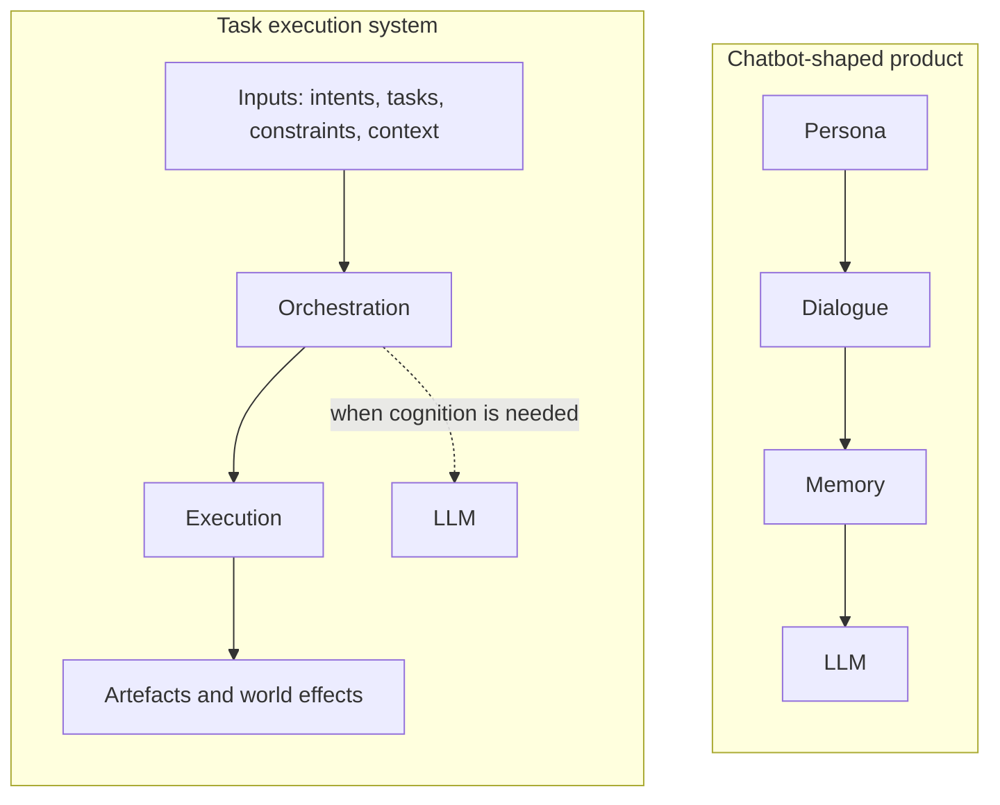

# Why fount Agents Are Not Chatbots

Here is a picture. Open any product page labelled "Agent" and you will find it: a named character with a personality, a store of memories from past conversations, and a large language model humming underneath. The packaging varies — companion, copilot, assistant, teammate — but take it apart and you always find the same four parts in a different order.

I build agents too. What I build descends from a different picture, and fount starts from a claim you are welcome to argue with:

> An agent is not a chatbot built around an LLM. It is a task execution system that can combine different kinds of computation, and the LLM is just one cognitive ability it can call.

The weight sits on *task execution system*. Let's take both sides apart.

## The template

Products flying the "AI Agent" flag are almost universally assembled from four parts:

1. **A persona**: a system prompt gives the model a name, a personality, a backstory — and this is treated as the product's identity.
2. **Dialogue**: the chat window is the only interface; every user need must be expressed as a message.
3. **Memory**: past chats are summarised, vectorised, and injected back into the prompt so the character "remembers" you.
4. **An LLM**: the engine driving everything, generating every reply end to end.

None of these parts is wrong on its own. What's wrong is the order, and the priorities the order implies: in this architecture, dialogue is the fundamental interface, the LLM is the fundamental processor, and persona and memory hang around them as decoration. A system built this way can *talk about* tasks but struggles to *do* them. It will describe a file-cleanup plan with great verve and then invent a cron expression that does not exist. What this architecture is genuinely good at is talking.

And the chat window was never a technical necessity. It is the habit of the first wave of LLM products, mistakenly promoted to product identity.

## Take the chat window off

Remove it and an agent becomes something else: a program that accepts a task and is responsible for getting it done. It is closer to a scheduler, a compiler, a process manager — not a character in a chat window.

**What it receives.** Activation conditions, intents, tasks, constraints, context. The sources are wider than most products admit:

| Input | Typical sources | Examples |
| --- | --- | --- |
| Activation | Event systems, timers, webhooks | "run daily at 02:00"; a file on disk changed |
| Intent | A human, another agent | "clean up the build directory" |
| Task | Programs, upstream systems | a work item with acceptance criteria |
| Constraints | Policy, callers | read-only access; a token budget; never touch production |
| Context | Files, world state, prior runs | repo layout; the artefacts of the last run |

Notice who is *not* on that list: a human who wants to chat. A person arriving with a question is one activation source among many — structurally no more special than a timer that fires at 2 AM.

**What it owes.** To convert input into a sequence of execution steps and, in the end, produce some artefact or effect on the world. Artefacts can be text, files, code, tool calls, API requests, state changes, new tasks — any observable result. The test is simple: if a system's output can be either a sentence or a merge commit, it is an agent. If the only possible output is text, it is a chatbot, whatever the landing page says.

Two loops, side by side:

```text
# the chatbot loop
loop {
    message := await user_input()
    reply   := llm(persona, memory, message)
    show(reply)
}
```

```text
# the agent loop (sketch)
on activation(input):              # timer, event, human, agent, or program
    task := interpret(input)       # natural language, structured data, or both
    plan := decompose(task, constraints)
    for step in plan:
        result := execute(step)    # a program, a Tool Call, an API request, or the LLM
        state  := update(state, result)
    emit(artefact)                 # files, commits, requests, state changes...
```

In the first loop the LLM is everything. In the second it is one callable among several, and the loop itself — the decomposition, the ordering, the bookkeeping over state — is the agent.

## The template is inside-out

Many products treat "persona → dialogue → memory → LLM" as the core structure of the thing they are building. It is exactly backwards. Where the weight sits is the task and its execution:

| Question | Chatbot-shaped product | Task execution system |
| --- | --- | --- |
| Why does the system exist? | To sustain a conversation | To complete tasks |
| What is the interface? | A chat window | Whatever the task needs: events, APIs, files, dialogue |
| What is state? | Chat logs and character memory | Task state, artefacts, effects on the world |
| What is the LLM? | The engine everything depends on | A cognitive ability, called on demand |
| What is persona? | The product's identity | One task configuration among many |

The same comparison as a picture:



Read the left subgraph top to bottom and you get a personality simulator. Read the right one and you get a machine that works. The LLM appears in both, but its position differs — load-bearing engine in one, consultant on call in the other. That position is the dividing line between the two things.

## A persona is one task among many

The most direct way to see the inversion is to put four system prompts side by side:

- "You are a tsundere maid"
- "You are a code reviewer"
- "You are a SQL optimiser"
- "You are an automatic backup program"

They look like four different products. Structurally they are the same object: a set of tasks and behavioural constraints applied to a system. Each specifies what to attend to, how to respond, and what counts as "done". The maid and the backup program do not differ in kind — only in acceptance criteria. For one, "done" means the user feels accompanied; for the other, the file arrived. A persona is a policy, not a soul.

This also explains why chatbot-template products all start to look alike once the novelty wears off: a product whose core is a persona can only grow by adding more personas, while a product whose core is task execution grows by accepting new tasks. The persona goes back where it belongs — a configuration of a capable machine, not the machine itself.

## The one-line version

> An Agent is not an LLM that is given a task. It is a system that uses intelligence when intelligence is necessary.

## What this looks like in fount

fount is built on the second frame. An agent is a modular part, and activation can come from any direction: a person typing, another agent, a program, a timer, an event. The same agent chats with you in the chat shell and posts in the social shell; swap the shell and the agent is untouched, because a shell is an interface, not the thing itself.

Characters and personas are first-class citizens in fount — but architecturally they are configurations the execution system can wear. How the wearing works, what gets loaded, what gets exposed: [Building fount Shell](building-fount-shell) has the full field notes. One question is still owed an answer first: what does the LLM actually do in this architecture? I've split its workload into two lists, plus a long list of jobs it should never touch — see [The LLM Is Not the Agent](llm-is-not-the-agent).
