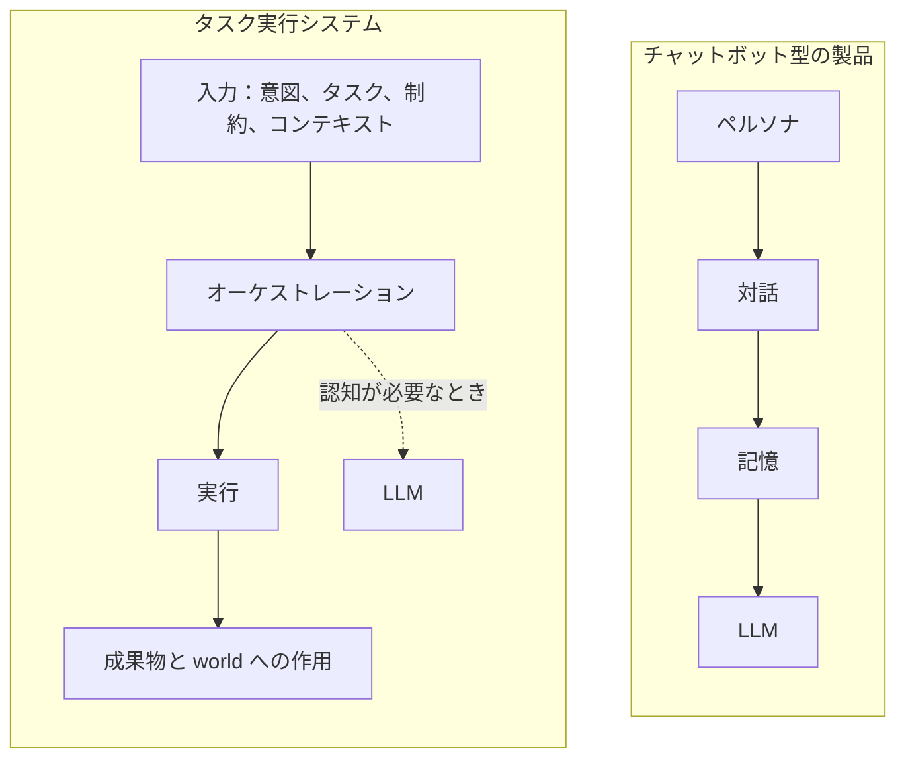

# fount のエージェントはなぜチャットボットではないのか

一枚の絵を思い浮かべてほしい。「Agent」と銘打った製品ページをどれでも開けば、同じものがある。名前と性格を持ったキャラクター、過去の会話の記憶、その下で唸っている大規模言語モデル。パッケージはさまざまだ——コンパニオン、コパイロット、アシスタント、チームメイト——だが、分解してしまえば、いつも同じ四つの部品が順番を変えて現れる。

私もエージェントを作る。だが私が作るものは別の絵から来ている。fount の出発点は、遠慮なく反論してかまわない一つの主張だ：

> エージェントとは LLM を中心に組み立てられたチャットボットではない。異なる種類の計算を組み合わせられるタスク実行システムであり、LLM はそれが呼び出せる認知能力の一つにすぎない。

重みは「タスク実行システム」に置かれている。両側を分解してみよう。

## あのテンプレート

「AI Agent」の旗を掲げる製品は、ほぼ例外なく四つの部品から組み立てられている：

1. **ペルソナ**：システムプロンプトがモデルに名前、性格、来歴を与え、それ自体が製品のアイデンティティとされる。
2. **対話**：チャットウィンドウが唯一のインターフェースで、ユーザーのあらゆる要求はメッセージとして表現されなければならない。
3. **記憶**：過去のチャットが要約・ベクトル化され、プロンプトに注ぎ戻されて、キャラクターがあなたを「覚えている」ようにする。
4. **LLM**：すべてを駆動するエンジンで、どの返答も端から端までこれが生成する。

どの部品も単体では間違っていない。間違っているのは順序であり、その順序が示唆する優先順位だ。このアーキテクチャでは、対話が根本的なインターフェース、LLM が根本的なプロセッサ、ペルソナと記憶はその周りにぶら下がる装飾にすぎない。こうして組み立てられたシステムは、タスクについて*語る*ことはできても、タスクを*こなす*のは苦手だ。ファイル整理の計画を滔々と語り、存在しない cron 式をでっち上げる。このアーキテクチャが本当に得意なのは、話すことだ。

そしてチャットウィンドウは決して技術的な必然ではなかった。それは最初期の LLM 製品の習慣で、誤って製品のアイデンティティに昇格させられただけだ。

## チャットウィンドウを外すと

外してしまえば、エージェントは別のものになる。タスクを受け取り、それを成し遂げる責任を負うプログラムだ。チャットウィンドウの中のキャラクターではなく、スケジューラ、コンパイラ、プロセスマネージャに近い。

**何を受け取るか。** アクティベーション条件、意図、タスク、制約、コンテキスト。入力の出所は、多くの製品が認めたがるよりずっと広い：

| 入力               | 典型的な出所                        | 例                                                           |
| ------------------ | ----------------------------------- | ------------------------------------------------------------ |
| アクティベーション | イベントシステム、タイマー、webhook | 「毎日 02:00 に実行」；ディスク上のファイルが変更された       |
| 意図               | 人間、別のエージェント              | 「ビルドディレクトリを片付けて」                             |
| タスク             | プログラム、上流システム            | 受け入れ基準付きの作業項目                                   |
| 制約               | ポリシー、呼び出し元                | 読み取り専用権限；トークン予算；本番には絶対に触れない       |
| コンテキスト       | ファイル、world の状態、過去の実行  | リポジトリ構造；前回実行の成果物                             |

このリストに*いない*のは誰か。チャットしたい人間だ。質問を携えて現れる人は、数あるアクティベーション源の一つにすぎない——構造上、深夜二時に発火するタイマーと何ら特別な違いはない。

**何を負うか。** 入力を一連の実行ステップに変換し、最終的に何らかの成果物、あるいは world への作用を生み出すこと。成果物はテキスト、ファイル、コード、ツール呼び出し、API リクエスト、状態変更、新しいタスク——観測可能な結果なら何でもよい。判定は単純だ。システムの出力が文にも merge commit にもなりうるなら、それはエージェントだ。可能な出力がテキストだけなら、ランディングページが何と言おうと、それはチャットボットだ。

二つのループを並べてみる：

```text
# チャットボットのループ
loop {
    message := await user_input()
    reply   := llm(persona, memory, message)
    show(reply)
}
```

```text
# エージェントのループ（概略）
on activation(input):              # タイマー、イベント、人間、エージェント、またはプログラム
    task := interpret(input)       # 自然言語、構造化データ、あるいはその両方
    plan := decompose(task, constraints)
    for step in plan:
        result := execute(step)    # プログラム、ツール呼び出し、API リクエスト、または LLM
        state  := update(state, result)
    emit(artefact)                 # ファイル、commit、リクエスト、状態変更……
```

最初のループでは LLM がすべてだ。二番目では、LLM はいくつかある呼び出し可能なものの一つにすぎず、ループ自体——分解、順序付け、状態の記帳——こそがエージェントだ。

## テンプレートは裏返しになっている

多くの製品は「ペルソナ → 対話 → 記憶 → LLM」を、自分が作っているものの中核構造だと思っている。まったく逆だ。重みはタスクとその実行にある：

| 問い                       | チャットボット型の製品           | タスク実行システム                                     |
| -------------------------- | -------------------------------- | ------------------------------------------------------ |
| システムはなぜ存在する？   | 会話を維持するため               | タスクを完了するため                                   |
| インターフェースは？       | チャットウィンドウ               | タスクが必要とするもの：イベント、API、ファイル、対話   |
| 状態とは？                 | チャットログとキャラクターの記憶 | タスク状態、成果物、world への作用                     |
| LLM とは？                 | すべてが依存するエンジン         | 必要に応じて呼ばれる認知能力                           |
| ペルソナとは？             | 製品のアイデンティティ           | 数あるタスク構成の一つ                                 |

同じ比較を絵にすると：



左の子図を上から下へ読めば人格シミュレータが得られる。右を読めば働く機械が得られる。LLM はどちらにも現れるが、その位置は違う——一方では荷重を支えるエンジン、他方では呼べば来る顧問だ。この位置こそが二つのものの分水嶺だ。

## ペルソナは数あるタスクの一つ

この「裏返し」を見る最も直接的な方法は、四つのシステムプロンプトを並べることだ：

- 「あなたはツンデレのメイド」
- 「あなたはコードレビュアー」
- 「あなたは SQL オプティマイザ」
- 「あなたは自動バックアッププログラム」

四つの異なる製品に見える。構造上は同じ対象だ：システムに適用されたタスクと振る舞いの制約の集合。それぞれが、何に注意を向け、どう応答し、何を「完了」とするかを規定する。メイドとバックアッププログラムは種類が違うのではない——違うのは受け入れ基準だけだ。一方にとって「完了」はユーザーが同伴を感じること、他方にとってはファイルが届くこと。ペルソナはポリシーであり、魂ではない。

これは、チャットボットテンプレートの製品が新鮮さの切れた後に一様に見え始める理由も説明する。中核がペルソナの製品は、ペルソナを増やすことによってしか成長できない。中核がタスク実行の製品は、新しいタスクを受け入れることによって成長する。ペルソナは本来の場所へ戻る——有能な機械の一つの構成であって、機械そのものではない。

## 一行版

> エージェントとは、タスクを与えられた LLM ではない。知能が必要なところでだけ知能を使うシステムである。

## fount ではどう見えるか

fount は二つ目の枠組みで作られている。エージェントはモジュール化された part で、アクティベーションはどの方向からも来る：タイプしている人間、別のエージェント、プログラム、タイマー、イベント。同じエージェントが、チャット shell ではあなたと話し、ソーシャル shell では投稿する。shell を入れ替えてもエージェントはそのままだ——shell はインターフェースであって、本体ではないからだ。

キャラクターとペルソナは fount では一級市民だ。しかしアーキテクチャ上、それらは実行システムがまとえる構成にすぎない。どうまとうのか、何が読み込まれ、何が露出するのかは、[fount Shell の構築](building-fount-shell) に完全な現場記録がある。ただ、その前に一つ答えを返すべき問いがある。このアーキテクチャで LLM は実際に何をするのか。私はその仕事を二つのリストに分けた。それに加えて、決して触れるべきでない長いリストもある——[LLM はエージェントではない](llm-is-not-the-agent) を参照。
