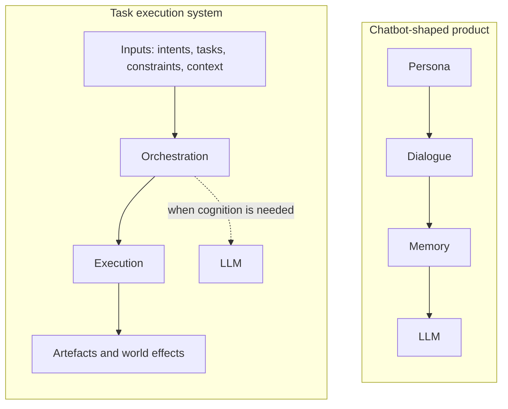

# 为什么 fount 的 Agent 不是聊天机器人

先摆一幅画面。打开任何一个标着「Agent」的产品页，你看到的都是：一个有名字有性格的角色，一份过往对话的记忆，底下一台嗡嗡作响的大语言模型。包装各异——伴侣、副驾驶、助理、队友——拆开看，都是这四件东西的排列组合。

我也造 Agent，但我造的东西和这幅画面不同源。fount 的出发点是一句可以摆上台面被反驳的话：

> Agent 不是围绕 LLM 搭建的聊天机器人，而是一个以完成任务为目的、能够组合不同计算能力的执行系统。LLM 只是它可以调用的一种认知能力。

这句话的分量全在「执行系统」四个字上。下面把两边都拆开。

## 那个模板

如今打着「AI Agent」旗号的产品，几乎都由四个部件拼装而成：

1. **人格**：一段 System Prompt 赋予模型名字、性格与背景故事，并被当作产品的身份本身。
2. **对话**：聊天窗口是唯一界面，用户的一切需求都必须表达成消息。
3. **记忆**：过往聊天被总结、向量化，再注回 prompt，好让角色「记得」你。
4. **LLM**：驱动一切的引擎，每条回复都由它端到端生成。

单看每个部件都没有错。错的是顺序，以及顺序暗示的优先级：在这套架构里，对话是根本界面，LLM 是根本处理器，人格与记忆挂在两者周围当装饰。照这个模板搭出来的系统，能*谈论*任务，却很难*完成*任务——它会绘声绘色地描述一个整理文件的计划，一本正经地讲解定时备份该如何配置，然后凭空编出一条不存在的 cron。这套架构真正擅长的事情就是说话。

聊天窗口从来不是什么技术必然。它只是第一波 LLM 产品的使用惯性，被错误地提拔成了产品身份。

## 拆掉聊天窗口之后

把聊天窗口拿掉，Agent 是另一种东西：一个接受任务、并负责把任务办成的程序系统。它更接近调度器、编译器、操作系统里的进程管理器，而不是聊天窗口里的一个角色。

**它接收什么。**来自外部的激活条件、意图、任务、约束、上下文。输入的来源，比大多数产品愿意承认的宽得多：

| 输入 | 典型来源 | 例子 |
| --- | --- | --- |
| 激活条件 | 事件系统、定时器、webhook | 「每天 02:00 运行」；磁盘上某个文件变更了 |
| 意图 | 人类、另一个 Agent | 「把构建目录清理一下」 |
| 任务 | 程序、上游系统 | 一条带验收标准的工作项 |
| 约束 | 策略、调用方 | 只读权限；token 预算；绝不碰生产环境 |
| 上下文 | 文件、世界状态、先前运行 | 仓库结构；上一轮执行的产物 |

这个清单里没有谁？想聊天的人类。一个带着问题而来的人，只是众多激活源中的一种——在结构上，和凌晨两点准时触发的定时器平级。

**它欠下什么。**将输入转换为一系列执行过程，最终产生某种产物，或对外部世界产生作用。产物可以是文本、文件、程序代码、工具调用、API 请求、状态修改、新的任务——任何可观察的结果。判据很简单：一个系统的输出既可以是一句话、也可以是一次 merge commit，它是 Agent；它唯一可能的输出是文本，那它就是聊天机器人，无论落地页怎么写。

两种循环放在一起，差别一目了然：

```text
# 聊天机器人的循环
loop {
    message := await user_input()
    reply   := llm(persona, memory, message)
    show(reply)
}
```

```text
# Agent 的循环（示意）
on activation(input):              # 定时器、事件、人类、Agent 或程序
    task := interpret(input)       # 自然语言、结构化数据，或两者兼有
    plan := decompose(task, constraints)
    for step in plan:
        result := execute(step)    # 程序、Tool Call、API 请求，或 LLM
        state  := update(state, result)
    emit(artefact)                 # 文件、commit、请求、状态变更……
```

第一个循环里，LLM 就是全部。第二个循环里，LLM 只是若干可调用能力之一，而循环本身——分解、排序、对状态的记账——才是 Agent。

## 模板的结构恰好是反的

「人格 → 对话 → 记忆 → LLM」这个顺序，被很多产品当成了要造的东西的核心结构。恰好反了。真正的 Agent，重心在任务与执行：

| 问题 | 聊天机器人形态的产品 | 任务执行系统 |
| --- | --- | --- |
| 系统为什么存在？ | 维持一场对话 | 完成任务 |
| 界面是什么？ | 聊天窗口 | 任务需要什么就是什么：事件、API、文件、对话 |
| 状态是什么？ | 聊天记录与角色记忆 | 任务状态、产物、对世界的作用 |
| LLM 是什么？ | 一切运转所依赖的引擎 | 一种认知能力，按需调用 |
| 人格是什么？ | 产品的身份 | 众多任务配置中的一种 |

同一组对比，画出来是这样：



把左边那张子图自上而下读，你得到一台人格模拟器；把右边那张读下来，你得到一台干活的机器。LLM 在两张图里都出现，位置却不同——一边是承重引擎，一边是随叫随到的顾问。这条分界线就是两种东西的分界线。

## 人格只是任务的一种

看清这个「反」，最直接的办法是把四段 System Prompt 摆在一起：

- 「你是一个傲娇的女仆」
- 「你是一名代码审查员」
- 「你是一名 SQL 优化器」
- 「你是一台自动备份程序」

它们看起来像四种产品，结构上却是同一个对象：施加给系统的一组任务与行为约束。每一段都规定了系统该关注什么、该如何响应、什么叫做「做完了」。女仆人设和自动备份程序并不是两种性质的东西——区别只在验收标准：前者的「做完」是「用户感到被陪伴」，后者是「文件送达」。人格是一种策略（policy），不是灵魂。

这顺便解释了为什么照聊天机器人模板做的产品，新鲜感一过就千篇一律：核心是人设的产品，只能靠增加更多人设来成长；核心是任务执行的产品，靠接受新任务来成长。人设退回它本来的位置——一台能干的机器的一种配置，而非机器本身。

## 一句话版本

> An Agent is not an LLM that is given a task. It is a system that uses intelligence when intelligence is necessary.
> （Agent 不是一个被赋予任务的 LLM，而是一个只在需要智能的地方使用智能的系统。）

## fount 里长什么样

fount 按第二种框架构建。Agent 是一个模块化的 part，激活可以来自任何方向：正在打字的人、另一个 agent、一段程序、一个定时器、一个事件。同一个 agent，在聊天 shell 里陪你说话，在社交 shell 里发帖，换掉外壳，agent 原样不动——外壳本来就是接口，不是本体。

角色与人格在 fount 里是一等公民，但架构上，它们是执行系统可以穿戴的配置。怎么穿戴、加载什么、向内暴露什么，[构建 fount Shell](building-fount-shell) 有完整的现场记录。在那之前还欠一个解释：LLM 在这套架构里到底负责什么。我把它的活计拆成了两份清单，外加一长串它碰都不该碰的——见 [LLM 不是 Agent](llm-is-not-the-agent)。
