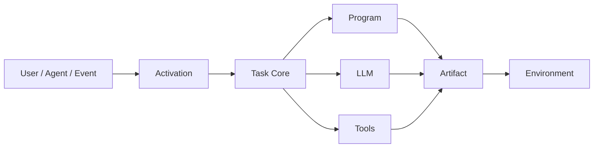

# Building fount Shell

Any theory owes its reader an implementation eventually. This series has owed this one from day one.

The one-line version first:

> **An Agent is not an LLM that is given a task. It is a system that uses intelligence when intelligence is necessary.**

[fount](https://github.com/steve02081504/fount) is the compilation target of that sentence. This essay is the field notes from the landing: what got built, what changed while building, and which of my own positions are under revision. The map of everything before this lives in [Where to Start](reading-guide); there will be no nine-sentence recap here — one sentence per essay is quite enough violence for any body of work.

## From theory to architecture

Strip the series to its load-bearing walls and the architecture falls out almost mechanically. Events arrive: user messages, timers, the actions of other agents in a world. Something decides what is relevant. A core plans and routes the task: deterministic parts run as programs; cognitive parts go to the model; actions on the world go through Tools. Results become artefacts and land back in the environment.



Every box in the diagram is a theory chapter in an engineering uniform:

- **Activation** is dynamic activation, literally: given an event, decide which personas, memories, tools and context slices travel with it. By default, nothing does.
- **Task Core** is the allocation engine. It decomposes the task and routes each piece by budget: what can be computed gets computed; what must be understood gets reasoned; what touches the world goes through a Tool.
- **Artefact → Environment** closes the loop from the very first essay: the agent acts on a world. An artefact can be a chat reply, a file, a scheduled event, a message to another agent — the loop closes through the environment, not through the chat log.

Note what the diagram does **not** contain: a box labelled "model, everywhere". The LLM appears exactly once, on one of three routes. That placement is the entire series, drawn.

## Everything is a part

Architecture diagrams are cheap; the interesting question is what the runtime actually looks like. fount's answer is a single organising idea: **everything is a part.** Parts are dynamically loaded, self-contained modules, and parts have types:

```text
src/public/parts/
├── shells/            # interaction shells: chat, social...
├── chars/             # characters: composable task configurations
├── worlds/            # the environments agents live and act in
├── personas/          # task-bound behavioural configurations
├── plugins/           # capability injection: code-execution, file-operations, timer...
├── serviceSources/    # AI / search / translation / speech service sources
└── serviceGenerators/ # factories turning configuration into services
```

This taxonomy is not a filing obsession; each type falls straight out of the theory.

### Why the Shell and the agent are separate

Because the agent is a task execution system and chat is one event source among many. Hard-code chat into the agent core and the first essay's definition is violated at the root. So the chat shell is a part: it translates input into events and renders artefacts. Swap it for the social shell — the same agent, posting somewhere else — and the agent underneath notices nothing. **The shell is the interaction surface; the agent beneath is untouched.**

### Why characters and personas are parts

Because a persona is a task configuration, not a soul. A char binds a target portrait, a style, a toolset, a world — everything the task needs to be executed *this way*. Different tasks deserve different configurations, and users deserve to compose them: pick a shell, pick a char, mount a world, attach a plugin — no code, all composition. When the persona is data rather than architecture, [the roleplay question](does-roleplay-make-llms-worse) stops being a religious debate and becomes an A/B experiment.

### Why worlds are parts

Because the environment loop in the diagram needs something to pass *through*. A world is where events originate and artefacts land — it gives the agent a habitat, not a chat log.

The generalisation writes itself: **everything the theory treats as a variable — interface, persona, environment, services — becomes a replaceable part; everything it treats as an invariant — activation, allocation, the task core — stays in the core.** That sentence is the whole design.

## The cage, in its actual form

The safety chapters gave principles; this section shows them in code. If you can read source, check along.

Every reply request in fount carries a `supported_functions` list: markdown, html, unsafe_html, files, add_message... For anything absent from the list, the corresponding plugin prompt is simply never injected. The model never learns that it *could* send files — no temptation, no abuse. This is "capabilities that don't exist cannot be abused" at the implementation layer.

Least privilege has a concrete shape, too. The code-execution plugin distinguishes `view_files` (the model looks; the content stays on the machine) from `add_files` (the model looks *and* sends). Sensitive content — camera, screenshots — defaults to the former; the prompt states in writing that unless the user explicitly asks for a file to be sent, `view_files` is the right call. Content reaching the model and content leaving the machine are two different permissions.

Two clauses in that plugin's prompt are plain enough to be overlooked: "avoid deleting files/folders directly; prefer the recycle bin" and "when overwriting data, consider backing up the original first". Neither would have saved my ID photo — publish-class operations are irreversible, the lesson of [the canary chapter](untrusted-upstream) — but they are the daily-edition version of the same idea: leave the error an exit.

The weakest link gets stated honestly too: **permission auditing.** At the time of the incident (April 2026), GentianAphrodite had none; today, fount's permission model still stops at capability gating — a complete ledger of who held what access to which resource and when does not exist yet. The direction lives in the repo's design docs (the human-agent parity work: entities, key pairs, message signing), but that is another essay. Until then, take this paragraph as the footnote to every safety claim in this series: the person writing the principles and the person violating them can be the same person.

## Seven design patterns

Name a thing and the name becomes a constraint. fount's architecture exists so that these become defaults:

1. **Deterministic First.** If a program can compute the answer, don't consult the model. The cheapest token is the one never sent.
2. **Dynamic Activation.** Context is assembled per event: relevant personas, relevant memories, relevant tools. The default amount of context is zero.
3. **Minimal Context.** Assemble the smallest set that keeps the task on target. Context is a budget, and every line in it pays rent.
4. **Task-Oriented Persona.** Personas exist to shape task performance — goals, style, constraints — not to name chatbots and put hats on them.
5. **LLM on Demand.** The model is called at specific, bounded positions in the task pipeline, not kept warm as a resident oracle.
6. **Tool over Prompt.** Rather give the agent a tool than describe a procedure in the system prompt. A described procedure is a suggestion; a tool is an interface.
7. **Program over Reasoning.** Eliminate the *need* to reason rather than improving reasoning. The best prompt for multiplication is a calculator.

None of these patterns is clever — that's the point. Each one is the theory refusing to pay a bill it doesn't owe.

## Positions under revision

A series that preaches honesty owes its ending some. This is not a disclaimer-shaped "open questions" list; it is the list of places where I am actually changing my mind:

- **Dynamic activation has its own costs.** Deciding what to activate is itself a task, and tasks fail. Retrieval errors are silent: the model doesn't know which memory it was never given. A narrowly-activated system can fail confidently in ways a stuffed-context system happens not to.
- **Persona is not pure overhead.** [The roleplay essay](does-roleplay-make-llms-worse) landed on "mixed evidence"; there genuinely are cases where a character frame *raises* task performance. Treating persona as pure cost overcorrects, and where the border lies, nobody has a map.
- **Rules sometimes lose to models.** A hand-written regex router accumulates maintenance debt, and one small-model call can handle the same variation at lower total cost. The allocation principle does not repeal the budget.
- **Less context is not always better.** Whenever the model must re-derive facts you deleted, aggressive trimming trades a token cost for a reasoning cost. Sometimes the stuffed context is the cheaper machine.
- **The "smarter model" temptation is bigger than I admitted.** After the deepseek3.5 incident I assumed I was immune to marketing. Honestly: every new model release, my first reaction is still "let's try it". Discipline is not an asset you acquire once; it is rent you pay every time.

These are not pleasantries pinned to the end. Each is a place where fount's architecture deliberately makes the question *measurable*: swap the persona part, ablate the activation, compare the budgets. When revisions land, the essays will be revised too.

## What fount is

fount is open source and modular, and the modularity is not an aesthetic preference — it is that architecture diagram compiled into executable constraints: chars and personas replacing hard-coded behaviour with composable task configurations; shells that treat chat as one event source among many; a task core that routes by budget; and the cage, in its code form.

If the series' argument holds, the future of agent engineering belongs not to bigger models but to better allocation: systems that know which budgets they are spending, use intelligence only where intelligence pays — and have a cage such that when a card is drawn wrong, the cost of the wrong card doesn't land on your ID photo.

I paid for the rewrite of that second half with one incident. I hope it was worth it.
