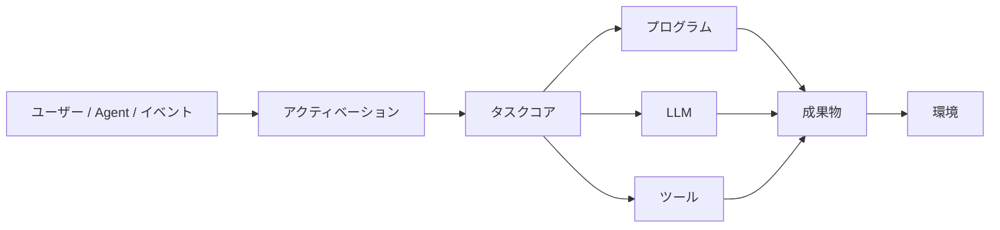

# fount Shell を構築する

どんな理論も、いずれ読者に実装を負っている。この連載が負っていたのは、初日からこの一本だ。

一言版を先に置いておく：

> **エージェントとは、タスクを与えられた LLM ではない。必要なときにだけ知能を使うシステムである。**

[fount](https://github.com/steve02081504/fount) はこの一文のコンパイルターゲットだ。本稿はその着地現場の記録である：何が作られ、作る中で何が変わり、どの立場を私自身がまだ改訂しているか。それ以前のすべての地図は[どこから読むか](reading-guide)にある。ここで九連句を復唱するつもりはない——一本のエッセイへの乱暴は、一句で十分だ。

## 理論からアーキテクチャへ

連載から耐力壁だけを残せば、アーキテクチャはほとんど機械的に落ちてくる。イベントが到来する：ユーザーのメッセージ、タイマー、world にいる他のエージェントの行動。何かが関連性を決める。コアがタスクを計画しルーティングする：決定論的な部分はプログラムとして実行し、認知を要する部分はモデルへ回し、world に働きかける行動はツールを通す。結果は成果物となり、環境へと戻っていく。



図の各ボックスは、エンジニアの制服を着た理論の各章だ：

- **Activation** は文字どおりの動的アクティベーションである：一つのイベントが与えられたとき、どのペルソナ、記憶、ツール、コンテキストの切片がそれに同行するかを決める。既定では、何も同行しない。
- **Task Core** は配分エンジンだ。タスクを分解し、各部分を予算でルーティングする：計算できるものは計算し、理解しなければならないものは推論し、world に触れるものはツールを通す。
- **Artefact → Environment** は最初のエッセイのループを閉じる：エージェントは world に働きかける。成果物はチャットの返信、ファイル、予約イベント、別のエージェントへのメッセージでありうる——ループはチャットログではなく、環境を通じて閉じる。

この図に**ない**ものに注意してほしい：「モデル、いたるところに」と書かれたボックスだ。LLM はちょうど一度だけ、三つのルートのうちの一つに現れる。この配置こそが、連載全体を一枚に描いたものだ。

## すべては part

アーキテクチャ図は安い。面白い問いは、ランタイムが実際にどんな姿をしているかだ。fount の答えは一つの組織原理に集約される：**すべては part。** part は動的に読み込まれる自己完結したモジュールで、型を持つ：

```text
src/public/parts/
├── shells/            # 対話シェル：chat、social……
├── chars/             # キャラクター：組み合わせ可能なタスク構成
├── worlds/            # エージェントが暮らし行動する環境
├── personas/          # タスクに束縛された行動構成
├── plugins/           # 能力の注入点：code-execution、file-operations、timer……
├── serviceSources/    # AI / 検索 / 翻訳 / 音声などのサービスソース
└── serviceGenerators/ # 構成をサービスに変えるファクトリ
```

この分類は収納癖ではない。どの型も理論から直接導かれる。

### なぜ Shell と Agent は分かれているのか

エージェントはタスク実行システムであり、チャットは数あるイベントソースの一つにすぎないからだ。チャットをエージェントコアにハードコードすれば、最初のエッセイの定義が根元から破られる。だから chat シェルは一つの part なのだ：入力をイベントに翻訳し、成果物を描画する。それを social シェルに差し替えても——同じエージェントが別の場所に投稿するだけ——下のエージェントは何も気づかない。**シェルは対話の表面であり、その下のエージェントは手つかずのままだ。**

### なぜ char と persona は part なのか

persona はタスク構成であって、魂ではないからだ。char は対象のポートレート、スタイル、ツールセット、world を束ねる——タスクを「このやり方で」実行するのに必要なすべてを。タスクが違えば構成も違うべきで、ユーザーはそれらを組み合わせるに値する：シェルを選び、char を選び、world を載せ、plugin を添える——コードは書かず、すべて組み合わせで。ペルソナがアーキテクチャではなくデータになれば、[ロールプレイの問い](does-roleplay-make-llms-worse)は宗教論争であることをやめ、A/B テストになる。

### なぜ world は part なのか

図の中の環境ループには、何かが「通り抜ける」先が要るからだ。world はイベントが生まれ、成果物が着地する場所である——エージェントにチャットログではなく住処を与える。

一般化は自然に書ける：**理論が変数として扱うもの——インターフェース、ペルソナ、環境、サービス——はすべて差し替え可能な part になり、理論が不変量として扱うもの——アクティベーション、配分、タスクコア——はコアに残る。** この一文が設計のすべてだ。

## 檻の実際の姿

安全の各章は原則を述べた。この節ではそれをコードで示す。ソースが読めるなら、照らし合わせてほしい。

fount のすべての返信リクエストは `supported_functions` のリストを携える：markdown、html、unsafe_html、files、add_message……。リストにないものについては、対応するプラグインのプロンプトがそもそも注入されない。モデルは「自分がファイルを送れる」ことすら知らない——誘惑もなければ、濫用もない。これが「存在しない能力は濫用されえない」の実装層だ。

最小権限にも具体的な形がある。code-execution プラグインは `view_files`（モデルが見る。内容はマシンから出ない）と `add_files`（モデルが見て、*かつ*送る）を区別する。カメラ、スクリーンショットといった機微な内容は既定で前者を通り、プロンプトには「ユーザーが明示的にファイル送信を求めない限り、`view_files` を使うべき」と明記されている。内容がモデルに届くことと、内容がマシンから出ていくことは、二つの別個の権限だ。

そのプラグインのプロンプトには、素朴すぎて見落とされがちな二つの条項がある。「ファイル/フォルダを直接削除するのは避け、ゴミ箱への移動を優先せよ」「データを上書きするときは、誤操作に備えて元ファイルのバックアップを検討せよ」。どちらも私の ID 写真は救えなかった——公開クラスの操作は不可逆であり、[カナリアの章](untrusted-upstream)の教訓だ——が、これは同じ発想の日常版である：誤りに出口を残せ。

最も弱い環も正直に述べておく：**権限監査。** 事故の時点（2026年4月）で、GentianAphrodite には権限監査が一切なかった。今日でも、fount の権限モデルは能力ゲートの粒度で止まっている——誰が、いつ、どのリソースに対して、どんな権限を持っていたかの完全な台帳は、まだ存在しない。方向性はリポジトリの設計文書（人間とエージェントの平権の作業：実体、鍵ペア、メッセージ署名）にあるが、それは別のエッセイの話だ。それまでは、この段落を本連載のあらゆる安全主張の脚注として受け取ってほしい：原則を書く人間と、それを破る人間は、同一でありうる。

## 七つのデザインパターン

ものに名前を与えれば、その名前は制約になる。fount のアーキテクチャは、これらが既定になるために存在する：

1. **Deterministic First.** プログラムが答えを計算できるなら、モデルに問い合わせない。最も安いトークンは、決して送られなかったトークンである。
2. **Dynamic Activation.** コンテキストはイベントごとに組み立てる：関連するペルソナ、関連する記憶、関連するツール。コンテキストの既定量はゼロだ。
3. **Minimal Context.** タスクを的から外さない最小の集合を組み立てる。コンテキストは予算であり、その一行一行が家賃を払う。
4. **Task-Oriented Persona.** ペルソナはタスク遂行を形づくるために存在する——目標、スタイル、制約——チャットボットに名前をつけ帽子をかぶせるためではない。
5. **LLM on Demand.** モデルはタスクパイプラインの特定の、有界な位置で呼ばれる。常駐の託宣として保温されるのではない。
6. **Tool over Prompt.** システムプロンプトで手順を説明するより、エージェントにツールを与える。説明された手順は提案であり、ツールはインターフェースだ。
7. **Program over Reasoning.** 推論を改善するのではなく、推論の**必要**そのものを消す。掛け算にとって最良のプロンプトは電卓だ。

これらのパターンはどれも賢くはない——そこが要点だ。それぞれが、理論が負う必要のない勘定を支払うのを拒んだ結果である。

## 改訂中の立場

誠実さを説く連載は、結びにも誠実さを負う。これは免責事項めいた「未解決の問い」の一覧ではない。私が実際に考えを改めつつある箇所の一覧だ：

- **動的アクティベーションには自前のコストがある。** 何をアクティベートするかの決定それ自体がタスクであり、タスクは失敗する。検索の誤りは静かだ：モデルは自分が与えられなかった記憶を知らない。狭くアクティベートされたシステムは、コンテキストを詰め込んだシステムがたまたまやらない仕方で、自信満々に失敗しうる。
- **ペルソナは純粋なオーバーヘッドではない。** [ロールプレイのエッセイ](does-roleplay-make-llms-worse)は「証拠は割れている」に着地したが、キャラクターの枠がタスク遂行を*高める*場合も確かに存在する。ペルソナを純粋なコストとして扱うのは過剰修正であり、その境界がどこにあるか、誰も地図を持っていない。
- **ルールは時にモデルに負ける。** 手書きの正規表現ルーターは保守負債を溜め込み、小さなモデルへの一度の呼び出しが同じ変動をより低い総コストで扱える。配分の原則は予算を廃止しない。
- **コンテキストは少なければ常に良いわけではない。** モデルが削除された事実を推論し直さねばならないたびに、積極的な切り詰めはトークンコストを推論コストに交換している。詰め込まれたコンテキストこそ安い機械であることもある。
- **「より賢いモデル」の誘惑は私が認めたより大きい。** deepseek3.5 の事故の後、自分はマーケティングに免疫があると思っていた。正直に言う：新しいモデルが出るたび、私の最初の反応は今でも「とりあえず試そう」だ。規律は一度手に入れる資産ではなく、毎回支払う家賃である。

これらは文末にピン留めされた世辞ではない。それぞれが、fount のアーキテクチャが意図的にその問いを**測定可能**にする場所だ：ペルソナの part を差し替え、アクティベーションをアブレーションし、予算を比較する。改訂が着地したら、エッセイも改訂されるだろう。

## fount とは何か

fount はオープンソースでモジュラーであり、そのモジュラー性は審美的な好みではない——あのアーキテクチャ図が実行可能な制約へとコンパイルされたものだ：ハードコードされた振る舞いを組み合わせ可能なタスク構成に置き換える char と persona、チャットを数あるイベントソースの一つとして扱うシェル、予算でルーティングするタスクコア、そしてコードの形をした檻。

連載の論証が成り立つのなら、エージェント工学の未来はより大きなモデルではなく、より良い配分にある：自分がどの予算を使っているかを知り、知能が報われる場所でだけ知能を使うシステム——そして、カードを引き間違えたとき、その誤ったカードの代償があなたの ID 写真に降りかからないような檻を持つシステムだ。

私は後半のこの書き直しを、一つの事故と引き換えに手に入れた。それが報われたことを願う。
