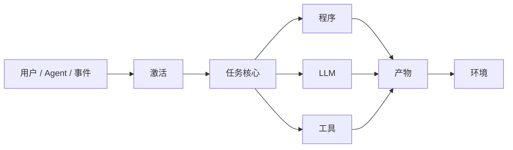

# 构建 fount Shell

任何理论最终都欠读者一个实现。这个系列欠的，从第一天起就是这一篇。

一句话版本先摆出来：

> **Agent 不是一个被赋予任务的 LLM，而是一个只在需要智能的地方使用智能的系统。**

[fount](https://github.com/steve02081504/fount) 就是这句话的编译目标。本文是落地现场的复盘：装了什么、装的时候改了什么、哪些观点我自己还在修。前作的地图在[从哪里读起](reading-guide)，这里不再复述一遍九连句——对每篇文章的暴行就到此为止。

## 从理论到架构

把系列拆到承重墙，架构几乎是机械地掉出来。事件到达：用户消息、定时任务、世界中另一个 agent 的动作。有某个东西决定什么相关。一个核心对任务做规划与路由：确定性的部分作为程序执行；认知的部分交给模型；作用于世界的动作走 Tool。结果变成 Artifact，落回环境。



图里每个框，都是穿上了工程制服的理论章节：

- **Activation** 是动态激活的字面实现：给定一个事件，决定此刻相关的 persona、记忆、Tool 和上下文切片。默认情况下，什么都不随行。
- **Task Core** 是分配引擎。它拆解任务，按预算路由每一块：能算的就算，必须理解的才推理，要触碰世界的走 Tool。
- **Artifact → Environment** 闭合了第一篇文章的循环：Agent 作用于一个世界。Artifact 可以是一条聊天回复、一个文件、一个定时事件、发给另一个 agent 的消息——闭环经由环境完成，而不是经由聊天记录。

注意这张图里**没有**的东西：一个标着「模型，无处不在」的框。LLM 只出现一次，在三条路由之一上。这个位置安排，就是整个系列的论点画成的图。

## 一切皆 part

架构图很便宜；有趣的问题是运行时到底长什么样。fount 的答案是单一的组织性观念：**一切皆 part。**part 是动态加载的自包含模块，part 有类型：

```text
src/public/parts/
├── shells/            # 交互外壳：chat、social……
├── chars/             # 角色：可组合的任务配置
├── worlds/            # Agent 生活和行动的环境
├── personas/          # 绑定到任务的行为配置
├── plugins/           # 能力注入点：code-execution、file-operations、timer……
├── serviceSources/    # AI / 搜索 / 翻译 / 语音等服务来源
└── serviceGenerators/ # 把配置变成服务的工厂
```

这个分类法不是收纳癖，每个类型都是从理论直接推导出来的。

### 为什么 Shell 与 Agent 分离

因为 Agent 是任务执行系统，而聊天只是众多事件来源之一。如果把聊天硬编码进 Agent 核心，第一篇文章的定义在根上就被违背了。所以 chat shell 是一个 part：它把输入翻译成事件，把 Artifact 渲染出来。把它换成社交 shell——同一个 agent 换个地方发帖——底下的 Agent 毫无察觉。**Shell 是交互表面；底下的 Agent 原封不动。**

### 为什么角色和 persona 是 part

因为 persona 是任务配置，不是灵魂。一个 char 绑定目标画像、风格、工具集、世界——任务「以这种方式」执行所需要的一切。不同的任务值得不同的配置，而用户值得去组合它们：选一个 Shell、选一个 char、挂载一个 world、附上 plugin——不写代码，全部组合。当 persona 是数据而不是架构时，[角色扮演问题](does-roleplay-make-llms-worse)就不再是宗教辩论，而变成一次 A/B 实验。

### 为什么 world 是 part

因为图中的环境闭环需要「穿过」的什么东西。world 是事件起源、Artifact 落地的地方——它给 Agent 一个栖息地，而不是一份聊天记录。

规律可以推广：**理论中一切被视为变量的东西——接口、persona、环境、服务——都变成可替换的 part；一切被视为不变量的东西——激活、分配、任务核心——留在核心。**这一句话就是全部设计。

## 笼子的真实形态

安全那几章讲了原则，这一节讲它们在代码里的样子。读得懂源码的可以直接对照。

fount 的每个回复请求都带着一份 `supported_functions` 清单：markdown、html、unsafe_html、files、add_message……清单里没有的能力，对应的插件提示词根本不会注入。模型连「自己能发文件」都不会知道——谈不上诱惑，也谈不上滥用。这是「能力不存在就不会被滥用」的实现层。

最小权限也有具体的形状。code-execution plugin 区分 `view_files`（模型看，内容不出机器）与 `add_files`（模型看*并*发送）——摄像头、屏幕截图这类敏感内容，默认走前者，提示词里白纸黑字写着「除非明确要求发送文件，否则……更应该使用 view_files」。内容见到模型，和内容离开机器，是两个权限。

plugin 的提示词里还有两条朴素到容易被忽略的条款：「尽量不要直接删除文件/文件夹，考虑移动到回收站」「覆写数据时，考虑进行原文件的备份，以防误操作」。这两条救不了我的身份证——发布类操作不可撤销，这是[金丝雀那章](untrusted-upstream)的教训——但它们是同一个思路的日常版：给错误留退路。

最薄弱的一环也照实说：**权限审计。**事故发生时，龙胆没有任何权限审计；到今天，fount 的权限模型仍然停在能力门控的粒度上——谁、在什么时候、对什么资源、持有什么权限的完整账本，还没有。方向在仓库的设计文档里（人-agent 平权那份：实体、密钥对、消息署名），但那是另一篇文章的事。在那之前，请把这一段当作本系列所有安全论述的脚注：写原则的人和违反原则的人可以是同一个。

## 七条设计模式

给东西命名，名字就成了约束。fount 的架构就是为了让下面这些成为默认而建的：

1. **Deterministic First.** 程序能算出答案的，就不咨询模型。最便宜的 token 是永远没发出去的那个。
2. **Dynamic Activation.** 上下文按事件装配：相关的 persona、相关的记忆、相关的 Tool。上下文的默认数量是零。
3. **Minimal Context.** 装配能维持任务不脱靶的最小集合。Context 是预算，里面每一条都要交房租。
4. **Task-Oriented Persona.** persona 的存在是为了塑造任务表现——目标、风格、约束——而不是给聊天机器人起名字、戴帽子。
5. **LLM on Demand.** 模型在任务管线上特定、有界的位置被调用，而不是作为常驻神谕被保温。
6. **Tool over Prompt.** 宁可给 Agent 一个 Tool，也不要在 System Prompt 里描述一套流程。描述出来的流程是建议；Tool 是接口。
7. **Program over Reasoning.** 宁可消灭推理的**必要**，也不要改进推理。乘法最好的 prompt 是计算器。

这些模式没有一条称得上聪明——这正是重点：每一条都是理论拒绝支付一笔不必支付的预算。

## 我还在修的观点

一个呼吁诚实的系列，欠结尾一份自己的诚实。这不是免责声明式的「开放问题」清单，是我真的在改主意的清单：

- **动态激活自带成本。**决定激活什么本身就是一个任务，而任务会失败。检索错误是静默的：模型不知道自己没被给过哪段记忆。激活得窄的系统，可能以一种塞满上下文的系统碰巧不会的方式，自信地犯错。
- **persona 不是纯开销。**[角色扮演那篇](does-roleplay-make-llms-worse)的谨慎结论是毁誉参半；确实存在角色框架**提升**任务表现的情形。把 persona 纯当开销是矫枉过正，而边界在哪里，没有地图。
- **规则有时输给模型。**手写正则搭的 Router 积累维护负债，而一次小模型调用可能以更低的总价处理同样的变化。分配的原则并不废除预算。
- **Context 越少不一定越好。**只要模型必须重新推导被删掉的事实，激进的裁剪就把 token 成本换成了推理成本。有时塞满的上下文才是更便宜的那台机器。
- **「更聪明」的诱惑比想象中大。**deepseek3.5 的事故之后，我以为自己对营销免疫了。说实话：每次有新模型发布，我的第一反应仍然是「换上去试试」。纪律不是一次获得的资产，是每次都要重新支付的租金。

这些不是钉在文末的谦辞。每一条都是 fount 架构刻意让问题**可测量**的地方：换掉 persona part、消融激活、对比预算。修完会回来改文章。

## fount 是什么

fount 开放源代码、模块化，而模块化不是审美偏好——它是那张架构图变成了可执行的约束：用组合任务配置取代硬编码行为的 char 与 persona；把聊天当作众多事件来源之一的 Shell；按预算路由的 Task Core；笼子在代码里的形状。

如果这个系列的论点成立，Agent 工程的未来不属于更大的模型，而属于更好的分配：知道自己在花哪几种预算的系统，只在需要智能的地方，使用智能——以及一个在它抽错卡时，让它抽错的代价不落在你身份证上的系统。

后半句是我用一次事故换来改写的机会。希望它值。
