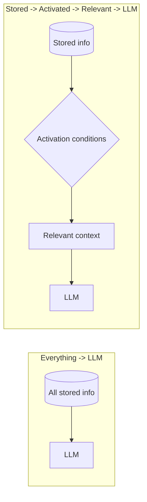

# Don't Put Everything in the Context

The default engineering posture toward the context window is a hamster's posture toward the food bowl: stuff it first, think later. Conversation history, tool definitions, retrieved documents, memories, user profiles, examples, guardrails, past summaries — keep everything, push everything into the prompt, and let the model figure it out.

The previous chapter ([Does Roleplay Make LLMs Worse?](does-roleplay-make-llms-worse)) argued that a persona is not free and should be activated on demand. Think about that argument for five more minutes and an unsettling generalisation surfaces — persona is only one guest at the crowded party. This chapter argues for the opposite default. Slogan first, architecture after:

> Context should be activated, not merely stored.

## From persona to context engineering

Recall the shape of the persona argument:

1. Everything in the prompt shares one inference's finite budget;
2. Task-irrelevant content can degrade the core task;
3. So persona content should enter the context only when relevant.

Now notice: none of those three steps mentions persona in any essential way. Substitute *memories*, *documents*, *tool results*, *user history*, or *yesterday's debugging session* for "persona content", and every step still holds. The conclusion is much bigger than the example that generated it:

- No task-irrelevant information should live permanently in the model's context by default;
- Information should be pulled in when needed, not pushed in and left there.

Two architectures, side by side:



On the left, the model doubles as the router: it must read everything, judge what matters, and work — all simultaneously. On the right, routing happens *before* the model, which only ever sees survivors. The left pipeline spends model capacity on relevance judgements; the right hands those judgements to cheap machinery.

## Memories with activation conditions

Once "activation beats hoarding" is decided, memory stops being a list of strings and becomes structured data. A minimally useful memory at least knows what it is about, and when to wake up:

```json
{
  "content": "The user's birthday is August 15th",
  "keywords": ["birthday", "cake", "party"],
  "topics": ["personal", "dates"],
  "activation": {
    "date_range": "08-10 ~ 08-20"
  },
  "related_tasks": ["small talk", "gift ideas"]
}
```

This memory sleeps for eleven months a year. During the August 10–20 window it is simply *present*: when the user mentions weekend plans, it is already in context — no query needed. The rest of the year it costs storage and not one token of budget.

The payoff is easy to underestimate. The user says "my birthday is coming up", and a few `if` statements activate the relevant memories — no embedding call, no retrieval round-trip, and crucially no extra LLM call to judge "is this memory relevant?". Context routing that a program can do should not be given to an LLM. Not because the LLM would get it wrong, but because the program does it for free, deterministically, correctly every single time.

## Where the rules run out

If every memory came with clean keywords, routing would be a solved problem. It is not. Suppose a user says:

> "I'm about to be a year older in a few days."

No "birthday" anywhere. No date. The fact is expressed *implicitly*, through an idiom, and its link to the stored "August 15th" memory has to be established semantically, not lexically. A rule-based router shrugs; a human listener gets it instantly — because humans route by meaning.

Idioms are not even the hard end. Multilingual users express the same intent through different surface forms; implicit references ("like last time") point at a memory without naming it; complex associations ("similar to that trip idea you had, but indoors") require reasoning across several stored items at once. Any single-layer router fails somewhere in this space.

The answer is not to abandon rules. It is to put rules where they belong: the cheapest rung of a ladder.

## The routing ladder

| Rung | Method | Cost | Good at | Fails at |
| --- | --- | --- | --- | --- |
| Level 0 | Deterministic rules: keywords, time windows, types, tags | ≈0, pure code | Explicit matches, date-triggered facts, structured events | Implied meaning, paraphrase, cross-language |
| Level 1 | Traditional search: full-text, BM25, database queries | Low, fast, indexable | Lexical overlap, known terms, IDs, names | Synonyms, intent behind wording |
| Level 2 | Embedding retrieval | Medium, index + vector search | Semantic similarity, paraphrase, cross-language drift | Multi-hop, negation, recency |
| Level 3 | LLM routing, reranking, reasoning | Expensive: latency + tokens | Ambiguity, complex relevance, arbitration, giving reasons | Almost nothing — and you pay for that |

The climbing strategy is the oldest rule in engineering: **try the cheap thing first; pay for the expensive thing only when the cheap thing fails.** In practice, a well-fed agent makes the overwhelming majority of its activation decisions at Level 0 — birthdays, schedules, topic tags, explicit mentions. Levels 1 and 2 catch most of the rest. Level 3 is an occasional, deliberate escalation, not a default.

Beyond cost, the ladder buys something else: auditability. Every layer below the LLM is deterministic, or at least inspectable — you can log why a memory fired, unit-test the router, reproduce the exact context a model saw. Hand relevance judgement to the model and the context itself becomes non-reproducible, which is precisely what makes agent debugging miserable. Cheap routing is not just cheaper; it produces debugging reports.

## The extreme form of isolation: the subagent

The ladder handles *information*: deciding which memories, which documents, enter the context. But some tasks are hard in a different way — not "what should go in", but "the process itself manufactures mud". An exploratory search drags back thirty thousand tokens of results. A debugging session drags in whole logs and several failed patch versions. A few-thousand-line file where nine tenths is irrelevant to the conclusion.

The old approach: pour all the mud into the main context and let the model wade through — the diffuse tax from the previous chapter, paid in one lump sum. The alternative: outsource the wading entirely.

> Give a fresh, blank context nothing but the task itself and the minimum of material. Let it wade alone. It brings back only the distilled conclusion.

That is the subagent pattern. The main context never sees the search results or the logs — they consume the subagent's attention, not the protagonist's. When the subagent terminates, its entire working context is destroyed; only the conclusion survives. This is the slogan's architectural completion: Levels 0–3 filter information *before* the model, while the subagent seals unfilterable mud inside a disposable context. At the limit, the thing being filtered is no longer a memory but the whole worksite.

The cost deserves naming, and it is an interesting cost: isolation cuts both ways. A subagent inherits nothing from the parent context — no conversational backstory, none of those "things that go without saying". The task description must be self-sufficient: goal, paths, constraints, known findings, expected output, nothing omitted. The handover is exactly as reliable as it is complete. But compared with watching your main model do `GROUP BY` over twenty thousand tokens of search results, the rent is cheap.

## Some arithmetic

Say the agent holds $N$ memories and a given session touches $k$ relevant ones. The stuff-everything design pays for all $N$ on every call: more tokens, more latency, more money, plus the diffuse tax — capacity spent reading irrelevant material. The activation design pays for routing (near zero at Level 0) plus $k$.

When $k \ll N$ — which is almost always true of a long-lived agent — the activation architecture wins on every axis at once: faster, cheaper, and what the model sees is *about the task*. Focusing the context on the task is the highest-leverage single thing you can do for output quality.

This is also where fount lands: information lives outside the prompt as parts and stores, and activation conditions decide who travels. The model sees a workbench, not a warehouse.

Everything activated so far was pre-stored. But a good chunk of what we hand models is *computed on demand*: translations, summaries, expanding a name into a full dossier. That work should never reach the model at all — [Let the Program Do It](let-the-program-do-it).
