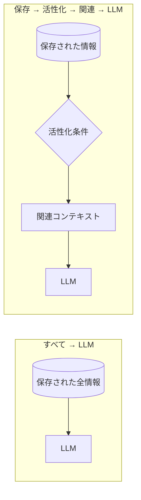

# すべてをコンテキストに詰め込むな

エンジニアがコンテキストウィンドウに向ける既定の姿勢は、ハムスターが餌皿に向ける姿勢と似ている。まず詰め込む、考えるのは後だ。会話履歴、ツール定義、検索された文書、記憶、ユーザープロフィール、例、ガードレール、過去の要約——すべて取っておき、すべてプロンプトに押し込み、あとはモデルに何とかさせろ、と。

前章（[ロールプレイは LLM をダメにするのか？](does-roleplay-make-llms-worse)）は、ペルソナは無料ではなく、オンデマンドで活性化されるべきだと論じた。その議論をもう五分考えてみると、落ち着かない一般化が浮かび上がる——ペルソナは混雑したパーティーの客の一人にすぎないのだ。本章は逆の既定姿勢を主張する。まずスローガン、次にアーキテクチャ：

> コンテキストは、ただ保存されるのではなく、活性化されるべきだ。

## ペルソナからコンテキスト工学へ

ペルソナ論証の形を思い出そう：

1. プロンプト内のすべては、一回の推論の有限な予算を分け合う；
2. タスクと無関係な内容は中核タスクを劣化させうる；
3. したがってペルソナの内容は、関連するときだけコンテキストに入るべきだ。

ここで気づいてほしい。この三段のどこにも、本質的にペルソナへ言及する箇所はない。「ペルソナの内容」を*記憶*、*文書*、*ツールの結果*、*ユーザーの履歴*、あるいは*昨日のデバッグ現場*に置き換えても、各段は依然として成り立つ。結論は、それを生んだ例よりはるかに大きい：

- タスクと無関係な情報は、既定でモデルのコンテキストに永久に住み着くべきではない；
- 情報は必要になったときに引き込まれるべきで、押し込まれて置き去りにされるべきではない。

二つのアーキテクチャを並べてみる：



左では、モデルがルーターを兼ねる。すべてを読み、何が重要か判断し、そして仕事をする——すべて同時に。右では、ルーティングはモデルの*前に*行われ、モデルは生き残ったものしか見ない。左のパイプラインは関連性の判断にモデルの容量を使う。右はその判断を安価な機械に渡す。

## 活性化条件を持つ記憶

「活性化は溜め込みに勝る」と決めたとたん、記憶は文字列のリストであることをやめ、構造化データになる。最低限役立つ記憶は、少なくとも自分が何についてのものか、そしていつ目を覚ますべきかを知っている：

```json
{
  "content": "ユーザーの誕生日は 8 月 15 日",
  "keywords": ["誕生日", "ケーキ", "パーティー"],
  "topics": ["個人", "日付"],
  "activation": {
    "date_range": "08-10 ~ 08-20"
  },
  "related_tasks": ["雑談", "ギフトの提案"]
}
```

この記憶は一年のうち十ヶ月は眠っている。8 月 10 日から 20 日の窓のあいだ、それはただ*そこに居る*。ユーザーが週末の予定に触れれば、すでにコンテキストの中にある——クエリは要らない。残りの期間はストレージを食うだけで、予算のトークンは一つも食わない。

この利得は過小評価されやすい。ユーザーが「もうすぐ誕生日なんだ」と言えば、いくつかの `if` 文が関連する記憶を活性化する——埋め込みの呼び出しも、検索の往復も要らず、肝心なのは「この記憶は関連するか？」を判断するための追加の LLM 呼び出しも要らないことだ。プログラムができるコンテキストルーティングを LLM に任せるべきではない。LLM が間違えるからではなく、プログラムなら無料で、決定論的に、毎回必ず正しくやってのけるからだ。

## ルールが通用しなくなる場所

すべての記憶にきれいなキーワードが付いていれば、ルーティングはとっくに解決済みの問題になっていた。そうではない。ユーザーがこう言ったとしよう：

> 「あと数日でまた一つ歳を取るんだ。」

どこにも「誕生日」はない。日付もない。事実は慣用表現を通じて*暗黙に*表現されており、保存された「8 月 15 日」の記憶との結びつきは、字面ではなく意味によって確立されなければならない。ルールベースのルーターは肩をすくめるだけだが、人間の聞き手は即座に理解する——人間は意味でルーティングするからだ。

慣用表現はまだ難しい方の端ですらない。多言語のユーザーは同じ意図を異なる表層形で表現する；暗黙の参照（「この前と同じ」）は名指しせずにある記憶を指す；複雑な連想（「前に旅行で提案してくれたあれに似てるけど、屋内のやつ」）は複数の保存項目にまたがって同時に推論することを要求する。どんな単層ルーターも、この空間のどこかで必ず失敗する。

答えはルールを捨てることではない。ルールをあるべき場所、すなわちはしごのいちばん安い段に置くことだ。

## ルーティングのはしご

| 段      | 手法                                                     | コスト                        | 得意                                                       | 苦手                                 |
| ------- | -------------------------------------------------------- | ----------------------------- | ---------------------------------------------------------- | ------------------------------------ |
| Level 0 | 決定論的ルール：キーワード、時間窓、型、タグ             | ≈0、純粋なコード              | 明示的な一致、日付で発火する事実、構造化されたイベント     | 暗黙の意味、言い換え、言語をまたぐ   |
| Level 1 | 従来の検索：全文検索、BM25、データベースクエリ           | 低い、高速、インデックス可能  | 語彙の重なり、既知の用語、ID、名前                         | 同義語、言葉の裏の意図               |
| Level 2 | 埋め込み検索                                             | 中程度、インデックス + ベクトル検索 | 意味的類似、言い換え、言語をまたぐずれ                 | マルチホップ、否定、新しさ           |
| Level 3 | LLM ルーティング、再ランキング、推論                     | 高コスト：遅延 + トークン     | 曖昧さ、複雑な関連性、仲裁、理由の提示                     | ほとんど何も——しかもその分を払う     |

登り方はエンジニアリングで最も古いルールだ：**まず安いものを試し、安いものが失敗したときにだけ高いものに金を払う。** 実際、よく養われたエージェントは、その圧倒的多数のアクティベーション判断を Level 0 で行う——誕生日、スケジュール、トピックタグ、明示的な言及。Level 1 と Level 2 が残りの大半を受け止める。Level 3 は時折の、意図的なエスカレーションであって、既定ではない。

コスト以外に、このはしごはもう一つ何かを買ってくれる：監査可能性だ。LLM より下の各層は決定論的で、少なくとも検査可能だ——ある記憶がなぜ発火したかを記録し、ルーターに単体テストを書き、モデルが見た正確なコンテキストを再現できる。関連性の判断をモデルに渡せば、コンテキストそのものが再現不能になる。それこそがエージェントのデバッグを悲惨にする元凶だ。安いルーティングはただ安いだけでなく、デバッグ報告を生み出す。

## 隔離の究極形態：サブエージェント

はしごが扱うのは*情報*だ。どの記憶、どの文書をコンテキストに入れるかを決める。だが、別の意味で難しいタスクもある。「何を入れるべきか」ではなく、「過程そのものが泥を製造する」のだ。探索的な検索は数万トークンの結果を引きずり戻す。デバッグのセッションは丸ごとのログと何版もの失敗したパッチを引き込む。数千行のファイルのうち九割が結論と無関係、ということもある。

昔のやり方は、泥をすべて主コンテキストに流し込み、モデルにぬかるみを歩かせる——前章で述べた拡散税を一括で支払う。代わりに、泥を歩く作業そのものを外注する手がある：

> まっさらな空白のコンテキストに、タスクそのものと最小限の材料だけを与えよ。ひとりでぬかるみを歩かせよ。持ち帰るのは蒸留された結論だけだ。

これがサブエージェントのパターンだ。主コンテキストは検索結果もログも一度も見ない——それらは主役ではなくサブエージェントの注意を消費する。サブエージェントが終了すると、その作業コンテキスト全体が破棄され、結論だけが生き残る。これが本章のスローガンのアーキテクチャ面での完成形だ。Level 0〜3 はモデルの*前に*情報を濾過し、サブエージェントは濾過できない泥を丸ごと使い捨てのコンテキストに封じ込める——隔離を突き詰めれば、濾過される対象はもはや記憶ではなく、作業現場そのものになる。

このコストには名前を付けておく価値がある。そしてこれは興味深いコストだ。隔離は諸刃なのだ。サブエージェントは親コンテキストから何も継承しない——会話の来歴も、あの「言わずもがなの暗黙」もない。タスク記述は自足していなければならない：目標、パス、制約、既知の知見、期待される出力、どれ一つ省けない。引き継ぎがどれだけ完全かで、隔離がどれだけ信頼できるかが決まる。だが主モデルに二万トークンの検索結果を `GROUP BY` させるより、その家賃はずっと安い。

## いくつかの算術

エージェントが $N$ 個の記憶を持ち、あるセッションが関連する $k$ 個だけに触れるとしよう。「全部詰め込む」設計は毎回の呼び出しで $N$ 個すべてに払う：より多くのトークン、より大きな遅延、より多くの金、加えて拡散税——無関係な素材を読むのに費やされる容量。「活性化する」設計はルーティング費（Level 0 ではほぼゼロ）と $k$ だけを払う。

$k \ll N$ のとき——長生きするエージェントではほとんど常にそうだ——活性化型アーキテクチャはすべての軸で同時に勝つ：より速く、より安く、そしてモデルが見るものは*タスクについて*のものになる。コンテキストをタスクに集中させることが、出力品質のためにできる最もてこの効く一手だ。

fount の着地点もここだ。情報は part とストアとしてプロンプトの外に住み、活性化条件が誰を同行させるかを決める。モデルが見るのは倉庫ではなく、作業台だ。

ここまで活性化されてきたものは、すべてあらかじめ保存されたものだ。だがモデルに渡すもののかなりの部分は*オンデマンドで計算される*：翻訳、要約、名前を完全な調書に展開する、など。そうした仕事はそもそもモデルに届くべきではない——[プログラムにやらせろ](let-the-program-do-it)。
