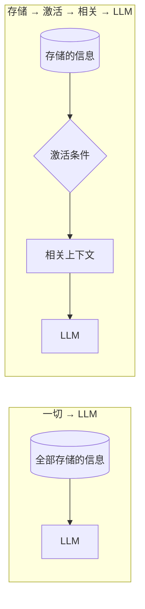

# 别把所有东西都塞进上下文

工程师面对上下文窗口的默认姿态，和仓鼠面对食盆差不多：先塞满再说。对话历史、工具定义、检索文档、记忆、用户画像、示例、护栏、过往摘要——全都留着，全都塞进提示词，让模型自己看着办。

上一篇（[角色扮演会让 LLM 干不好正事吗？](does-roleplay-make-llms-worse)）论证了人格不是免费的，应当按需激活。这个论证只要多想五分钟，一个令人不安的推广就会浮出水面——因为 persona 只是拥挤派对上的一位客人而已。本章主张相反的默认姿态，先给一句口号，再给一个架构：

> 上下文应当被激活，而不是被囤积。

## 从 persona 到上下文工程

回顾 persona 论证的形状：

1. 提示词里的一切共享一次推理的有限预算；
2. 任务无关的内容可能降低核心任务表现；
3. 所以 persona 内容应当只在相关时进入上下文。

现在注意：这三步没有任何一步特别提到 persona。把「persona 内容」换成记忆、文档、工具结果、用户历史或昨天的调试现场，每一步依然成立。结论比引出它的例子大得多：

- 任何任务无关的信息，都不应该默认永久驻留在模型上下文里；
- 信息应当在被需要时被拉进来，而不是被推进去然后一直留在那里。

两种架构，并排放着：



左边，模型兼任路由器：它必须读完一切、判断什么重要、然后干活——全部同时进行。右边，路由发生在模型*之前*，模型只拿到幸存者。左边的管线把模型容量花在相关性判断上；右边把这个判断交给廉价的机器。

## 带激活条件的记忆

一旦决定「激活优先于囤积」，记忆就不再是一列字符串，而开始成为结构化数据。一条最低限度可用的记忆，至少知道自己关于什么、什么时候该醒来：

```json
{
  "content": "用户的生日是 8 月 15 日",
  "keywords": ["生日", "蛋糕", "聚会"],
  "topics": ["个人", "日期"],
  "activation": {
    "date_range": "08-10 ~ 08-20"
  },
  "related_tasks": ["闲聊", "礼物建议"]
}
```

这条记忆一年里有十一个月处于休眠。在 8 月 10 日到 20 日的窗口里，它就简单地*在场*：用户提到周末安排时，它已经在上下文里了，连查询都省了。其余时间它只占存储，不占任何预算。

收益很容易被低估。用户说「我快生日了」，几条 `if` 语句就能激活相关记忆——不需要 Embedding 调用，不需要检索往返，最关键的是：不需要再调用一个 LLM 去判断「这条记忆是否相关」。能由程序完成的 Context Routing，就不应该浪费 LLM。不是因为 LLM 会做错，而是因为程序免费、确定、每一次都对。

## 规则会失灵的地方

如果每条记忆都自带干净的关键词，路由早就成了已解决的问题。可惜不是。设想一位用户说：

> 「我过几天又要长一岁了。」

这句话里没有「生日」，也没有日期。事实通过习语被*隐含*地表达，它与「8 月 15 日」那条记忆之间的联系必须经由语义建立，而不是字面匹配。规则式路由只能耸肩，人类听众瞬间就懂——因为人类按语义路由。

习语还不是最难的。多语言用户会用不同的表层形式表达同一意图；隐式指代（「跟上次一样」）不点名地指向某条记忆；复杂关联（「类似你上次为旅行提议的那个，但要室内的」）需要同时对多条存储内容做推理。任何单层路由器都会在这个空间里的某处失灵。

答案不是抛弃规则，而是让规则待在它该在的位置：梯子上最便宜的第一级。

## 路由阶梯

| 层级 | 方法 | 成本 | 擅长处理 | 失效场景 |
| --- | --- | --- | --- | --- |
| Level 0 | 确定性规则：关键词、时间窗口、类型、标签 | ≈0，纯代码 | 显式匹配、日期触发的事实、结构化事件 | 隐含语义、换一种说法、跨语言 |
| Level 1 | 传统搜索：全文检索、BM25、数据库查询 | 低，快、可索引 | 词汇重叠、已知术语、ID、名称 | 同义改写、措辞背后的意图 |
| Level 2 | Embedding 检索 | 中等，需建索引 + 向量检索 | 语义相似、同义改写、跨语言偏移 | 多跳关联、否定、时效性 |
| Level 3 | LLM 路由、重排序、推理 | 昂贵，延迟 + token | 歧义、复杂相关性、仲裁、给出理由 | 几乎没有——但你为它付钱 |

攀爬策略是工程学的老规矩：**先试便宜的，只有便宜的方法失效时才为昂贵的付钱。**实践中，一个喂养得当的 agent，绝大多数激活决策发生在 Level 0——生日、日程、主题标签、显式提及。Level 1 和 Level 2 接住其余的大部分。Level 3 是少见的、深思熟虑的升级手段，不是默认选项。

除了省钱，这套阶梯还买到一样东西：可审计。LLM 之下的每一层都是确定性的，或至少是可检视的——你可以记录某条记忆为何被触发、给路由器写单元测试、复现模型看到的上下文。把相关性判断交给模型，上下文本身就变得不可复现，而不可复现的上下文恰恰是 agent 调试痛苦的根源。廉价路由不只是便宜，它还能出调试报告。

## 隔离的终极形态：subagent

路由阶梯处理的是*信息*：决定哪些记忆、哪些文档进入上下文。但有些任务的困难不在「该放进什么」，而在「过程本身会制造大量烂泥」：一次探索性检索会带回几万 token 的搜索结果；一次调试会拖进整段日志和几版失败的补丁；读一份几千行的文件，九成内容与结论无关。

老办法是把烂泥整个倒进主上下文，让模型自己蹚过去——上一篇描述的那笔弥散税一次交清。另一种做法，是把蹚泥这件事整个外包出去：

> 给一个全新的、空白的上下文，只交代任务本身和最少量的材料，让它独自在烂泥里蹚完，最后只把蒸馏过的结论带回来。

这就是 subagent 模式。主上下文自始至终没见过那些搜索结果、那些日志——它们消费的是 subagent 的注意力。subagent 终止时，它的整个工作上下文随之销毁，只有结论幸存。这是本章口号在架构层面的完成式：Level 0–3 在模型*之前*过滤信息，subagent 则把无法过滤的烂泥整个关进一次性的上下文——隔离到最后，过滤对象不再是哪条记忆，而是整个工作现场。

代价也要说清楚，而且这个代价很有意思：隔离是双向的。subagent 不继承父级上下文的任何东西——没有对话的来龙去脉，也没有那些「不必写出来的默契」。任务描述必须自足：目标、路径、约束、已知发现、期望的产出，一样都不能省。交接写得多完整，隔离就有多可靠。但比起让主模型在两万 token 的检索结果里做 `GROUP BY`，这笔租金便宜得多。

## 一笔算术

假设 agent 存有 $N$ 条记忆，某次会话只触及相关的 $k$ 条。「全都塞进去」的设计每次调用都为全部 $N$ 条付费：更多 token、更多延迟、更多钱，外加弥散税——容量花在读无关材料上。「按需激活」的设计只付路由费（Level 0 时接近零）加 $k$。

如果 $k \ll N$——长寿的 agent 里几乎总是如此——激活式架构就在每一个坐标轴上同时获胜：更快、更便宜，而且模型看到的上下文*是关于任务的*。让上下文聚焦于任务本身，是你为输出质量能做的杠杆率最高的一件事。

fount 的落点也在这里：信息以 part 和存储的形式生活在提示词之外，激活条件决定谁随行。模型看到的是一个工作台，不是一座仓库。

到目前为止，被激活的都是预先存储好的东西。但交给模型的相当一部分内容是*按需计算的*：翻译、摘要、把一个名字展开成完整档案。这类活根本不该劳驾模型——[让程序来做](let-the-program-do-it)。
