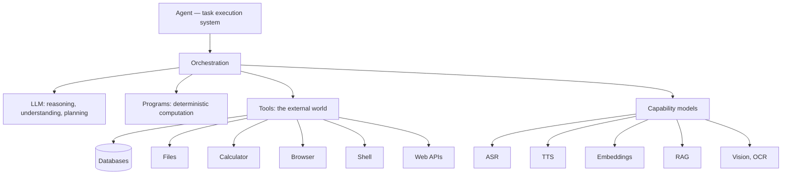

# The LLM Is Not the Agent

The previous chapter took the LLM off the agent's throne: it is a cognitive ability the system can call, not the agent itself (see [Why fount Agents Are Not Chatbots](agents-are-not-chatbots)). Said the other way round, that claim is a compliment — the LLM has earned two positions inside the system that nothing else can fill. This chapter describes both jobs, then hands over its blacklist: the work it ruins the moment it touches.

## Job one: translating human speech into executable structure

People express goals in unstructured language; machines execute structured operations. Something has to translate between the two, and that translation is a thoroughly cognitive task — a capability that, for the entire history of computing until very recently, did not exist.

Take a request a human would actually make: `zip up every JS file I changed yesterday and send it to Xiaoming.` No GUI menu matches that sentence. No CLI command takes it as an argument. The LLM turns it into a goal and a sequence of steps:

```text
Input: "Zip up every JS file I changed yesterday and send it to Xiaoming."

Goal: deliver yesterday's modified JS files to Xiaoming

Steps: 1. list files modified in the last 24 hours
       2. filter to *.js
       3. bundle the matches
       4. resolve the contact "Xiaoming"
       5. send the archive
```

Then it translates the steps into operations a machine can actually run:

```js
const changed = await fs.findModifiedSince(yesterday)  // query files
const js      = changed.filter(f => f.ext === ".js")   // filter by extension
const bundle  = await zip.create(js, "daily-js.zip")   // bundle
const peer    = await contacts.lookup("Xiaoming")      // resolve contact
await transfer.send(peer, bundle)                      // send
```

Until recently, this translation required a human sitting at the interface, clicking and typing. That is the genuinely revolutionary part. But notice what the example quietly reveals: of the five steps, only one requires cognition — understanding the request, sketching the plan. Listing, filtering, zipping, contact lookup, sending: all deterministic. Keep that asymmetry in mind; two sections from now it becomes a principle.

## Job two: thinking where nothing can be computed

Some problems have no closed-form solution: analysing code, understanding language, divining what a user actually wants, planning, weighing conflicting options, working with partial information, creating. Their common structure: the answer cannot be *computed*, only *thought* by something with the power to generalise. That is cognition, and the LLM supplies it on demand.

### Cognitive-as-a-Service

A neutral name for this arrangement: cognitive compute. Reading, planning, writing, judging — chunks of human cognition are now packaged as a metered service, priced per token. Philosophically this is an odd and far-reaching development. Not long ago, this was the irreducible human contribution to knowledge work; now it has a unit price, an SLA, and rate limits.

It is worth being blunt about what exactly got abstracted. Before the LLM, intelligence was never priced on its own — it always shipped bundled. A company hiring a knowledge worker was buying cognition but paying for a whole person: sick leave, holidays and pension contributions included. The capability was welded to a life and sold together with it. What the LLM did, at bottom, was prise intelligence out of the person, package it, and put it on the shelf. For the first time, capital can buy intelligence itself without also keeping a whole human alive.

The comparison is stark, and worth putting on the table. Hiring a human expert is a subscription: the salary includes their holidays, their sick days, their entire life — and "how smart they are" is never written into the contract. Renting an LLM is metered: unused, it never appears on the bill; capability upgrades with versions instead of depreciating from the day of hire; benchmark scores are in writing. For procurement purposes, these are not the same species.

The ledger has a other side, though. A human expert comes with judgement and responsibility — above all, with the standing to *answer for consequences*, which metered intelligence does not include. So the layer that answers for consequences must be the agent system itself; it cannot be outsourced to the model. That sentence gets used repeatedly later on ([Cage the Power](cage-the-power) is built entirely on top of it).

Whatever one makes of this philosophically, architecturally it is clarifying. If cognition is a metered utility, the agent is the customer — and a sensible customer does not buy electricity to run a hand-cranked calculator.

## The blacklist

Which yields the principle:

> Prefer deterministic computation for deterministic problems; call the LLM only where cognition is genuinely needed.

`123456 × 789012`. "What date is next Wednesday?" "Copy these files." Sorting, hashing, regex, permission checks, database queries. Handed to a model, each of these is a small gamble; handed to a program, each is a library call. Even when the model happens to be right, it is slower, more expensive and harder to audit than a function that is correct by construction. The full comparison table, and the six budgets behind it, get their own chapter in [Let the Program Do It](let-the-program-do-it).

## The same goes for the other models

Once you stop equating the agent with the LLM, a family of similar mistakes becomes visible. Each of the following performs exactly one well-defined transformation:

- **ASR**: speech to text;
- **TTS**: text to speech;
- **Embedding**: text to vectors;
- **RAG**: given a query, fetch information;
- **Vision models**: image understanding;
- **OCR**: text in images.

Each is a capability module the agent can call, in exactly the way it calls the LLM. None of them is "the agent". "An agent is just an LLM with ears and a voice" commits the same category error as "an agent is an LLM" — with better audio quality.

## An honest architecture diagram

All the parts, in one picture, with the agent — the task system — at the centre:



Here the LLM is one node among several, invoked through orchestration like everything else. It is not at the centre, because the centre is the task. Taken apart by component:

| Component | What it contributes |
| --- | --- |
| Orchestration | Task decomposition, decisions, ordering, failure recovery |
| Programs | Deterministic computation |
| Tools | Effects on the external world |
| Models | Cognitive and perceptual abilities, LLM included |
| State | Task state, artefacts, memory |

## The whole argument in one line

> Agent ≠ LLM. Agent = orchestration + programs + tools + models + state.

The LLM has earned its place in that sum: it lets the rest of the system speak human and think where nothing can be computed. But a sum is not governed by one of its terms. The hard part is judging, step by step, whether a given step needs cognition or only computation — how to make that judgement, and what it saves, is the subject of [Let the Program Do It](let-the-program-do-it).
