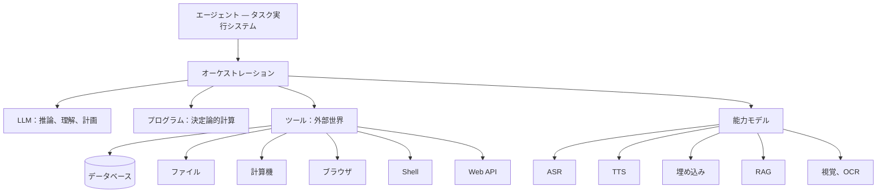

# LLM はエージェントではない

前章は LLM をエージェントの王座から降ろした。それはシステムが呼び出せる認知能力であって、エージェントそのものではない（[fount のエージェントはなぜチャットボットではないのか](agents-are-not-chatbots) を参照）。逆から言えば、この主張は褒め言葉になる——LLM はシステムの中で、他の何にも埋められない二つの地位を勝ち取った。本章ではこの二つの仕事を述べ、その後でブラックリストを引き渡す。触れた途端に台無しになる仕事のリストだ。

## 仕事一：人間の言葉を実行可能な構造に翻訳する

人間は目標を非構造化言語で表現し、機械は構造化された操作を実行する。その間に何かが翻訳しなければならず、この翻訳は徹底的に認知的なタスクだ——計算の歴史の中で、ごく最近まで存在しなかった能力である。

人間が実際に口にするであろう要求を一つ：`昨日変更した JS ファイルを全部 zip にまとめて、Xiaoming に送って。` この文に一致する GUI メニューはない。これを引数として受け取る CLI コマンドもない。LLM はこれを目標と一連のステップに変換する：

```text
入力："昨日変更した JS ファイルを全部 zip にまとめて、Xiaoming に送って。"

目標：昨日変更した JS ファイルを Xiaoming に届ける

ステップ：1. 直近 24 時間に変更されたファイルを列挙する
      2. *.js に絞り込む
      3. 該当するファイルをまとめる
      4. 連絡先「Xiaoming」を解決する
      5. アーカイブを送信する
```

続いてステップを、機械が実際に走らせられる操作に翻訳する：

```js
const changed = await fs.findModifiedSince(yesterday); // ファイルを照会
const js = changed.filter((f) => f.ext === '.js'); // 拡張子で絞り込む
const bundle = await zip.create(js, 'daily-js.zip'); // まとめる
const peer = await contacts.lookup('Xiaoming'); // 連絡先を解決する
await transfer.send(peer, bundle); // 送信する
```

つい最近まで、この翻訳にはインターフェースの前に座ってクリックしタイプする人間が必要だった。ここが本当に革命的な部分だ。だが、この例が静かに明かしていることに注意してほしい。五つのステップのうち、認知を要するのは一つだけ——要求を理解し、計画を描くこと。列挙、絞り込み、圧縮、連絡先の照会、送信はすべて決定論的だ。この非対称性を覚えておいてほしい。二つ先の節で、それは原則になる。

## 仕事二：計算できないところで考える

閉じた解を持たない問題がある。コードを分析する、言語を理解する、ユーザーが本当に何を望んでいるか見抜く、計画を立てる、相反する選択肢を秤にかける、不完全な情報で作業する、創造する。それらの共通構造はこうだ。答えは*計算*できず、汎化する力を持つ何かによって*考えられる*しかない。それが認知であり、LLM が必要に応じて供給する。

### 認知 as a Service

この取り決めに中立的な名前をつけよう：認知コンピュート。読む、計画する、書く、判断する——人間の認知の断片は今や従量課金のサービスとしてパッケージ化され、トークン単位で値付けされている。哲学的には奇妙で影響の大きい発展だ。つい最近まで、これは知識労働への還元不能な人間の寄与だった。今では単価があり、SLA があり、レート制限がある。

「何が抽象化されたのか」について率直に言う価値がある。LLM 以前、知能が単独で値付けされたことはなかった——常に束ねて流通していた。企業が知識労働者を雇うとき、買っているのはその人の認知だが、支払うのは人間一人分の値段だ。病欠、休暇、年金まで込みで。能力は生命に溶接され、生命ごと売られていた。LLM がやったことの本質は、知能を人間からこそぎ取り、単独でパッケージ化し、棚に並べたことだ。資本は初めて、一人の人間を丸ごと養いながらでなく、知能そのものを買えるようになった。

この対比は際どく、テーブルに載せる価値がある。人間の専門家を雇うのはサブスクリプションだ。給料にはその人の休暇、病欠、人生そのものが含まれ、そして「その人がどれだけ賢いか」は契約書に決して書かれない。LLM を借りるのは従量制だ。使わなければ請求書に現れず、能力は入社日から減価するのではなくバージョンとともに上がり、ベンチマークの点数は書面になっている。調達の意思決定にとって、両者は同じ種ではない。

ただし帳簿にはもう片面がある。人間の専門家には判断力と責任が付いてくる——何より、*結果に責任を負う資格*が。従量制の知能にはそれが含まれない。だから結果に責任を負う層は、エージェントシステム自身でなければならない。モデルに外注することはできない。この一文は後で繰り返し使う（[権力を檻に閉じ込める](cage-the-power) はその上に丸ごと建っている）。

哲学的にどう評価するにせよ、アーキテクチャ上は明快だ。認知が従量制のユーティリティなら、エージェントは顧客である——そして分別のある顧客は、手回し計算機を動かすために電気を買ったりしない。

## ブラックリスト

そこからこの原則が出る：

> 決定論的な問題には決定論的な計算を優先し、本当に認知が必要なところでだけ LLM を呼べ。

`123456 × 789012`。「次の水曜日はいつか」。「このファイルをコピーして」。ソート、ハッシュ、正規表現、権限チェック、データベースクエリ。これらはモデルに渡せばどれも小さな賭けになり、プログラムに渡せばどれもライブラリ呼び出しになる。たとえモデルがたまたま正しくても、構造上正しい関数より遅く、高く、監査しにくい。完全な比較表と、その背後にある六つの予算は、[プログラムにやらせろ](let-the-program-do-it) で独立した章になる。

## 他のモデルも同じ

エージェントと LLM を同一視するのをやめると、同種の誤りの一族が見えてくる。以下のそれぞれは、正確に一つのよく定義された変換を行う：

- **ASR**：音声からテキストへ；
- **TTS**：テキストから音声へ；
- **埋め込み**：テキストからベクトルへ；
- **RAG**：クエリを与えられ、情報を取得する；
- **視覚モデル**：画像理解；
- **OCR**：画像中の文字。

それぞれがエージェントの呼び出せる能力モジュールで、LLM を呼ぶのとまったく同じ仕方で呼ばれる。どれも「エージェントそのもの」ではない。「エージェントとは耳と声の付いた LLM にすぎない」は、「エージェントとは LLM だ」と同じカテゴリー錯誤を犯している——音質が良いだけだ。

## 正直なアーキテクチャ図

すべての部品を一枚の絵に、エージェント——タスクシステム——を中心に置く：



ここで LLM はいくつかあるノードの一つで、他のすべてと同様にオーケストレーションを通じて呼び出される。中心にはない。中心はタスクだからだ。部品ごとに分けてみると：

| 部品                 | 何を担うか                                                 |
| -------------------- | ---------------------------------------------------------- |
| オーケストレーション | タスク分解、意思決定、順序付け、失敗からの回復             |
| プログラム           | 決定論的計算                                               |
| ツール               | 外部世界への作用                                           |
| モデル               | 認知能力と知覚能力、LLM を含む                             |
| 状態                 | タスク状態、成果物、記憶                                   |

## 論証全体を一行で

> エージェント ≠ LLM。エージェント = オーケストレーション + プログラム + ツール + モデル + 状態。

LLM はこの和の中で自分の居場所を勝ち取った。システムの残りが人間の言葉を話し、計算できないところで考えることを可能にするからだ。だが和はその一項に支配されない。難しいのは、一歩一歩、そのステップが認知を要するのか計算だけで足りるのかを判断することだ——その判断の仕方と、それがどれだけ節約するかは、[プログラムにやらせろ](let-the-program-do-it) の主題である。
