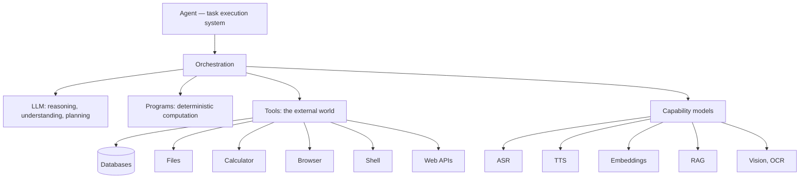

# LLM 不是 Agent

上一章把 LLM 从 Agent 的王座上请了下来：它是系统可调用的一种认知能力，不是 Agent 本身（见[为什么 fount 的 Agent 不是聊天机器人](agents-are-not-chatbots)）。这话反过来说更诚实——LLM 在系统里挣到了两个谁也替代不了的职位。本章把这两个职位写清楚，然后给出它的禁单：那些它一接手就出事的活。

## 职位一：把人话翻译成可执行结构

人类用非结构化的语言表达目标，机器执行结构化的操作。总得有东西把前者翻译成后者，而这个翻译是彻头彻尾的认知任务——计算史上直到最近才真正可用的一种能力。

看一个人类真的会说出来的请求：`把昨天修改过的所有 JS 文件打包，然后发给小明。`没有哪个 GUI 菜单对应这句话，也没有哪条 CLI 命令能把它当参数吃下去。LLM 把它翻译成一个目标加一串步骤：

```text
输入："把昨天修改过的所有 JS 文件打包，然后发给小明。"

目标：把昨天修改过的 JS 文件交付给小明

步骤：1. 列出最近 24 小时内修改过的文件
      2. 筛选出 *.js
      3. 把筛出的文件打包
      4. 解析联系人「小明」
      5. 发送压缩包
```

再把步骤翻译成机器真正能跑的操作：

```js
const changed = await fs.findModifiedSince(yesterday)  // 查询文件
const js      = changed.filter(f => f.ext === ".js")   // 按扩展名筛选
const bundle  = await zip.create(js, "daily-js.zip")   // 压缩打包
const peer    = await contacts.lookup("Xiaoming")      // 获取联系人
await transfer.send(peer, bundle)                      // 发送文件
```

过去这一步需要一个真人坐在界面前又点又敲。这是这项技术真正革命性的地方。但请注意这个例子里悄悄露出的另一件事：五个步骤中只有一步需要认知——理解请求、勾画计划。列文件、筛选、压缩、查联系人、发送，全是确定性操作。记住这个不对称，它很快会变成一条原则。

## 职位二：在无解可算处思考

有些问题没有闭式解：分析代码、理解自然语言、判断用户真实的意图、规划方案、在互相冲突的候选间权衡、处理残缺模糊的信息、创作。它们的共同结构是：答案无法被「算」出来，只能被一个具备泛化能力的东西「想」出来。这就是认知，LLM 按需供应它。

### 认知即服务

给这种安排起个中性的名字：认知计算资源。阅读、规划、写作、判断——这些人类认知活动被封装成了按量计费的服务，按 token 收费。这在哲学上是个奇怪而影响深远的进展：不久之前还是知识工作中不可还原的人类贡献的那个东西，如今有了单价、有了 SLA、有了限流。

值得把「抽象出了什么」说得更直白些。在 LLM 之前，智能从来没有被单独标价过——它总是捆绑着交付：企业雇一名知识工作者，买的是他的认知，付的却是整个人的价格，病假、假期、退休金全都在内。LLM 做的事，本质上是把智能从人身上抽象出来、单独封装、上架出售。资本第一次可以只购买智能本身，不必顺带养一个完整的人。

对比是刺眼的，但值得摆上桌。雇一名人类专家是包月制：月薪里含着他的假期、他的病假、他的整个生活，而且「他有多聪明」从来写不进合同。租一个 LLM 是计量制：不用就不出现在账单上，能力随版本升级而非入职之日起缓慢折旧，benchmark 分数白纸黑字。对采购决策而言，这两个东西不属于同一个物种。

这笔账还有另一面：人类专家随附判断力与责任心，尤其是**为后果负责的资格**——这恰恰是按 token 出租的智能不随附的。所以在 Agent 里，为后果负责的那一层必须是系统自己，不能外聘给模型。这句话后面会反复用到（[把权力关进笼子里](cage-the-power)整章都建立在它上面）。

无论哲学上如何评价，在架构上它是澄清性的：如果认知是按量租用的公用事业，Agent 就是客户。一个清醒的客户，不会买电来手摇计算器。

## 禁单

于是有了这条原则：

> 确定性问题优先使用确定性计算；只有在真正需要认知能力时，才调用 LLM。

`123456 × 789012`、「下周三是哪天」、「把这些文件复制一下」、排序、哈希、正则、权限检查、数据库查询——这些活交给模型，每一次都是一次小小的赌博；交给程序，每一次都是一次库调用。就算模型碰巧对了，它仍然比构造上就正确的程序更慢、更贵、更难审计。完整的对照表和它背后的六种预算账，在[让程序去做](let-the-program-do-it)里专门展开。

## 其他模型同理

一旦不再把 Agent 等同于 LLM，一族同类的错误就显形了。下面每个模型都只做一次定义良好的转换：

- **ASR**：语音转文本；
- **TTS**：文本转语音；
- **Embedding**：文本转向量表示；
- **RAG**：给定查询，获取信息；
- **Vision Model**：图像理解；
- **OCR**：识别图中的文字。

每一个都是 Agent 可以调用的能力模块，和它调用 LLM 的方式一模一样，没有一个是「Agent 本身」。「Agent 就是一台长了耳朵和嗓子的 LLM」，与「Agent 就是 LLM」犯的是同一个范畴错误，只是音质更好。

## 一张诚实的架构图

把所有部件放进一张图，Agent——任务系统——在中心：



LLM 在这张图里是若干节点中的一个，和其他一切一样经由 orchestration 被调用。它不在中心，因为中心是任务。按部件拆开看：

| 部件 | 贡献什么 |
| --- | --- |
| Orchestration | 分解任务、决策、排序、失败恢复 |
| Programs | 确定性计算 |
| Tools | 对外部世界的作用 |
| Models | 认知与感知能力，LLM 包含在内 |
| State | 任务状态、产物、记忆 |

## 一行字

> Agent ≠ LLM。Agent = orchestration + programs + tools + models + state。

LLM 在这个和式里挣得了自己的位置：正是它让系统的其余部分能说人话、能在无解可算处思考。但和式不会被其中一项支配。真正难的是逐步骤地判断「这一步需要认知，还是只需要计算」——这个判断怎么做、它省钱省到什么程度，见[让程序去做](let-the-program-do-it)。
