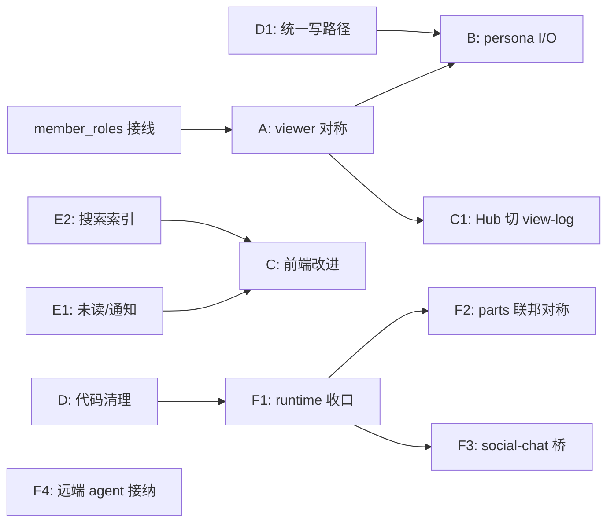

# Chat / Social 开发规划

生成时间：`2026-07-08`

## 定位与输入

本文档是 chat / social 两个 shell 的中期开发总纲，整合以下四份调研的结论，并以 `2026-07-08` 的代码现状重新核实过每一条事实：

- [chat-social-agent-ecosystem-report.md](../review/chat-social-agent-ecosystem-report.md)：三代 chat/social 生态定位对比
- [world-viewer-chatlog-parity.md](../review/world-viewer-chatlog-parity.md)：world viewer 对称模型设计
- [persona-human-io-parity-design.md](../review/persona-human-io-parity-design.md)：persona 劫持真人 I/O 设计
- [social-chat-production-readiness.md](../review/social-chat-production-readiness.md)：生产成熟度评估

一句话总纲：

**chat 的底盘（联邦/DAG/加密/归档）已经成型，接下来的主线是把"视角"（world/persona/viewer）和"运行时"（prompt/provider/tool loop）收回宿主；social 的主线是把读路径从"现算扫描"升级为"持久索引"，并补齐治理与远端 agent 接纳。**

---

## 一、现状快照（已核实）

### chat

| 事实 | 证据 |
| --- | --- |
| Hub 读消息走 `readChannelMessagesForUser()`，返回 `{ messages, reactions }`，**无任何 world/persona 视图过滤** | `src/group/queries.mjs`、`src/group/routes/channelMessages.mjs` |
| Hub 发消息走 `postChannelMessage()` 直接落 DAG，**落盘前无 persona/world 钩子** | `src/chat/channel/postMessage.mjs` |
| world 仅在 agent 生成路径有 `GetChatLogForCharname`；human 看 raw 物化视图 | `src/chat/session/chatRequest.mjs` L172-173 |
| `member_roles` 在 `chatReplyRequest` 中**恒为空数组**，导致 `prompt_struct` 里基于角色的 visibility 过滤实际无效 | `chatRequest.mjs` L125/L159、`src/prompt_struct/index.mjs` L209 |
| `userAPI.chat.GetChatLog` 悬空零调用；`WorldAPI.chat.GetCharReply` 悬空零调用 | `src/decl/userAPI.ts`、`src/decl/worldAPI.ts` |
| `remoteWorldProxy` 缺 `GetPrompt` / `TweakPrompt` / `GetGroupPrompt` / `GetCharReply` / `MessageEditing` | `src/chat/federation/remoteWorldProxy.mjs` |
| runtime 主链（`buildPromptStruct` → `AIsource.StructCall` → plugin `ReplyHandler` loop）仍在 char 模板侧；shell 只调 `char.GetReply(request)` | `src/chat/session/triggerReply.mjs` L227、char 模板 `main.mjs` |
| 存在**双写路径**：Hub `postChannelMessage`（DAG-first）与 session `addUserReply`/`addChatLogEntry`（chatLog-first + mirror），钩子与自动回复触发点不一致 | `postMessage.mjs` vs `src/chat/session/messages.mjs` + `chatLogAppend.mjs` |
| 频道 HTTP edit/delete 走 DAG mutation，不经过 session 层的 world/user `MessageEdit/Delete` 钩子——同一"编辑消息"有两套语义 | `channelMessages.mjs` vs `session/messages.mjs` |
| 搜索是纯前端子串过滤，无后端索引 | `public/hub/wireHeaderEvents.mjs`、`channelMessageStore.mjs` |
| 无服务端未读/已读持久化；通知仅浏览器 `Notification` | `public/hub/hubNotifications.mjs`、`src/chat/lib/userGroups.mjs`（注释有 unread 字段但未实现） |
| `public/llms.txt` 多处漂移：文档化了不存在的 `POST /groups/:groupId/message`、`trigger-reply` 路由；RPC memberId 格式与实现不一致；`batch-get` 未文档化 | `public/llms.txt` |

### social

| 事实 | 证据 |
| --- | --- |
| 通知为后端现算（遍历 known owners 全量物化+扫描）+ 前端 `localStorage` 已读水位，无服务端 inbox | `src/notifications.mjs`、`public/src/views/notifications.mjs` |
| 搜索/趋势/回复列表均为"遍历 timeline + 物化 + 扫描"，无共享增量索引 | `src/search.mjs`、`src/trending/hashtags.mjs`、replies 路径 |
| 无举报/审核队列/内容警告/NSFW/mute；已有 follow/block/hide/follow-approve/信誉过滤/节点 denylist | `src/endpoints/relationships.mjs`、`src/personalBlock.mjs` |
| 远端非本机托管 agent 的 timeline ingress **被明确拒绝**——缺跨节点 `nodeHash → operator` 身份链 | `test/integration/timeline_ingress.test.mjs` L227-237 |
| agent 接入走 `interfaces.social`（OnMention/OnFollow/OnFollowerUpdate）独立小链路，不经 chat 的 prompt_struct/runtime；类型注释声称"未实现 OnMention 时回退 chat.GetReply"但**运行时未实现该回退** | `src/dispatch.mjs`、`src/lib/charSocial.mjs`、`src/decl/socialAPI.ts` |
| social↔chat 桥接仅有前端深链（DM 跳转、群链接、共享 markdown 库），无后端结构化桥 | `public/shared/runUri.mjs`、`groupRef.mjs` |
| WS live 测试仅验证连接+hello；WS 推送后前端整页 reload feed，无增量更新 | `test/live/scripts/ws.mjs`、`public/src/init.mjs` |
| 前端无乐观更新、互动错误多静默降级、profile/explore/通知无分页加载 | `public/src/views/*` |

---

## 二、工作流 A：世界视角对齐（viewer 对称模型）

目标：**world 能对 agent 做的视图操作，对 human 同样生效**。消灭"agent 看 world-filtered view、human 看 raw view"的隐性人类优待。方案采用 [world-viewer-chatlog-parity.md](../review/world-viewer-chatlog-parity.md) 的方案 B。

### A1. 模型层

- `src/decl/chatLog.ts`（或 worldAPI.ts）新增 `chatViewer_t`：

```ts
type chatViewer_t = {
	kind: 'user' | 'char'
	memberId: string      // 统一主键，entity hash 语义，不再以 username/charname 当身份
	ownerUsername: string
	channelId: string
	charname?: string     // 本地 char viewer 兼容辅助
	roles?: string[]
	entityHash?: string
}
```

- `WorldAPI.chat` 新增 `GetChatLogForViewer(arg, viewer)`；`GetChatLogForCharname` 降级为 legacy sugar（decl 注释标注，不删）。
- **不新增** `GetChatLogForUsername`。仓库内没有任何 world 实现过它，没有兼容包袱，直接跳过过渡态。

### A2. 统一分发

- shell 内新增 `applyWorldChatLogView(arg, viewer)`（建议放 `src/chat/session/viewerLog.mjs`）：优先 `GetChatLogForViewer`，char viewer 回退 `GetChatLogForCharname`，否则透传。
- `getChatRequest()` 中现有的 charname 特判（`chatRequest.mjs` L172-173）改为构造 `viewer = { kind: 'char', ... }` 后走统一分发。
- `rpcDispatcher.mjs` 与 `remoteWorldProxy.mjs` 同步补 `GetChatLogForViewer` 的 RPC 代理。

### A3. human 对称读口

- 新增 `materializeViewerChatLog(groupId, channelId, viewer, options)`：读底层消息 → hydrate 成 `chatLogEntry_t[]`（复用 `buildChatLogEntriesFromChannelLines`）→ 附 sidecar/logContext → `applyWorldChatLogView` → 可选 persona 过滤（见工作流 B）→ 投影 UI DTO。
- 新增 endpoint `GET .../channels/:channelId/view-log`，返回 viewer 化后的消息 DTO（需要携带 reactions/pins 等 Hub 现有 DTO 字段，或由前端分开取）。
- **raw 的 `GET .../messages` 保留**，供治理/调试/审计使用。
- Hub 主聊天视图（`messageRefresh.mjs` 的 `loadMessages()`）切到 view-log 读口。切换时机放在 A2 稳定之后，因为要处理 reactions/streaming 占位/投票汇总等 DTO 差异。

### A4. member_roles 接线（顺道修复）

viewer 化本身依赖角色语义可用。DAG 物化的 `state.members[memberKey].roles` 已存在，`getChatRequest()` 构造时把真实 roles 注入 `member_roles` 与 `extension.member_roles`，让 `prompt_struct` 里的 visibility 过滤真正生效。这是一个独立小改动，可最先做。

### 验收

- world 实现 `GetChatLogForViewer` 后，同一条隐藏规则对 agent prompt 和 Hub human 视图同时生效（集成测试：一个测试 world 对特定 viewer 隐藏某消息，断言 char 的 chat_log 与 view-log API 都看不到）。
- 老 world（只实现 `GetChatLogForCharname`）在 agent 路径行为不变。
- raw messages API 输出不变。

---

## 三、工作流 B：Persona 加固（human I/O parity）

目标：persona 从"给 AI 看的用户设定 + 展示身份"升级为**真人输入/输出链路的一等中间层**。方案采用 [persona-human-io-parity-design.md](../review/persona-human-io-parity-design.md)，依赖工作流 A 的 viewer 抽象。

### B1. 输入侧：`BeforeUserSend`

- `userAPI.chat` 新增：

```ts
BeforeUserSend?: (ctx: {
	groupId: string, channelId: string,
	username: string, personaname?: string, memberId: string,
	input: channelMessageContent_t, files?: file_t[],
}) => Promise<{ input?, files?, reject? } | undefined>
```

- 接入点：`postChannelMessage()` 落 DAG 之前（`src/chat/channel/postMessage.mjs`）。返回 `reject` 时 HTTP 4xx；返回改写内容则以改写后内容继续。
- 所有声明"human send"的入口统一走这里。注意遗留 CLI 路径 `actions.send → addUserReply` 也要接（或在工作流 D 中把它并入统一写路径后自然收口）。
- 明确不做前端 patch——远端/CLI/bot 都会绕过，必须是服务端语义。

### B2. 输出侧：persona viewer 过滤

- `userAPI.chat.GetChatLog`（现悬空）**废弃删除**，替换为 `GetChatLogForViewer(arg, viewer)`，与 world 同签名。
- 在 `materializeViewerChatLog()` 中的固定顺序：base log → world `GetChatLogForViewer`（客观世界规则）→ persona `GetChatLogForViewer`（用户主观滤镜）→ UI DTO。
- 原则：persona 只影响观察视图与 prompt 视图，不篡改底层 DAG 真相。

### B3. edit/delete 前置钩子

- `userAPI.chat` 新增 `BeforeUserEdit` / `BeforeUserDelete`。
- 接入点：频道 HTTP `PUT/DELETE .../messages/:eventId` 路径（`channelMessages.mjs` → `appendChannelMessageEdit/Delete` 之前）。
- 顺道解决现状问题：频道 HTTP edit/delete 目前完全绕过 session 层的 world/user `MessageEdit/Delete` 钩子。接钩子时把 world 的 `MessageEdit/MessageDelete` 一并接入频道路径，消除"两套编辑语义"。

### 落地顺序

B1（输入拦截，独立可做）→ B2（依赖 A3 的 materialize 层）→ B3（依赖工作流 D 对 edit/delete 路径的梳理，可并行）。

### 验收

- 测试 persona 实现 `BeforeUserSend` 改写/拒绝，断言 DAG 落盘内容与 HTTP 响应。
- 测试 persona `GetChatLogForViewer` 隐藏消息，断言 view-log API 结果；同时断言 raw API 不受影响。
- world 过滤先于 persona 过滤的顺序有测试锁定。

---

## 四、工作流 C：前端表现改进

### C1. chat Hub

1. **主视图切 view-log 读口**（A3 的前端半边）：`loadMessages()` / `channelMessageStore` 消费 viewer DTO；streaming 占位、`decryptView` 失败占位、投票汇总等现有展示逻辑保持。
2. **未读/已读**：依赖工作流 E1 的服务端未读模型；前端补频道/群未读 badge、侧栏排序按最近活跃、"跳到最早未读"分割线。
3. **搜索**：依赖 E2 的后端索引；Hub 搜索框从"前端过滤已加载消息"升级为调后端搜索 API，支持跨频道/跨时间，结果可跳转定位（复用 `pin-context` 式上下文拉取）。
4. `llms.txt` 修正（见 D4）。

### C2. social 前端

按投入产出排序：

1. **错误反馈统一**：互动操作（like/repost/reply/follow）失败时给 toast，消除 `.catch(() => default)` 静默降级；`showToastI18n` 已有基建，复用即可。
2. **乐观更新**：like/repost/save 先改本地计数与状态再发请求，失败回滚，不再每次 `refreshVisiblePosts` 整段刷新。
3. **WS 增量更新**：`init.mjs` 收到 `{ type: 'post', entityHash, postId }` 后做单帖插入/提示"有新帖"横幅，而不是整页 reload feed；通知 badge 由 WS 事件驱动。
4. **分页补齐**：feed 无限滚动（IntersectionObserver 替代 load-more 按钮）；notifications 用后端已有的 cursor 做 load more；profile posts 分页。
5. **通知已读**：切到 E1 的服务端水位后，多端一致。

---

## 五、工作流 D：后端代码清理整理

原则：不追求向后兼容，追求最终产物简洁。

### D1. 统一消息写路径

现状是双写：Hub `postChannelMessage`（DAG-first）与 session `addUserReply → addChatLogEntry`（chatLog-first + `syncChatLogEntryToDag` mirror），两边钩子（world `AddChatLogEntry/AfterAddChatLogEntry`）与自动回复触发点（`eventPersist.mjs` 的 `maybeAutoTriggerCharReply` vs session 侧）不一致。

方向：**DAG-first 为唯一权威写路径**。

- `postChannelMessage` 作为唯一 human 消息落盘入口，前置 persona `BeforeUserSend`（B1）。
- world 的 `AddChatLogEntry/AfterAddChatLogEntry` 钩子迁移到 DAG 写路径（`eventPersist` 层或 postMessage 层），语义统一为"事件落 DAG 前/后"。
- session 层 `addUserReply` 收敛为 `postChannelMessage` 的调用方（CLI action 复用同一入口），删除 chatLog-first 的独立写分支与 mirror 逻辑。
- 频道 HTTP edit/delete 与 session edit/delete 同理合并（配合 B3）。

### D2. 悬空接口与声明清理

- 删除 `userAPI.chat.GetChatLog`（被 B2 的 `GetChatLogForViewer` 取代）。
- `WorldAPI.chat.GetCharReply` 零调用：要么在 `triggerReply` 生成路径接入（world 代角色回复，语义上有价值），要么从 decl 删除。倾向接入——它是"world 拦截 agent 输出"的对称能力，与本轮 viewer 主题一致；若暂不做则删，不留悬空。
- `socialAPI.ts` 注释声称的"OnMention 未实现时回退 chat.GetReply"：实现它（social→chat 桥的最小形态，见 F3）或改注释。倾向实现。

### D3. 目录与命名整理

- `rpcDispatcher.mjs` 从 `src/chat/` 根挪进 `src/chat/federation/`（它本质是 group RPC 的服务端分发）。
- `src/stream/`（通用 diff/buffer）与 `src/chat/stream/`（群 WS）命名撞车：前者更名（如 `src/streaming_text/`）或并入 lib。
- `visibility.mjs` 文件头注释改为与实际一致（当前仅 prompt 路径使用）；待 A3 后它会真正参与读路径，届时再更新。
- social：`endpoints/discover.mjs` 拆出 search/notifications/translate/viewer 各自路由文件；`feed/helpers.mjs` 的 `listKnownTimelineOwners`（=following）与 `listLocalTimelineOwners`（=磁盘目录）改名以区分语义（如 `listFollowedTimelineOwners` / `listLocalTimelineDirs`）。

### D4. 文档对齐

- chat `public/llms.txt`：删除不存在的 `POST /groups/:groupId/message`、`POST /groups/:groupId/trigger-reply`；修正 RPC memberId 格式描述（entity hash vs `owner:charname` 双轨现状）；补 `batch-get`、`view-log`（A3 后）。
- social `public/llms.txt`：同步 `suspect/unsuspect` 保留事件类型的真实状态。
- 各文件头注释随实现变更同步（fount 惯例）。

### D5. remoteWorldProxy 补齐

- 补 `GetPrompt` / `TweakPrompt` / `GetGroupPrompt` / `GetChatLogForViewer` 的 RPC 代理与 `rpcDispatcher` 对应 case，使远端 world 在 prompt 组装阶段成为完整参与者（这是"parts 联邦能力对称"的 world 半边；plugin/persona 的联邦对称属于 F 期）。
- `MessageEditing` 视 D1 合并后的钩子布局决定是否代理。

---

## 六、工作流 E：产品化基础（未读/通知/搜索/治理）

对应成熟度报告的"必须补"清单，chat 与 social 共享设计思路。

### E1. 服务端未读/通知模型

- **chat**：每用户每频道持久化 `lastReadEventId`（或 HLC 水位），存用户数据目录 JSON；`PUT .../channels/:channelId/read-marker` + `listUserGroups` 返回未读摘要（补上 `userGroups.mjs` 注释里画过的饼）；WS 推送未读变更，多端同步。
- **social**：通知从现算升级为**持久 inbox**——在 `commitTimelineEvent` / ingest 时增量写入被通知者的 inbox JSONL（append-only，复用 timeline 基建），已读水位服务端持久化，替换 `localStorage`。现算的 `buildNotifications()` 保留为 inbox 重建工具。
- Web Push 在 inbox 之后作为增强项。

### E2. 搜索索引层

- 共享一个轻量本地全文索引方案（无外部服务，符合单进程原则）：倒排索引按 channel/timeline 分片落盘，增量更新挂在消息落盘/ingest 点，冷归档月文件建索引时懒扫描一次。
- chat：跨频道消息搜索 API + Hub 前端接入（C1.3）。
- social：`searchPosts` 优先查索引，索引未覆盖的 owner 回退现有扫描。
- 顺道优化 social 重读路径：notifications（E1 解决）、replies 列表（reply 反向索引：`replyTo → postIds`）、trending（周期性物化计数而非请求时全扫）。

### E3. social 治理最小集

- 事件类型补 `report` / `mute`；`mute` 为私有个人列表（同 `personal_hide` 基建），`report` 落本地治理队列 + 联邦转发给内容 owner 节点。
- 帖文 `contentWarning` 字段 + 前端折叠展示。
- 审核队列 UI 后置（F 期），先把数据语义立起来。
- 信任边界提醒：report/mute 的联邦入站属于"其他节点传来的内容"，按仓库惯例做网络层清扫（签名校验、字段规整），本地数据信任自己。

### E4. 实时链路测试加强

- social live `ws` suite 从"连接+hello"扩展为：发帖 → 断言 WS push → 断言客户端可见行为；补断线重连用例。
- chat 联邦已有较全矩阵，视 A/B/D 改动补 viewer-log 与统一写路径的回归用例。

---

## 七、工作流 F：未来开发规划（方向性）

按依赖顺序排列，均为 A-E 完成后的下一阶段。

### F1. runtime 主链收口宿主

生态报告的核心判断：宿主已现代化，runtime 还在 char 模板里。目标是把 `buildPromptStruct → AIsource.StructCall → plugin ReplyHandler loop` 这条链收回 shell。

- 路线：shell 提供默认 runtime 执行器（`src/chat/session/` 下），`char.GetReply` 变为可选覆盖——char 未实现时 shell 用 char 声明的 AIsource + prompt 接口直接跑默认链；实现了则保持完全控制权。
- 收益：宿主统一治理 provider 选择、tool contract、重试/审计/可观测性；char 模板大幅缩水（easychar 模板即是默认链的雏形）。
- 这是大改动，单独立项设计，不与 A-E 混做。

### F2. parts 联邦对称

- persona 跨节点从"特判透传"（`extension.otherPersona`）升级为正式 remote persona proxy。
- plugin 联邦参与（至少 prompt 贡献侧）。
- 依赖 F1：runtime 收口后 shell 才有统一位置代理这些调用。

### F3. social ↔ chat 结构化桥

按生态报告的边界原则：social 只传结构化 ingress，chat 只产出结构化草稿。

- `social → chat`：OnMention 无 handler 时回退——把 mention 事件转成 chat 的 `chatReplyRequest` ingress（一次性小会话或绑定专用 channel），agent 用完整 runtime 思考后产出回帖文本。
- `chat → social`：char 在 chat 会话中产出"发帖草稿"结构化输出，经确认后走 social `POST /posts`。
- 不把 persona/world/plugin 塞进 social 主语义层。

### F4. 远端 agent 的 social 接纳

- 补跨节点 `nodeHash → operator` 身份链（p2p 信任图扩展），让远端托管 agent 的 timeline ingress 可被授权，解除 `timeline_ingress.test.mjs` 中的拒绝现状。
- 属于 p2p 层工作，见 `src/scripts/p2p/AGENTS.md`。

### F5. 可观测性

- 现有 Sentry 之上补关键指标：联邦同步失败率、DAG 追补延迟、WS 连接数、生成耗时分布。以 debugLog/内部计数起步，不引重型 APM。

### 明确不做（本规划周期内）

- ActivityPub 兼容层：与自研联邦路线冲突，成本高收益不明，仅在目标转向公开联邦生态时重估。
- 移动推送/多端 native：无移动端载体。
- 大厂级 AV/直播产品化：现有 relay/streaming channel 维持现状。

---

## 八、里程碑与依赖



建议批次（每批可独立合入、独立验收）：

| 批次 | 内容 | 说明 |
| --- | --- | --- |
| M1 | A4 + A1 + A2（模型层 + agent 路径统一分发） | 小步、无行为破坏，老 world 兼容 |
| M2 | B1（BeforeUserSend）+ D1（统一写路径） | 两者动同一片代码，一起做省两遍手术 |
| M3 | A3 + B2（materialize 层 + view-log API + persona 过滤）+ C1.1（Hub 切读口） | viewer 化闭环 |
| M4 | B3 + D2 + D3 + D4 + D5（edit/delete 钩子、悬空清理、目录整理、文档对齐、remoteWorldProxy 补齐） | 清理批 |
| M5 | E1 + C 相关前端（未读/通知 + badge/乐观更新/WS 增量） | 产品化第一批 |
| M6 | E2 + E3 + E4（搜索索引、治理最小集、live 测试） | 产品化第二批 |
| F 期 | F1 → F2/F3，F4/F5 并行 | 各自单独立项设计 |

### 测试策略

- 每个 M 批次配套集成测试进各 shell 的 `test/manifest.json`（`fount test` 自包含，无需跑服务器）。
- M2/M3 是行为敏感批次：写路径统一前先为现有双路径行为补对照用例，合并后断言单路径行为覆盖两者语义。
- viewer/persona 钩子测试用测试专用 world/persona part（mimic `data/users/.../worlds` 结构），断言"agent 视图 = human view-log 视图 ≠ raw 视图"。
