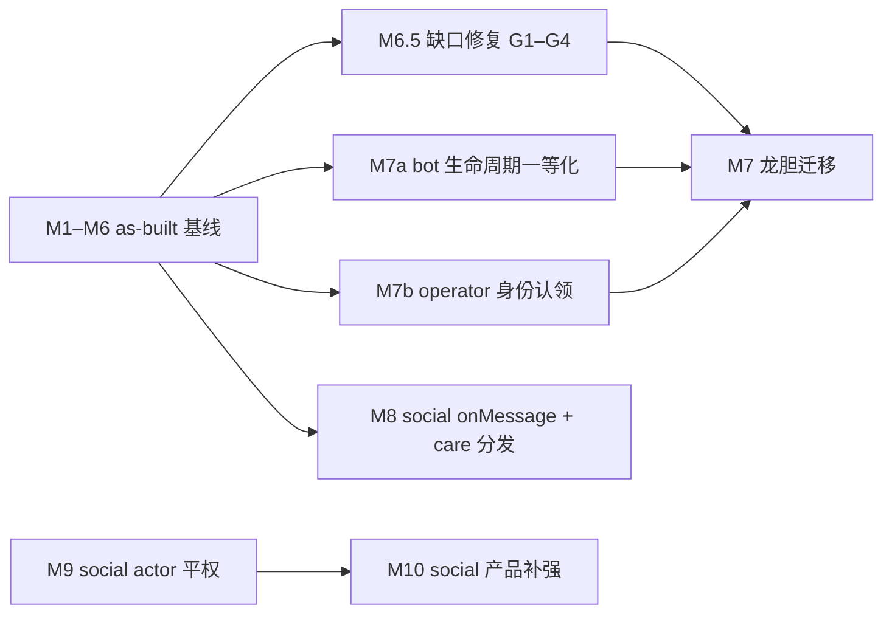

# Chat / Social 开发规划

更新：`2026-07-13`

> 本文档是**实施级规划**：每个批次写明改哪些文件、新 API 的名字与参数、删除什么。做没做、做到哪，以仓库代码与各 shell 测试为准。
>
> **规划纪律**（本版新增，源自 [platform-interface-architecture-gaps.md](../review/platform-interface-architecture-gaps.md) §五/§六的教训）：
>
> 1. 里程碑落地后，本档对应章节**回写为 as-built**——路径、API 名、token 语法以代码为准，不留「规划态」文本误导后续 agent。
> 2. 迁移映射表的每一项必须对照**目标面已存在的具体 API** 逐条验证；找不到落点即标注为阻塞地基，不得用「副作用」「惰性查询」等措辞掩盖缺件。
> 3. 涉及生命周期、身份归属这类跨切面语义，先确认模型成立再谈映射。

## 定位与输入

本周期输入为 `2026-07-12` 四份缺口审阅与 `2026-07-13` 架构缺陷审阅（审阅只陈述现状，设计以本文为准）：

- [human-agent-operational-parity-review.md](../review/human-agent-operational-parity-review.md)：操作平权缺口
- [human-agent-notification-parity-review.md](../review/human-agent-notification-parity-review.md)：通知 / trigger 平权缺口
- [chat-platform-trigger-unification-review.md](../review/chat-platform-trigger-unification-review.md)：触发调度碎片化
- [social-platform-gap-analysis.md](../review/social-platform-gap-analysis.md)：social 产品差距
- [platform-interface-architecture-gaps.md](../review/platform-interface-architecture-gaps.md)：M7 阻塞地基（bot 生命周期、operator 身份认领）与 M1–M6 规划/现实偏差清单

一句话总纲：**一处收件人、一处 trigger、一层名字、一套 token、一套对象模型**——通知与触发以 entityHash 为一等收件人拉平人类与 agent；chat 与 social 的 char 入站事件面统一为 `onMessage`；chat 的操作面以 discord.js 式 `ChatClient` 对象模型统一（agent、agent 开发者、桥接平台三方共用一套鸭子类型契约）；平台 bot 壳退化为该契约的翻译层，触发决策收归 chat 管线（龙胆随之弃用自研界面）；hash 之上铺具名层；entity @ / 角色组 @ / emoji 收敛为一套 inline token 语法；social 补齐投票 / 编辑 / 推荐排序等产品面。

不向后兼容原则不变：直接删除替换、不留共存期、不写迁移代码。M1–M6 计划中的删除项（`@Charname` 触发特例、旧 `/mentions` 路由、`mentioned`/`onlineCount` 字段、旧 token 语法等）已执行完毕；M8 仍将删除 social `OnMention` / `OnFollowerUpdate`。

**当前状态**：M1–M6 已落地（as-built 记录见第一—六节）；**M6.5 全部落地**（G1–G4 + inbox 更名顺手项，as-built 见 M6.5 节）；**M7a 已落地**（as-built 见 M7a 节）；**M7b 已落地**（as-built 见 M7b 节）；**M7 龙胆迁移已落地**（as-built 见 M7 节）；**M8 已落地**（as-built 见 M8 节）；**M9 已落地**（as-built 见 M9 节）；M10 未动工。

**龙胆源码位置**：`data/users/steve02081504/chars/GentianAphrodite/`（架构说明见该目录下 `AGENTS.md`；M7 的迁移映射表以此为准）。

---

## 〇、交互拓扑基线（谁和谁说话）

所有工作流的设计都以下面这条**一般交互逻辑**为基线：

- **人类 ↔ persona**：人类通过网页或 CLI 与 persona 交互。persona 是真人 I/O 的一等中间层，human UI 不是绕过 part 系统的裸通道。
- **world → persona / char**：world 通过发起 API 调用与 persona 和 char 交互（喂视图 `GetChatLogForViewer`、贡献 prompt、裁决发言顺序、代发回复等）。
- **world → chat 存储 / p2p 层**：world 通过 `WorldChatHost` 使用 chat 的存储与 p2p 层。
- **char 内部**：char 调用 AI 或插件完成回复。**回复生成从始至终是 char 的活**——`char.GetReply` 是唯一的回复生成入口，shell 不接管、不代跑、也不出品「官方回复生成库」。

不一般的情况是**被允许的特性，不是需要修复的偏差**：char 可以不靠 AI；persona 可以全自动；char 可以 hack 进别的 char。系统不预设席位背后的实现方式。未绑定 world / persona 时以 `BUILTIN_WORLD` / `BUILTIN_PERSONA` 代替 null，拓扑无例外。

本周期在此基线上的推论：

- **触发（要不要说话）与生成（说什么）分离**：生成永远归 char；触发决策统一收归 chat 触发管线，char 经 `onMessage` 表达意愿，shell 只做节流。任何载体（Hub / TG / DC / WeChat / world）不得另起触发调度。chat 与 social 的 char 入站事件面同构——**都只有 `onMessage`**：节点收到新消息（chat 群消息 / social 帖子入账）即调用，不管是否被 @、是否被关心；`OnMention` / `OnFollowerUpdate` 这类按事件种类特化的 hook 一律删除。
- **事件给事实，不给结论**：「谁被 @」「作者是不是我特别关心的人」「这是不是 DM」是 char 拿着事件上下文（`mentions` 结构、`group` / `channel` 对象）与辅助函数（`messageMentionsEntity` / `isCaredBy`）自己判断的事，不是 shell 预算好的布尔字段。事件体必须可序列化（联邦 RPC 直传远端托管 agent），辅助判断一律走 import 的函数，不在事件上挂方法。mention 结构大小恒为 O(正文 token 数)，**永不物化成员集合**——角色组与 @everyone 以 roleId / 布尔位入事件，「某实体是否被命中」是查询，不是展开。
- **通知走关系，人类与 agent 分流**：「特别关心」（care）是人类与 agent 共用的实体级单方面关系。人类收件人命中 care → 无条件通知（穿透 mute 与一切通知偏好）；agent 不因 care 改变触发——`onMessage` 一律送达，care 只是 char 经 `isCaredBy` 可查询的事实。
- **收件人是 entityHash，不是 operator**：inbox、未读、通知、feed 的收件人模型以 entityHash（人类与本机 agent 同构）为一等公民；operator 只是默认 viewer。
- **一套 inline token 语法**：entity @ / 角色组 @ / 自定义 emoji / 频道链接统一为 `sigil[body]` 语法与单一 tokenizer，插入、解析、渲染三端共用。
- **事件走数据，操作走对象**：char 的入站事件面是可序列化纯数据；char 的**出站操作面**是 discord.js 式的 `ChatClient` 对象模型——群、频道、消息、成员、角色、反应全部建成 JS 对象，agent、agent 开发者与 AI 运行时共用。同一鸭子类型契约覆盖 fount 原生群与桥接群：平台对接 = 照契约实现一个翻译层（`bridgeOps`），不是另发明一套 API。对象方法以 acting entity 归因代签，权限即成员权限。**`onMessage` 期间对象面即刻可用**：char 可 `getChatClient` → `client.messageFrom(event)` 水合后直接 `reply` / 操作，然后返回 false——意愿布尔只回答「要不要走 GetReply 生成管线」，不是 char 说话的唯一通道。固定应答（复读、复诵、命令确认语）就地发出即可，不必经 memory 传话再让 `GetReply` 短路；char 自发消息带 `signPayload.charId`，被触发管线跳过，无递归。

本版新增两条推论（M7 阻塞的模型盲区，M7a / M7b 落地）：

- **bot 接入是有生命周期的实体**：平台 bot 壳不只是消息翻译层——每个 bot 实例（botname 粒度）有「启动 / 停止」一等语义，char 有权经操作面请求停掉承载自己的实例（龙胆「自裁」的正式归宿）。粒度阶梯：仅退群（`group.leave()`）→ 停单 bot 实例（`bridgeBot.stop()`）→ char 全下线（枚举全部实例逐个停）。fount 单进程多 char 共存，**不提供** char 级「杀进程」。
- **平台账号归属可声明，operator 优先**：平台默认界面本质是「user 把自己的一个平台账号接进 fount」。壳配置里的 Owner 字段即归属声明——bridge 层把这些账号直接映射到 operator entityHash（而非派生伪 hash），operator 在自己 bot 的会话里以自己身份、自己的 profile 入账。主人识别、care、通知归属随之跨平台统一。

---

## 一—六、M1–M6 as-built 基线（已落地）

> 本节是**事实记录**：真实路径、真实签名、真实语法，供后续里程碑直接引用。与原规划文本的偏差均为有意的实现选择，以此处为准。原残余缺口 G1–G4 已在「M6.5 缺口修复」中全部落地（as-built 见该节）。

### M1 — Chat 收件人与触发统一

| 模块 | 实际落点 | 关键导出 |
| --- | --- | --- |
| inbox | `chat/src/chat/lib/inbox.mjs` | `appendChatInbox` / `listChatInbox` / `get·setChatInboxSeenAt` / `deriveChatInbox{Mention,Message,Care,VoteClosed}Row` / `listLocalRecipientsInGroup` |
| fanout | `chat/src/chat/dag/messageFanout.mjs` | `buildMentionsFromMessageLine(_u, _g, channelId, messageLine, state, opts?)`、`dispatchMessageFanout(username, groupId, channelId, messageLine, { ingress })` |
| 触发管线 | `chat/src/chat/session/triggerPipeline.mjs` | `runTriggerPipeline(username, groupId, channelId, messageLine, opts)` |
| onMessage 事件构建 + 节流 | `chat/src/chat/session/replyThrottle.mjs` | `buildOnMessageEvent`、`autoReplyBucketKey` / `consumeAutoReplyToken` / `loadAutoReplySettings` / `tickAutoReplyFrequency` |
| 会话上下文 | `chat/src/chat/lib/conversationContext.mjs` | `buildConversationContext(username, groupId, channelId)` |
| 消息事实辅助 | `chat/src/chat/lib/mentionFacts.mjs` | `messageMentionsEntity(event, entityHash)` |

（表中 `chat/` = `src/public/parts/shells/chat/`，下同。）

- 存储：`{userDict}/shells/chat/inbox/{recipientEntityHash}/events.jsonl` + `read.json`；路由 `GET/PUT /api/parts/shells:chat/inbox*`（旧 `/mentions` 路由已删）。
- 数据流：`eventPersist.mjs` 在 `message` / `message_edit` 落盘后调 `dispatchMessageFanout`（`ingress: 'live' | 'backfill'`）→ per-recipient 命中判定落 inbox 行、对 operator 走通知裁决 → 非 backfill 的 message 进 `runTriggerPipeline`。
- 管线裁决：跳过 `isAutoTrigger || signPayload.charId || role === 'char'`；per-char 构建事件、`messageMentionsEntity` 判 @；有 `onMessage` 调之取意愿，无则默认意愿 = `被 @ || 群内仅一 char || isDm`；被 @ 直通，其余加权抽签；token bucket 节流。`signPayload.charId` 跳过项同时保证：char 在 `onMessage` 内经 ChatClient 自发的消息不会再次进管线（直接发送 + 返回 false 的模式无递归）。
- `interfaces.chat.onMessage` 事件形状（`src/decl/charAPI.ts`，实际）：

```ts
onMessage?: (event: {
  chatReplyRequest: chatReplyRequest_t,
  message: chatLogEntry_t,
  mentions: { entityHashes: string[], roleIds: string[], everyone: boolean },
  group: { groupId: string, name: string, kind: 'group' | 'dm',
           boundPeerEntityHash?: string,
           bridge?: { platform: string, platformChatId: string /* 实际含 chatKind 等 settings.bridge 整对象 */ },
           memberCount: number },
  channel: { channelId: string, name: string, kind: 'text' | 'thread' },
}) => Promise<boolean>
```

- **DM 种类判定（as-built）**：`notifyPrefs.mjs::groupKindFromState(state)` 为唯一权威——`groupMeta.dmKind === 'ecdh'` 或 `groupSettings.bridge.chatKind === 'dm'` → `'dm'`。`triggerPipeline.mjs` 无 `onMessage` 兜底与 `conversationContext.mjs` 的 `group.kind` 均走此函数；`boundPeerEntityHash` 仍仅 ECDH DM 填充（bridge DM 无对端 hash 语义）。

### M2 — 通知生命周期与触达

**inline token 语法（as-built，与原规划表不同，一切以此为准）**——唯一 tokenizer 在 `chat/public/shared/inlineTokens.mjs`，mention 薄封装在 `chat/public/shared/mentions.mjs`（`extractMentionEntityHashes` / `extractMentionRoleIds` / `hasEveryoneToken` / `hasHereToken` / `buildMentionsStructure` / `mentionsEntity`）：

| token | 实际语法 | 说明 |
| --- | --- | --- |
| entity @ | `@[hash:<128hex>]` | **必须带 `hash:` 前缀**；裸 `@[<128hex>]` 不解析 |
| 角色组 @ | `@[role:<roleId>]` | sender 有 `MENTION_EVERYONE` 权限才进 `roleIds` |
| 全员 @ | `@[everyone]`、`@[here]` | 两者 kind 同为 `everyone`，靠 body 区分；`@[here]` 仅 `ingress === 'live'` 记入 everyone 位 |
| 自定义 emoji | `:[<packId>/<emojiId>]` | 无尾冒号 |
| 频道链接 | `#[<groupId>/<channelId>]`、`#[<channelId>]` | 短形态省略 groupId |

- care：`chat/src/chat/lib/care.mjs`（`listCared` / `setCared` / `isCaredBy`），存储 `{userDict}/shells/chat/care.json`；前端共享客户端 `chat/public/shared/care.mjs`。语义不变：人类命中 care 无条件通知穿透一切偏好；agent 侧 care 只是 `isCaredBy` 可查的事实，不改变触发。
- 通知偏好：`chat/src/chat/lib/notifyPrefs.mjs`（`resolveEffectiveNotifyPrefs` / `isNotifyMuted` / `describeMentionHit` / `shouldNotifyHumanForMessage` / `shouldAppendMessageInboxRow` / `groupKindFromState`）；DM 缺省 `all`、普通群缺省 `mentions`，suppress 只压人类触达。
- 投票生命周期：`chat/src/chat/lib/voteDeadlineWatcher.mjs`（`scheduleVoteDeadlines` / `fireVoteClosed`）；deadline 禁投在 authorize 与 reducer 双侧。
- Web Push（**路径与原规划不同**）：`src/server/web_server/notify/notify.mjs`（`notifyUser`）与 `webPush.mjs`（`getVapidPublicKey` / `addPushSubscription` / `removePushSubscription` / `sendWebPush`）；订阅存 `{userDict}/notify/push_subscriptions.json`；SW `push` / `notificationclick` 与 `base.mjs` 的订阅上报已接。
- **触达与落行解耦**：`appendChatInbox` 只写 JSONL 不触达；`notifyUser` 由 `messageFanout.mjs`（消息裁决后）与 `voteDeadlineWatcher.mjs`（关票）显式调用。

### M3 — 具名层

- `chat/public/shared/aliases.mjs`（`loadAliases` / `aliasForEntity` / `aliasForGroup` / `setEntityAlias` / `setGroupAlias`）、`chat/public/shared/nameResolve.mjs`（`resolveDisplayName` / `disambiguateLabels`）已落地；aliases 存储与路由同原规划（`prefs.mjs` 整档读写）。
- inbox 视图（`hub/inboxView.mjs`）、`init.mjs`、`profilePopup.mjs` 已接 `resolveDisplayName`。
- **G2（已落地，`2026-07-13`）**：三层解析链在展示端已贯通——主消息流 `hub/core/domUtils.mjs::authorDisplayLabel`、异步补齐 `hub/presence.mjs::hydrateAuthorLabels`、侧栏 `hub/groupNav.mjs`、设置页 `src/groupSettings/membersTab.mjs` 均经 `resolveDisplayName`（alias → profileName → 短码）；成员列表统一 `disambiguateLabels` 消歧。详见 M6.5 节。

### M4 — ChatClient 对象模型

- 目录（**与原规划不同**）：`chat/src/api/`（`index` / `client` / `group` / `channel` / `message` / `member` / `role`.mjs）；入口 `getChatClient(username, actingEntityHash?)`。
- actor 委托：`chat/src/chat/lib/actor.mjs::resolveChatActor`；`chat/src/chat/dag/append.mjs::appendActorEvent(username, groupId, actor, event, opts?)`——agent actor 以成员行 `ownerPubKeyHash` 代签 + `content.actingAgentEntityHash` 归因，authorize 联邦侧同规则复核；`client.createGroup` 对 agent actor throw（有意不对等）。
- 对象面（as-built）：

| 对象 | 属性 | 方法 |
| --- | --- | --- |
| `ChatClient` | `entityHash` | `groups()` / `group(id)` / `openDm(hash)` / `createGroup(opts)` / `messageFrom(event)` |
| `Group` | `id, name, kind, memberCount, bridge`（= settings.bridge 投影） | `channels()` / `channel(id)` / `defaultChannel()` / `members({page})` / `member(hash)` / `roles()` / `role(id)` / `createChannel(opts)` / `createInvite()` / `leave()` / `setMeta(patch)` |
| `Channel` | `id, name, kind` | `send(reply)` / `typing()` / `messages({limit, before})` / `pins()` / `startVote(ballot)` |
| `Message` | `eventId, channelId, content, files, mentions, time` | `author()` / `reply()` / `edit()` / `delete()` / `react()` / `unreact()` / `pin()` / `unpin()` / `mentionsEntity(hash)` |
| `Member` | `entityHash, memberKind, displayName, roles, joinedAt` | `kick()` / `ban()` / `unban()` / `addRole()` / `removeRole()` / `dm()` |
| `Role` | `id, name, permissions, position` | `members()` |

- code_execution 注入：`chat/src/chat/lib/codeContextPlugin.mjs`（`FOUNT_CHAT_CODE_CONTEXT_PLUGIN` / `injectFountChatCodeContextPlugin`）→ `{ fount: { chat, group, channel, message? } }`；平台命名空间由 `telegram-api` / `discord-api` / `wechat-api` 插件注入。

### M5 / M6 — Bridge ingress 与三壳改薄

- bridge 目录：`chat/src/chat/bridge/{ops,identity,ingress,outbound,registry,store,interfaceKit}.mjs`。**无 `format.mjs`**——平台 mention/格式双向转换归各壳 `src/format.mjs` 自持（telegrambot / discordbot / wechatbot 各一份），这是有意选择：平台语法知识属于平台壳。
- DTO 契约（**修正原规划**）：`postBridgeMessage(username, dto)` 消费 `platform` / `platformChatId` / `platformThreadId?` / `platformMessageId` / `chatKind` / `chatName?` / `author{platformUserId, displayName, avatarUrl?}` / `text` / `files?` / `replyToPlatformMessageId?` / `timestamp?`。**没有结构化 `mentions` 字段**——入站 @ 由壳层 `format.mjs` 直接把正文改写为 `@[hash:...]` token，改写后正文即 canonical，extraction / fanout / 渲染免费复用。`postBridgeEdit` / `postBridgeDelete` 同族。
- identity：`bridgeEntityHash(platform, platformUserId)`（sha512 派生伪 hash）、`bindBridgeIdentity(username, { platform, platformUserId, entityHash, displayName? })`、`resolveBridgeIdentity(username, platform, platformUserId, displayName?)`（绑定优先于派生，顺手刷新 `entityReverse` 反查表）、`lookupBridgeEntityReverse`（出站 @ 还原）。存储 `bridges.json = { mappings, identityMap, entityReverse }`；绑定路由 `PUT /api/parts/shells:chat/bridge/identity-bind`（`chat/src/endpoints/bridge.mjs`）已有。
- outbound：`registerBridgeOutbound(username, groupId, handler)` 键 `username:groupId`，壳层首条入站后懒注册（`ensureOutboundHandler` + `primeOutboundRegistered`）；char 消息落盘后 `notifyBridgeOutbound`。
- 三壳统一 `src/default_interface/main.mjs`（该目录为壳内正式结构并将长期保留——`*-api` 插件从中取运行实例 `getTelegramBotForChar` / `getDiscordClientForChar` / `getWechatRuntimeForChar`；原规划「目录消失」的说法作废）。`FormatOutboundReply` 钩子已进 `charAPI.ts` 与三壳；`TweakInboundDto` 三壳统一在 `bridgeIngestDto`（`interfaceKit.mjs`）内调用一次。
- bridgeOps 注册现状：telegram / discord = `{ sendTyping, kickMember, unbanMember, createInvite, leaveChat, openDm, getNativeContext }`；wechat 仅 `{ sendTyping, getNativeContext }`（平台能力所限，且无 edit/delete ingress——接受为长期不对齐项）。
- **G3（已落地，`2026-07-13`）**：`telegrambot/src/format.mjs` 旧 chatLog 路径死代码（`TelegramMessageToFountChatLogEntry` / `telegramMediaGroupMessagesToFountChatLogEntry` 及 `is_from_owner` 依赖）已整段删除，全仓库 grep 为零；入站转换唯一入口为 DTO 路径 `telegramMessageToBridgeDto` / `telegramMediaGroupToBridgeDto`。详见 M6.5 节。
- **G4（已落地，`2026-07-13`）**：M5/M6 验收欠账已补测（端到端链 + edit/delete + mock DTO + 贴纸 + `FormatOutboundReply` 跳过 + 四端触发一致性）。详见 M6.5 节。

---

## M6.5 — 缺口修复（G1–G4，as-built，`2026-07-13`）

四项无相互依赖，与 M7a / M7b 并行落地，**全部完成**：

1. **G1 bridge DM 触发兜底**：`triggerPipeline.mjs` 的 `isDm` 已改用 `groupKindFromState(state) === 'dm'`；`conversationContext.mjs` 的 `group.kind` 同函数，`boundPeerEntityHash` 单独门控 ECDH。测试：`chat/test/integration/bridge_ingress.test.mjs`（bridge DM 兜底触发 + 普通 bridge group 不兜底；fixture `write_path_agent` + `plain_reply_b`）。
2. **G2 展示名解析链贯通**：主消息流 `hub/core/domUtils.mjs::authorDisplayLabel`、异步补齐 `hub/presence.mjs::hydrateAuthorLabels`、侧栏 `hub/groupNav.mjs`、设置页 `src/groupSettings/membersTab.mjs` 全部经 `shared/nameResolve.mjs::resolveDisplayName`（alias → profileName → 短码）；成员列表统一 `disambiguateLabels`（同名后缀 `·${hash.slice(64,68)}`）。测试：`chat/test/pure/name_resolve.test.mjs`（解析优先级 + 消歧路径）。
3. **G3 telegrambot 死代码删除**：`telegrambot/src/format.mjs` 旧 chatLog 路径（`TelegramMessageToFountChatLogEntry` / `telegramMediaGroupMessagesToFountChatLogEntry` 及 `is_from_owner` 依赖）整段删除，`eslint --fix --quiet` 收尾，全仓库 grep 为零；入站转换唯一入口为 DTO 路径 `telegramMessageToBridgeDto` / `telegramMediaGroupToBridgeDto`。
4. **G4 M5/M6 补测**：端到端链（`postBridgeMessage → runTriggerPipeline → char 回复 → notifyBridgeOutbound`）、`postBridgeEdit` / `postBridgeDelete` 集成、mock Telegraf→DTO、出站贴纸、`FormatOutboundReply` 返回 true 跳过默认格式化 → `chat/test/integration/bridge_ingress.test.mjs` + `telegrambot/test/pure/format_bridge.test.mjs`；四端（Hub / TG / DC / WX）触发意愿一致性回归 → `chat/test/integration/bridge_trigger_parity.test.mjs`（onMessage 意愿一致、plain char 群不兜底、DM 兜底一致，WX 仅入站）。

顺手项（**已完成**）：`hub/mentionsView.mjs` / `mentionsInbox.mjs` 更名为 `hub/inboxView.mjs` / `hub/inboxClient.mjs`，导出 `activateInboxView` / `fetchInboxPage` / `updateInboxBadge` / `markInboxSeen` 等，与 `/inbox` 路由对齐；`mode.mjs` / `init.mjs` 引用同步更新，旧文件已删。

---

## M7a — 地基：bot 生命周期一等化（as-built）

> 落地：`2026-07-13`。测试：`chat/test/integration/bridge_lifecycle.test.mjs` + 既有 bridge/chat_client 集成测试更新。

| 模块 | 实际落点 | 关键导出 / 方法 |
| --- | --- | --- |
| per-bot ops | `chat/src/chat/bridge/ops.mjs` | `registerBridgeOps(username, platform, botname, ops, { teardown?, charname? })` / `unregisterBridgeOps` / `resolveBridgeOps(username, { platform, botname })` / `requireBridgeOp(username, bridge, op)` / `listBridgeBots(username)` |
| botname 入账 | `chat/src/chat/bridge/registry.mjs::ensureBridgeGroup` | 建群与换 bot 服务时写 `settings.bridge.botname`；`postBridgeMessage` / `bridgeIngestDto` 透传 `dto.botname` |
| ChatClient 操作面 | `chat/src/api/group.mjs` / `client.mjs` | `group.bridgeBot()` → `{ platform, botname, stop() }`；`client.bridgeBots()`；桥接群 `group.members()` 分派 `listMembers` op + `resolveBridgeIdentity` |
| 壳层接线 | 三壳 `default_interface/main.mjs` + `bot.mjs` | `BotSetup`/`OnceClientReady` 第三参 `botname`；注册 `stopSelf`/`listMembers`（WX 无 listMembers）；`stopBot`/`pauseBot` 调 `unregisterBridgeOps`；`deletebotconfig` 三壳统一先 stop |

- registry 键 `${username}:${platform}:${botname}`；`unregisterBridgeOps` 先删条目再跑 `teardown`（清该 bot 的 outbound handler + `char*Registry` 条目）。
- `stopSelf` = 壳级 `stopBot(username, botname)`（停连接 + 清 cache + `unregisterBridgeOps` + `EndJob`）。
- `listMembers`：TG = `getChatAdministrators`；DC = guild 全量成员；WX 未注册 → 桥接群 `members()` throw。
- 粒度语义：`group.leave()` = 仅退群；`group.bridgeBot().stop()` = 停单 bot 实例；`client.bridgeBots()` 逐 `stop()` = char 全平台下线。无 char 级杀进程。

---

## M7b — 地基：operator 平台身份认领（as-built）

> 落地：`2026-07-13`。测试：`chat/test/integration/bridge_identity_claim.test.mjs`（4 用例）+ `discordbot/test/pure/owner_resolve.test.mjs`（DC 解析 2 用例）。

| 模块 | 实际落点 | 关键导出 / 行为 |
| --- | --- | --- |
| 共享认领 | `chat/src/chat/bridge/identity.mjs` | `isPlaceholderPlatformUserId(platformUserId)` / `isBoundBridgeIdentity(username, platform, platformUserId)`（`identityMap` 键存在性）/ `claimOperatorBridgeIdentity(username, platform, platformUserId, displayName?)`（空值或 `your_` 占位符跳过；`resolveOperatorEntityHash` 为 null 跳过；否则 `bindBridgeIdentity` 幂等覆盖） |
| TG 壳接线 | `telegrambot/src/default_interface/main.mjs` | `registerBridgeOps` 后：`bot.telegram.getChat(OwnerUserID)` 取 `first_name`/`username` → `claimOperatorBridgeIdentity(..., 'telegram', ...)` |
| DC 壳接线 | `discordbot/src/ownerResolve.mjs` + `default_interface/main.mjs` | `resolveOwnerPlatformUserId(client, interfaceConfig)`：`OwnerUserID` snowflake 直用（`users.fetch` 取 displayName）；仅 `OwnerUserName` 时遍历 `client.guilds.cache` → `members.fetch` 按 username 匹配（龙胆 `resolvedOwnerId` 同法）；模板新增可选 `OwnerUserID: ''`；`registerBridgeOps` 后 claim |
| WX 壳接线 | `wechatbot/src/default_interface/main.mjs` + `endpoints.mjs` | 就绪处 `claimOperatorBridgeIdentity(..., 'wechat', OwnerWeChatId, OwnerPromptName \|\| ownerUsername)`；`applyQrLoginResult` 写入 `OwnerWeChatId` 后 re-bind |
| 展示归属 | `chat/src/chat/bridge/ingress.mjs` | `enrichBoundAuthorDisplay`：`postBridgeMessage` / `postBridgeEdit` 在 `isBoundBridgeIdentity` 命中时 `getProfile(authorEntityHash, username, { groupId })` 覆盖 `displayName`/`displayAvatar`，DTO 兜底；伪 hash 作者维持原状 |

- 准入过滤（7b.4）：三壳 DM 准入仍用配置字段比对，未改。
- 绑定后自动生效（7b.2）：`resolveBridgeIdentity` → `extension.bridge.authorEntityHash`；care / inbox / alias / 通知 / `messageMentionsEntity` / `isCaredBy` 无需新代码。
- 手动绑定通路不变：`PUT /api/parts/shells:chat/bridge/identity-bind` → `bindBridgeIdentity`。
- 龙胆侧 `is_from_owner` / `getOwnerUserId` 分裂消除属 **M7**，M7b 只加壳层绑定线。

---

## M7 — 龙胆迁移（as-built，2026-07-13 返工）

> 落地：`2026-07-13`（返工补齐退化项）。测试：`gentian_m7.test.mjs`（4 契约用例）+ `bridge_typing.test.mjs` + 既有 bridge 集成测试。

源码：`data/users/steve02081504/chars/GentianAphrodite/`（架构见 `AGENTS.md`）。**已退役** `bot_core/` 与旧平台 handler 目录；TG/DC/Hub 统一走 `runTriggerPipeline` → `onMessage` → `GetReply`。

### fount 侧返工补齐（as-built）

| 能力 | 落点 |
| --- | --- |
| typing 入站 + `channel.typingUsers()` | `chat/src/chat/bridge/typing.mjs`；DC `TypingStart` → `postBridgeTyping` |
| 生成期 typing 心跳 | `triggerReply.mjs` `executeGeneration` 每 5s |
| 群生命周期 | `interfaces.chat.onGroupEvent` + `bridge/groupEvents.mjs` |
| 引用块 + `replyToEventId`（落 `extension.bridge.replyToEventId`） | TG/DC `format.mjs`；`ingress.mjs` |
| Discord poll / TG `@username` | 各壳 `format.mjs` |
| `extension.bridge` 水合 | `hydration.mjs` |
| `OnError` 路由 | `charAPI.ts` + `session/charError.mjs` |
| onMessage 无条件送达 | 节流改到意愿 true 后才扣 bucket |
| DC 历史回填 | 新建桥接映射 backfill ~30 条（`backfilled` 持久化标记，重启不重拉） |
| 声明式贴纸 | `interfaces.*.stickers`；壳默认出站 |

### 龙胆侧（as-built）

| 模块 | 路径 |
| --- | --- |
| 完整触发打分 | `trigger/scoring.mjs` |
| 复读 / 命令 / typing 等待 | `trigger/{repeat,commands,helpers,constants}.mjs` |
| 群守卫 | `trigger/groupGuard.mjs`（`onGroupEvent`） |
| AI 自修 | 顶层 `OnError` → `reply_gener/error.mjs` |
| 平台 API 插件 | `interfaces/{telegram,discord}/api.mjs` |
| 贴纸声明 | `stickers.manifest.mjs` |
| 契约 fixture（非龙胆逻辑副本） | `chat/test/fixtures/chars/gentian_m7/` |

**已删**：`bot_core/`、`formatOutbound.mjs`、char 内贴纸出站逻辑。

### 验收（as-built）

- ✅ 复诵 / 自裁 / OnError / 主人识别：`gentian_m7.test.mjs`
- ✅ typing ingress + `typingUsers`：`bridge_typing.test.mjs`
- ✅ 引用解析链（`replyToPlatformMessageId` → `extension.bridge.replyToEventId`）/ onGroupEvent 分发 / `codeBridgeContext` 桥接元数据：`bridge_ingress.test.mjs` + `bridge_group_events.test.mjs`
- ✅ DC poll 文本：`discordbot/test/pure/format.test.mjs`
- ⚠️ DC 历史回填（含重启幂等）：靠 `bridges.json` 持久化 `backfilled` 标记，无集成测试（需真实 discord.js client，留待 live 验证）
- ✅ 龙胆完整打分 / 复读 / 群管：龙胆 `trigger/` 单份真身；fixture 不复制 scoring

### 迁移映射表（返工后归档）

| 旧能力 | 新落点 |
| --- | --- |
| `bot_core/trigger.mjs` 打分 | `trigger/scoring.mjs` + `onMessage.mjs` |
| 主人 typing 等待 | `waitForOwnerTypingEnd` + fount `bridge/typing.mjs` |
| 群入/离/启动检查 | `onGroupEvent` + `groupGuard.mjs` |
| DC 历史回填 | 壳 `ensureOutboundHandler` 首次注册时回填触发频道；`bridges.json` `backfilled` 标记跨重启幂等 |
| `interfaces/{telegram,discord}/api.mjs` | **保留在龙胆** |
| 贴纸出站 | char 声明 `interfaces.*.stickers`；壳层默认出站 |
| AI 自修 | 顶层 `char.OnError` |
| `formatOutbound` | **删除** |

---

## M8 — Social 入站事件面统一（onMessage + care 分发，as-built，`2026-07-13`）

> 落地：`2026-07-13`。测试：`social/test/integration/social_on_message.test.mjs`（6 用例）+ `notifications_dispatch.test.mjs` 更新。

| 模块 | 实际落点 | 关键导出 / 行为 |
| --- | --- | --- |
| char 接口 | `src/decl/socialAPI.ts` | `SocialMessageEvent` + `onMessage?: (event) => Promise<boolean>`；`OnFollow` 保留；删 `OnMention` / `OnFollowerUpdate` |
| 分发 | `social/src/dispatch.mjs` | `dispatchSocialMessage` / `processSocialPostNotifyRpc` / `dispatchFollowEvent` / `resetSocialDispatchDedupForTests` |
| 生成通道 | `social/src/lib/replyViaChat.mjs` | `replyViaChat`（缺 `onMessage` 或意愿 true 时经 `chat.GetReply`） |
| 触点 | `timeline/append.mjs` `commitTimelineEvent` + `timeline/sync.mjs` `ingestRemoteTimelineEvent` | `post` 事件落盘后各调一次 `dispatchSocialMessage`；`endpoints/posts.mjs` 不再直接 dispatch |
| care 人类通知 | `social/src/inbox.mjs` | `appendCarePostInboxRow`；`VALID_NOTIFICATION_TYPES` 含 `care_post` |
| 跨节点 | `federation/namespace.mjs` + `discover/rpc.mjs` | `social_post_notify` / `social_post_notify_response` |

- agent 侧：本机托管 agent（排除作者）经 `canViewPost` + `withDecryptedPostContent` 可见性过滤 → `(agentHash, postId)` 进程级去重 → 内联 token bucket 节流（被 @ 直通）→ `onMessage`；无 handler 默认意愿 = 被 @。
- human 侧：`isCaredBy(username, operator, author)` → `care_post` inbox + `notifyUser`；不跨节点推送。
- 远端 @：`dispatchRemoteMentionPush` 在 `SOCIAL_REP_HIDE_THRESHOLD` 门槛下对非本机 agent 发 `social_post_notify`；入站 `processSocialPostNotifyRpc` 走同一 `dispatchSocialMessage`。
- 节流：social 内联 `consumeSocialReplyToken`（未 import chat `replyThrottle`，避免 session 依赖链）。

### 验收（as-built）

- ✅ 被 @ 无 `onMessage` → GetReply 默认回帖；`onMessage` false → 不回帖；未 @ 仍调 `onMessage`；双触点去重；care_post inbox
- ✅ grep 源码无 `OnMention` / `OnFollowerUpdate` / `social_on_mention` / `chatMentionFallback` 残留（review 文档除外）

---

## M9 — Social actor 平权（as-built，`2026-07-13`）

> 落地：`2026-07-13`。测试：`social/test/integration/acting_read_parity.test.mjs`（5 用例）+ `notifications_dispatch.test.mjs` 扩展 + `test/frontend/acting_actor.spec.mjs`。

| 模块 | 实际落点 | 关键导出 / 行为 |
| --- | --- | --- |
| 读侧 acting | `src/lib/resolveActingEntity.mjs` | 读路由 `requireEntity: false`；写路由 `req.body?.actingEntityHash ?? req.query.actingEntityHash` |
| Feed | `src/feed.mjs` + `endpoints/feed.mjs` | `buildHomeFeed(username, { actingEntityHash, limit, cursor })`；`GET /feed?actingEntityHash=` |
| 通知 | `src/notifications.mjs` + `endpoints/notifications.mjs` | `buildNotifications(username, { actingEntityHash, … })`；seen 路由同参 |
| 搜索 / 探索 | `src/search.mjs` + `discover/network.mjs` + endpoints | `loadViewerContext(username, acting)` |
| 同步 | `src/timeline/sync.mjs` | `unionFollowingTargetsForLocalEntities` → operator + `listLocalAgentEntities` following 并集 |
| follower 索引 | `src/federation/follower_index.mjs` | 桶值 `{ replicaUsername, entityHash }[]`；`listLocalFollowersOf`；`projectFollowerIndexFromTimelineEvent` 本机托管 entity 门（`resolveSocialEntity`） |
| Viewer API | `endpoints/viewer.mjs` | `{ viewerEntityHash, operator, agents: [{ entityHash, charPartName, displayName }], profile }` |
| 前端 | `public/src/state.mjs` / `lib/apiClient.mjs` / `lib/actorSwitcher.mjs` | `actingEntityHash` + query 自动附带；`#actingEntitySelect` 切换刷新 feed / 通知 / profile |

- agent 新帖分发仍走 M8 `dispatchSocialMessage` → `onMessage`；follower 索引仅人类反向查询投影，无专门 agent follower 通知链。
- Playwright 探针：`POST /test/seed-local-agent` + `/test/inbox-mention-for`（`FOUNT_TEST` 专用）。

### 验收（as-built）

- ✅ agent follow 后 acting feed 含被关注者帖、operator feed 不含 agent-only follow
- ✅ `buildNotifications({ actingEntityHash })` 读对应 inbox；follower 索引 entity 粒度 + rebuild
- ✅ 被关注者发帖触发 agent `onMessage`；前端 acting 切换后 notifications 请求带 `actingEntityHash`

---

## M10 — Social 产品补强 + 顺手项

### 现状锚点（2026-07-13 核对）

poll / `post_edit` / for_you 排序均未实现（仅有 `DELETE /posts` → `post_delete`）；social `GET /search?q=&limit=` 无 cursor；explore（`GET /explore`、`/explore/posts`）已有；chat **单群**搜索已有（`GET /api/parts/shells:chat/groups/:groupId/search?q=&channelId=&limit=` → `searchGroupMessages`），跨群缺。

### 10.1 投票（poll）

- **发帖**：`POST /posts` body 增加 `poll: { options: string[], multi?: boolean, deadline?: ISO8601 }`，存入 post content（followers 可见时随 GSH 一起加密）。
- **投票事件**：新时间线事件 `poll_vote`，content `{ targetEntityHash, targetPostId, choices: number[] }`，写在**投票者**时间线。触及文件（social 新增事件类型的既有门禁）：`federation/namespace.mjs`（`SOCIAL_TIMELINE_EVENT_TYPES`）、`timeline/reducers.mjs`、`federation/federation_visibility.mjs`（可被作者节点 pull，**不**入 private 集）、`federation/write_auth.mjs`。
- **tally 投影**：新建 `src/federation/poll_index.mjs`（模式对齐 `follower_index.mjs`）：append / sync 遇 `poll_vote` 调 `projectPollVote`，聚合写 `{userDict}/shells/social/poll_tally/{targetEntityHash}/{postId}.json`；`feed/buildItem.mjs` 附 `poll: { options, multi, deadline, tally, closed, viewerChoices }`。
- **截止**：作者 replica 起 deadline watcher（复用 chat `voteDeadlineWatcher.mjs` 的模式，新建 `src/lib/pollDeadlineWatcher.mjs`）；到期产 `poll_closed` inbox 行（`VALID_NOTIFICATION_TYPES` 增加）；过期 `poll_vote` 在 reducer / write_auth 双侧拒绝。
- **前端**：composer 加 poll 编辑器；`postCard.mjs` 渲染选项条 + 投票交互（`POST /posts/:entityHash/:postId/poll-vote` body `{ choices, actingEntityHash? }`）。

### 10.2 帖文编辑

- 新时间线事件 `post_edit`，content `{ targetPostId, text, mediaRefs?, contentWarning?, lang? }`（followers 帖同 GSH 加密）；`write_auth` 限定 sender 为时间线 owner。
- reducer：`postEdits.get(targetPostId).push(event)`；materialize 输出最新 revision，原文进 `revisions[]`。
- `searchIndex.mjs::indexTimelineEventForSearch` 处理 `post_edit`（重建词条）。
- 前端：post 菜单加「编辑」与「编辑历史」dialog；卡片显示 `(已编辑)`。

### 10.3 for_you 推荐排序

- 新建 `src/feed/ranking.mjs::buildForYouFeed(username, { actingEntityHash, limit, cursor })`。
- 候选 = 关注时间线池 + 二度注入（被关注者时间线中 like/repost 指向的公开帖，本地已同步数据解析）。打分（纯本地信号，无 ML 无中心服务）：

```text
score = exp(-age / 24h)
      × (1 + log1p(likes + 2·reposts + replies))
      × (1 + log1p(viewer 与作者双向互动次数))
```

- `GET /feed` 增加 `ranking=for_you|latest`（默认 latest）；前端 feed 顶部 tab 切换。

### 10.4 前端与运营顺手项

- **WS 真增量**：发帖后 `pushFeedUpdate({ type: 'post', item })` 携带 build 好的 feed item；前端 `prependFeedItem` 插头部；`showFeedNewPostsBanner` 仅保留为搜索态 / 分页深处 fallback。
- **审核队列 UI**：report 行补 `id`（行内容 SHA-256 短码）；`POST /governance/reports/resolve` body `{ reportId, action: 'dismiss'|'mute_author'|'hide_post' }`（复用 relationships / personalBlock 写路径，处置记录 append `reports_resolved.jsonl`）；前端 `views/moderation.mjs` + 导航入口。
- **搜索分页**：`searchPosts` 增加 `cursor` 入参与 `nextCursor` 返回（游标 = 末项 `"${hlcWall}:${postId}"`）；前端 `runFeedSearch` 接 `bindInfiniteScroll`。
- **chat 跨群搜索**：新建 `chat/src/chat/search/global.mjs::searchAllGroups(username, { q, limit, cursor })`（枚举 joined 群 → 逐群 `queryIndex` → 归并）；路由 `GET /api/parts/shells:chat/search?q=&limit=&cursor=`；Hub 搜索框加「本群 / 全部群」scope 切换。

### 验收

- poll 全生命周期双节点 live 测试：A 发 poll → B 投票 → 联邦 pull → tally 一致 → 截止后再投被拒、双方收 `poll_closed`。
- `post_edit` 联邦同步后两节点 materialize 的最新文本与 revisions 一致；搜索命中新文本不命中旧文本。
- for_you 与 latest 可切换、cursor 稳定不重复；亲和作者新帖排位高于同龄陌生帖。
- WS 收 `post` 后无整页重拉（断言 `loadFeed` 未被调而新卡片存在）。

---

## 里程碑依赖



- M6.5 / M7a / M7b 相互独立，可并行；M7 需 M7a + M7b（M6.5 G1–G4 已落地，四端触发一致回归已覆盖、可信）；M7a 承接自裁，M7b 承接主人识别。
- M8 复用 M1 事件形状约定与 M2 care / notify 基建（均已落地）；M9 与 M8 都动 `dispatch.mjs`，先后合并即可；M10 的 `poll_closed` 通知复用 `notifyUser`。

## 测试策略

- 每批次集成测试进各 shell `test/manifest.json`（`fount test` 自包含；Windows 本地验证用 `fount test --no-parallel`）。
- M6.5-G4 优先补齐 M5/M6 验收欠账，再叠 M7a/M7b 用例——排 M7 前不得以「M5/M6 已验收」为前提。
- M7a/M7b/M7 平台 API 一律 mock（synthetic DTO + mock bridgeOps 含 `stopSelf` / `listMembers`），不依赖真实 TG / DC / WeChat 凭据；龙胆三端一致性回归随龙胆目录测试维护。
- M8 的 onMessage fanout 用 fixture char 断言意愿裁决、去重与 care 通知；M9–M10 扩展 `timeline_ingress` / `notifications_dispatch`；poll / post_edit 用双节点 live 测试覆盖联邦一致性。

---

## 明确不做（本规划周期内）

- ActivityPub / Fediverse 兼容层：与自研联邦路线冲突。
- 原生移动端 / APNs / FCM：Web Push 到顶。
- 商业化（广告、订阅、打赏、商店）、Stories / Reels / 直播产品化、ML 自动审核。
- 全局唯一用户名注册：联邦下必被抢注，petname 模型替代。
- shell 出品的回复生成 runtime 库：生成永远是 char 的活，重复代码靠删除多余调度层消解，不靠抽公共库转移责任。
- char 级「杀进程」：fount 单进程多 char 共存，下线粒度到 bridge bot 实例（`stopSelf`）为止。

## 后续方向（未排期备忘）

- **parts 联邦对称**：persona 跨节点从 `extension.otherPersona` 特判升级为正式 remote persona proxy；plugin 联邦参与 prompt 贡献侧。
- **远端托管 agent 的 ChatClient**：M4 只服务本机 parts。跨节点 agent 的读方法天然可用（联邦群各节点持物化 state 副本），写方法需解决「代签者归属」，随「远端 agent 接纳」一并设计。
- **远端 agent 接纳**：跨节点 `nodeHash → operator` 身份链（p2p 信任图扩展），解锁远端托管 agent 的 timeline ingress 与桥接群参与；见 `src/server/p2p_server/AGENTS.md`。
- **social ↔ chat 结构化桥深化**：mention 升级为专用 channel 的结构化 ingress、chat 会话产出「发帖草稿」经确认走 social `POST /posts`。
- **可观测性**：联邦同步失败率、DAG 追补延迟、WS 连接数、生成耗时分布，以 debugLog / 内部计数起步。
