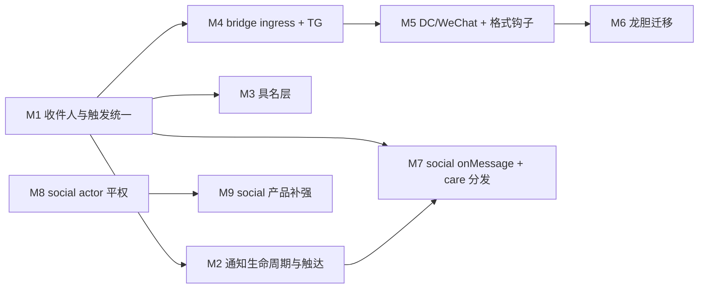

# Chat / Social 开发规划

更新：`2026-07-12`

> 本文档是**实施级规划**：每个批次写明改哪些文件、新 API 的名字与参数、删除什么。做没做、做到哪，以仓库代码与各 shell 测试为准。
>
> 已落地能力见审阅附录：[chat-vs-industrial-im-gap.md](../review/chat-vs-industrial-im-gap.md)、[social-platform-gap-analysis.md](../review/social-platform-gap-analysis.md)。

## 定位与输入

本周期输入为 `2026-07-12` 四份缺口审阅（只陈述现状，设计以本文为准）：

- [human-agent-operational-parity-review.md](../review/human-agent-operational-parity-review.md)：操作平权缺口
- [human-agent-notification-parity-review.md](../review/human-agent-notification-parity-review.md)：通知 / trigger 平权缺口
- [chat-platform-trigger-unification-review.md](../review/chat-platform-trigger-unification-review.md)：触发调度碎片化
- [social-platform-gap-analysis.md](../review/social-platform-gap-analysis.md)：social 产品差距

一句话总纲：**一处收件人、一处 trigger、一层名字、一套 token**——通知与触发以 entityHash 为一等收件人拉平人类与 agent；chat 与 social 的 char 入站事件面统一为 `onMessage`；平台 bot 壳退化为消息翻译层，触发决策收归 chat 管线（龙胆随之弃用自研界面）；hash 之上铺具名层；entity @ / 角色组 @ / emoji 收敛为一套 inline token 语法；social 补齐投票 / 编辑 / 推荐排序等产品面。

不向后兼容：`@Charname` 触发特例、`default_interface` 自管 log、operator 硬编码收件人、旧 `/mentions` 路由、social `OnMention` / `OnFollowerUpdate`、`onMessage` 的 `mentioned` / `onlineCount` 字段、裸 `@128hex` 与 `:[g/e]:` 旧 token 语法等直接删除替换，不留共存期、不写迁移代码（旧 `mention-inbox/events.jsonl` 之类的历史数据直接作废，存量正文里的旧 token 退化为原文显示）。

**龙胆源码位置**：`data/users/steve02081504/chars/GentianAphrodite/`（架构说明见该目录下 `AGENTS.md`；M6 的迁移映射表以此为准）。

---

## 〇、交互拓扑基线（谁和谁说话）

所有工作流的设计都以下面这条**一般交互逻辑**为基线：

- **人类 ↔ persona**：人类通过网页或 CLI 与 persona 交互。persona 是真人 I/O 的一等中间层，human UI 不是绕过 part 系统的裸通道。
- **world → persona / char**：world 通过发起 API 调用与 persona 和 char 交互（喂视图 `GetChatLogForViewer`、贡献 prompt、裁决发言顺序、代发回复等）。
- **world → chat 存储 / p2p 层**：world 通过 `WorldChatHost` 使用 chat 的存储与 p2p 层。
- **char 内部**：char 调用 AI 或插件完成回复。**回复生成从始至终是 char 的活**——`char.GetReply` 是唯一的回复生成入口，shell 不接管、不代跑、也不出品「官方回复生成库」。

不一般的情况是**被允许的特性，不是需要修复的偏差**：char 可以不靠 AI；persona 可以全自动；char 可以 hack 进别的 char。系统不预设席位背后的实现方式。未绑定 world / persona 时以 `BUILTIN_WORLD` / `BUILTIN_PERSONA` 代替 null，拓扑无例外。

本周期在此基线上补以下推论：

- **触发（要不要说话）与生成（说什么）分离**：生成永远归 char；触发决策统一收归 chat 触发管线，char 经 `onMessage` 表达意愿，shell 只做节流。任何载体（Hub / TG / DC / WeChat / world）不得另起触发调度。chat 与 social 的 char 入站事件面同构——**都只有 `onMessage`**：节点收到新消息（chat 群消息 / social 帖子入账）即调用，不管是否被 @、是否被关心；`OnMention` / `OnFollowerUpdate` 这类按事件种类特化的 hook 一律删除。
- **事件给事实，不给结论**：「谁被 @」「作者是不是我特别关心的人」「这是不是 DM」是 char 拿着事件上下文（`mentions` 结构、`group` / `channel` 对象）与辅助函数（`messageMentionsEntity` / `isCaredBy`）自己判断的事，不是 shell 预算好的布尔字段——`mentioned: boolean`、`onlineCount: number` 移除。事件体必须可序列化（联邦 RPC 直传远端托管 agent），辅助判断一律走 import 的函数，不在事件上挂方法。mention 结构大小恒为 O(正文 token 数)，**永不物化成员集合**——角色组与 @everyone 以 roleId / 布尔位入事件，「某实体是否被命中」是查询（本地物化 state 的成员归属 lookup），不是展开。
- **通知走关系，人类与 agent 分流**：「特别关心」（care）是人类与 agent 共用的实体级单方面关系。人类收件人命中 care → 无条件通知（穿透 mute 与一切通知偏好）；agent 不因 care 改变触发——`onMessage` 一律送达，care 只是 char 经 `isCaredBy` 可查询的事实。
- **收件人是 entityHash，不是 operator**：inbox、未读、通知、feed 的收件人模型以 entityHash（人类与本机 agent 同构）为一等公民；operator 只是默认 viewer。
- **一套 inline token 语法**：entity @ / 角色组 @ / 自定义 emoji / 频道链接统一为 `sigil[body]` 语法与单一 tokenizer（M2.1），插入、解析、渲染三端共用。

---

## M1 — Chat 收件人与触发统一

### 现状锚点

- `src/public/parts/shells/chat/src/chat/dag/eventPersist.mjs` 的 `broadcastAndPersist` 在 message 落盘后调 `maybeAppendMentionInbox`（**仅 operator**）与 `maybeAutoTriggerCharReply`。
- `src/chat/session/autoReply.mjs` 用 `^@([\w.-]+)` 匹配 `@Charname` 触发；`onMessage` 只在 `triggerReply.mjs::getCharReplyFrequency` 的链式/定频路径被调，**未接入入站主路径**。
- mention inbox 存 `{userDict}/shells/chat/mention-inbox/events.jsonl`，行无 recipient 字段。

### 1.1 统一 chat inbox（per-recipient）

新建 `src/public/parts/shells/chat/src/chat/lib/inbox.mjs`，**删除** `mentionInbox.mjs`：

```js
// 存储：{userDict}/shells/chat/inbox/{recipientEntityHash}/events.jsonl + read.json
export async function appendChatInbox(username, recipientEntityHash, row)
// row: { kind: 'mention'|'message'|'care'|'vote_closed', groupId, channelId, eventId,
//        authorEntityHash, authorDisplayName, textPreview, at }
// M1 只写 mention；message（mode='all' 群的普通消息，DM 属之）/ care / vote_closed 由 M2 接入
export async function listChatInbox(username, recipientEntityHash, { limit, cursor, kinds })
// 返回 { items, nextCursor, unreadCount }；cursor 沿用 "${at}:${groupId}:${eventId}"
export async function getChatInboxSeenAt(username, recipientEntityHash)
export async function setChatInboxSeenAt(username, recipientEntityHash, at)
```

路由改造：`src/endpoints/mentions.mjs` 重写为 `src/endpoints/inbox.mjs`（删除旧 `/mentions` 三条路由）：

```
GET /api/parts/shells:chat/inbox?recipientEntityHash=&kinds=&limit=&cursor=
GET /api/parts/shells:chat/inbox/seen?recipientEntityHash=
PUT /api/parts/shells:chat/inbox/seen         body: { at, recipientEntityHash? }
```

`recipientEntityHash` 缺省 = operator（`resolveOperatorEntityHash(username)`）；指定值须为 operator 或本机托管 agent 的 entityHash（校验方式对齐 social `resolveActingEntity`），否则 403。

### 1.2 消息落盘后的统一分发

新建 `src/chat/dag/messageFanout.mjs`，`eventPersist.mjs` 在 message 落盘后改调它（替换现有 `maybeAppendMentionInbox` + `maybeAutoTriggerCharReply` 两行）：

```js
export async function dispatchMessageFanout(username, groupId, channelId, messageLine, { ingress })
// ingress: 'live'（实时收到：本地发送、联邦 live gossip）| 'backfill'（catch-up / joinSnapshot / archive 补账）
```

内部流程：

1. 解析正文 token 得 **`mentions` 结构** `{ entityHashes: string[], roleIds: string[], everyone: boolean }`（M1 只有 entityHashes；M2 叠加 roleIds / everyone——sender 无 `MENTION_EVERYONE` 权限的 role / everyone token 不进结构；`@[here]` 仅 `ingress === 'live'` 时记入 everyone 位，这是接收时刻的本地事实，不落 DAG，canonical 只有正文 token，各节点判定不同属预期）。结构大小恒为 O(正文 token 数)——70 万人群 @everyone 也只是一个布尔位，**任何环节都不展开成员集合**。
2. 命中判定方向反转：不是「展开集合再找本机收件人」，而是对每个**本机收件人**（operator entityHash 与群内本机 agent 成员的 `agentEntityHash`）反问「你被这条 mentions 结构命中吗」（`messageMentionsEntity`，见 1.4）——本机收件人数是个位数，与群规模无关。直接 @ 命中者 `appendChatInbox(..., { kind: 'mention', ... })`；自己 @ 自己跳过。
3. 调 `runTriggerPipeline(...)`（见 1.3），把 `mentions` 结构传进去。

`ingress` 由调用方定性：本地发送与联邦 live gossip 入账传 `'live'`；catch-up / joinSnapshot / archive 补账路径传 `'backfill'`。backfill 时 mention inbox 行照落（离线期间被 @ 靠它在未读里浮出），但 `@[here]` 不展开、`notifyUser` 触达跳过（补一个月归档不该轰炸通知）、触发管线不跑（char 不回历史消息）。

M1 先只落 mention 行与触发；人类触达的 care 穿透与通知偏好裁决在本函数的 M2 分支接入（2.3 / 2.4）。

WS 广播 `channel_message` 改携带 `mentions` 结构（前端 badge 判定同样做 per-viewer 命中查询）。

### 1.3 触发管线

新建 `src/chat/session/triggerPipeline.mjs`，**删除** `autoReply.mjs`（其 `@Charname` 正则、单 char 全回、定频计数逻辑全部废弃或收编）：

```js
export async function runTriggerPipeline(username, groupId, channelId, messageLine, { mentions })
```

流程：

1. 跳过条件沿用：`content.isAutoTrigger || signPayload.charId || content.role === 'char'`。
2. 构建一次会话上下文（1.4 的 `group` / `channel` 对象），群内所有本机 char 成员复用；每个 char 的「被 @」= `messageMentionsEntity` 命中判定（管线手里就有物化 state，roles 交集是 O(1) 查表）。
3. **意愿**：char 有 `interfaces.chat.onMessage` → 调用（事件形状见 1.5），返回值即意愿；无 `onMessage` → 默认意愿 = `被 @ || 群内仅一个 char || group.kind === 'dm'`。
4. **节流**（shell 级，意愿之后）：现 `getCharReplyFrequency` 里的 token bucket（`autoReplyTokenBucketEnabled` / `autoReplyTokenBurst` / `autoReplyTokenRefillPerMessage`）搬到这里，按 `(groupId, channelId, charname)` 记账；被 @ 的 char 直通不扣节流否决权（仍扣 token）。`autoReplyFrequency` 群设置保留语义：作为无 `onMessage` 且未被 @ 时的兜底概率（每 N 条触发一次的计数器搬入本文件）。
5. **裁决**：被 @ 的 char 全部 `triggerCharReply`；其余有意愿者经 `pickNextCharForReply` 加权选一个。
6. `isCharReplyInFlight` 去重保持。

`triggerReply.mjs` 的链式轮询（`executeGeneration` 结束后 `handleAutoReply`）、world `GetSpeakingOrder`、`getCharReplyFrequency` 保留，仅同步 1.5 的 `onMessage` 新签名。

### 1.4 会话上下文对象与消息事实辅助

char 不再收 shell 预算好的结论字段（`mentioned` / `onlineCount` 删除），改收结构化上下文 + 自查辅助函数。

**新建** `src/chat/lib/conversationContext.mjs`：

```js
export async function buildConversationContext(username, groupId, channelId)
// → {
//   group: { groupId, name,
//            kind: 'group'|'dm',            // dmKind 元数据或 bridge 私聊 → 'dm'
//            boundPeerEntityHash?,          // ECDH DM 对端 entityHash
//            bridge?: { platform, platformChatId },  // M4 桥接群标记
//            memberCount },                 // active 成员数
//   channel: { channelId, name, kind: 'text'|'thread' },
// }
```

这层抽象同时是 Discord guild/channel、Telegram chat/thread 的公共投影——「有绑定对端的群即为 DM」，char 端 DM 判定统一为 `group.kind === 'dm'`，不再需要 per-platform 特判或 `onlineCount` 这种伪信号（要人数用 `group.memberCount`）。

**辅助函数**（char 侧 import；不挂在事件上——事件须可序列化跨联邦 RPC）：

- `src/public/pages/scripts/lib/mentions.mjs` 新增 `mentionsEntity(mentions, entityHash)`：纯函数，仅查 `mentions.entityHashes` 直接命中（social 的全部语义；chat 的直接 @ 判定）。
- **新建** `src/public/parts/shells/chat/src/chat/lib/mentionFacts.mjs`：

```js
export async function messageMentionsEntity(event, entityHash)
// 判定顺序：mentions.entityHashes 直接命中 → true；
// mentions.everyone → 查 entityHash 是否群内 active 成员；
// mentions.roleIds → 查该成员的 roles 交集；
// 归属查询走本地物化 state 的 per-group「entityHash → member」索引缓存，单次 O(1)。
// 既可查「我是否被 @」，也可查任意实体（龙胆判断「主人是否被 @」即此，主人在某 role 里
// 被 @[role:...] 点名同样命中）——char 不需要自己懂角色表，但 mention 结构永不物化成员集合。
```

联邦下无坑：远端托管 agent 的 `onMessage` 在其 home 节点执行，而联邦群的每个参与节点都持有物化 state 副本，归属查询处处本地可答。

- `isCaredBy(username, ownerEntityHash, targetEntityHash)`（M2.3 的 care 模块）：判断某作者是否在某实体的特别关心列表。

### 1.5 charAPI 扩展

`src/decl/charAPI.ts` 中 `interfaces.chat.onMessage` 事件形状重定义（**删除** `mentioned` / `onlineCount`）：

```ts
onMessage?: (event: {
  chatReplyRequest: chatReplyRequest_t,
  message: chatLogEntry_t,           // 触发本次询问的消息条目
  mentions: {                        // O(正文 token 数)，永不物化成员集合
    entityHashes: string[],          // 直接 @[hash]
    roleIds: string[],               // @[role:x]（sender 有权限才进）
    everyone: boolean,               // @[everyone]，或 live ingress 下的 @[here]
  },
  group: { groupId: string, name: string, kind: 'group' | 'dm',
           boundPeerEntityHash?: string,
           bridge?: { platform: string, platformChatId: string },
           memberCount: number },
  channel: { channelId: string, name: string, kind: 'text' | 'thread' },
}) => Promise<boolean>
```

同步更新调用点：`triggerReply.mjs`、`federation/rpcDispatcher.mjs` case `'onMessage'`、`federation/remoteProxy.mjs`（事件整体 JSON 直传），以及 `char_settings.html` / `zh-CN.json` 中涉及 onMessage 的说明文案。

### 1.6 Hub 前端

- `public/hub/mentionsInbox.mjs` / `mentionsView.mjs`：切到 `/inbox` 路由；`#mentions` 视图按 `kind` 分标签（M1 只有 mention，M2 加 message / care / vote_closed）。
- `groupStream.mjs` 的 badge bump 逻辑不变。

### 验收

- 集成测试重写 `chat/test/integration/mention_inbox.test.mjs` → `inbox_recipients.test.mjs`：以通知平权审阅第二节场景矩阵为蓝本——`@entityHash` @ 本机 agent → agent inbox 可查 **且** 被触发回复；`@entityHash` @ operator → operator inbox 可查；`@Charname` 纯文本不再触发任何 char。
- 新增 `trigger_pipeline.test.mjs`：多 char 群、char 实现 `onMessage` 返回 true → 不 @ 也发言；返回 false → 不发言；token bucket 生效；fixture char 断言事件收到 `group.kind` / `mentions` 结构而无 `mentioned` / `onlineCount` 字段；ECDH DM 群事件 `group.kind === 'dm'` 且携带 `boundPeerEntityHash`。

---

## M2 — 通知生命周期与触达

### 2.1 统一 inline token 语法 + 角色组 @

现状语法各自为政：entity @ 是裸 `@128hex`，自定义 emoji 是 `:[group/emoji]:`（尾冒号自成一格），频道链接是 `#[group/channel]`。统一为 **`sigil[body]`** 一族，直接替换、不留旧语法解析（存量消息中的旧 token 退化为原文显示，不迁移）：

| token | 语法 | 说明 |
| --- | --- | --- |
| entity @ | `@[<128hex>]` | 裸 `@128hex` 废除 |
| 角色组 @ | `@[role:<roleId>]` | roleId 为物化 `state.roles` 的键 |
| 全员 @ | `@[everyone]`、`@[here]` | `@[here]` = 仅实时收到本条消息的节点记入 everyone 位（`ingress === 'live'`），补账不记——不需要在线状态，语义是「事后翻到的不用惊动」 |
| 自定义 emoji | `:[<groupId>/<emojiId>]` | 原 `:[g/e]:`，去掉尾冒号 |
| 频道链接 | `#[<groupId>/<channelId>]` | 已是该形态，不动 |

- **新建** `src/public/pages/scripts/lib/inlineTokens.mjs`：`parseInlineTokens(text)` → `[{ kind: 'entity'|'role'|'everyone'|'emoji'|'channel', body, start, end }]`，唯一 tokenizer；`mentions.mjs` 的 `extractMentionEntityHashes` 与新增 `extractMentionRoleIds` 改为其上薄封装（chat / social 共用自动跟进）。
- **插入端**：`hub/mentionAutocomplete.mjs`、social `src/mentionAutocomplete.mjs` 插入 `@[hash]` / `@[role:id]` / `@[everyone]`；emoji picker docked 插入 `:[g/e]`。
- **渲染端**：chat `public/markdown_ext/index.mjs` 的 `EMOJI_TOKEN` 正则同步；`shared/expandMentions.mjs` 解析 `@[...]`。
- **结构化与权限**：在 `messageFanout.mjs` 服务端构建 `mentions` 结构——查 sender 成员的 `MENTION_EVERYONE` 权限位（新增到 `src/public/parts/shells/chat/src/permissions/chat.mjs` 的权限位表，默认授予 `@everyone` 角色之外的管理角色，同时管辖 `@[role:]` / `@[everyone]` / `@[here]`），有权限则 role token 记入 `roleIds`、everyone/here token 记入 `everyone` 位（here 仅 `ingress === 'live'`）；无权限则该 token 不进结构（消息本身不拒收）。**永不展开成员集合**——命中判定一律 `messageMentionsEntity` 按需查询（1.4）。
- **补全**：`src/group/lib/mentionSuggest.mjs::suggestGroupMentions` 返回项增加 `kind: 'role'` 候选（`@everyone` / `@here` + 群内各角色，携带 `roleId`、`name`、成员数）。

M1 的验收以 `extractMentionEntityHashes` 为界写测试，本节语法换皮不动其结构，只换插入 fixture。

### 2.2 投票生命周期

- **截止禁投**：`src/chat/dag/authorizeEvent.mjs` 的 `vote_cast` 分支增加校验——查 ballot（`content.ballotId` 对应 message 的 `content.deadline`），`event.hlc.wall > Date.parse(deadline)` → 拒绝；`reducers/messages.mjs` 的 `vote_cast` reducer 同条件忽略（联邦补账确定性一致）。
- **关票与通知**：新建 `src/chat/lib/voteDeadlineWatcher.mjs`：

```js
export function scheduleVoteDeadlines(username, groupId)  // 群 runtime 注册时调用，扫描物化 votes 中未过期 deadline，setTimeout
export async function fireVoteClosed(username, groupId, channelId, ballotId)
// → 对本机收件人（发起者 + 已投票者的 entityHash）appendChatInbox({ kind: 'vote_closed', ... })
// → broadcastEvent(groupId, { type: 'vote_closed', channelId, ballotId, tally })
```

不新增 DAG 事件——deadline 写在 ballot content 里，关闭是确定性读时事实，各 replica 自行通知本机收件人。频道未读保持 message-only（`vote_cast` 的可达性由 `vote_closed` 通知承担，不动 `messageSeq`，避免与 jsonl `seq` 水位错位）。

- **前端**：`hub/wireVoteEvents.mjs` 处理 `vote_closed` WS 刷新 tally 并禁用选项；投票块渲染显示「已结束」。

### 2.3 特别关心（care，chat / social 共用）

实体级单方面关系，人类与 agent 同一套 API（操作平权：agent 可自己维护自己的 care 列表）。

- **存储**（chat shell 持有，social 复用，先例同 M3 aliases）：`{userDict}/shells/chat/care.json`：

```json
{ "<ownerEntityHash>": ["<caredEntityHash>", "..."] }
```

- **新建** `src/public/parts/shells/chat/src/chat/lib/care.mjs`：

```js
export async function listCared(username, ownerEntityHash)
export async function setCared(username, ownerEntityHash, targetEntityHash, cared)  // cared=false 删除
export async function isCaredBy(username, ownerEntityHash, targetEntityHash)
```

- **路由**（加在 `src/endpoints/prefs.mjs`）：`GET/PUT /api/parts/shells:chat/care?ownerEntityHash=`；owner 校验对齐 1.1 inbox recipient（operator 或本机托管 agent 的 entityHash）。
- **前端共享客户端** `chat/public/shared/care.mjs`（social 经 `/parts/shells:chat/shared/care.mjs` 导入）；UI 入口：`hub/memberContextMenu.mjs`、`profilePopup.mjs`、social profile 页菜单加「特别关心」toggle（与 M3 的别名入口同排）。
- **语义**：
  - 人类（operator）收件人：care 命中的作者发消息 / 发帖 → 无条件 `notifyUser` + inbox `care` 行，**穿透 mute 与 2.4 的全部偏好**——这正是特别关心存在的意义。
  - agent：care 不改变触发——`onMessage` 一律送达；care 只是 `isCaredBy` 可查的事实（龙胆的「主人」= 龙胆 care 列表成员，见 M6）。

### 2.4 群/频道通知偏好（Discord 式）与 DM 默认

个人偏好，不上 DAG（别人不该看见你 mute 了谁）。存储 `{userDict}/shells/chat/notifyPrefs.json`：

```js
// { "<groupId>": { mode?: 'all'|'mentions'|'nothing',
//                  suppressEveryone?: boolean,   // 忽略 @[everyone] 与 @[here]（Discord 同款合并开关）
//                  suppressRoles?: boolean,      // 忽略 @[role:*]
//                  mutedUntil?: number | true,   // ms epoch；true = 永久
//                  channels?: { "<channelId>": { mode?, suppressEveryone?, suppressRoles?, mutedUntil? } } } }
```

- **默认值**：`group.kind === 'dm'`（1.4 派生，含 bridge 私聊）→ `mode: 'all'`；其余群 → `mode: 'mentions'`。「DM 时人类要被通知」由此成为普通路径，不再是 fanout 里的 DM 特例分支。
- **裁决**（`messageFanout.mjs` 对每个人类收件人，频道覆盖优先于群级）：care 命中 → 通知（穿透一切）；muted → 否；`nothing` → 否；`all` → 通知；`mentions` → 被直接 @ / 经角色组命中且未被 `suppressRoles`、或 everyone 位命中且未被 `suppressEveryone` → 通知（命中均为 `messageMentionsEntity` per-recipient 查询）。suppress 只作用于人类通知触达，不影响 agent——`mentions` 结构原样进 `onMessage` 事件。
- **inbox 落行**：mention 行始终记录（inbox 是提及台账，prefs 只压 `notifyUser` 触达）；`message` 行仅在 `mode: 'all'` 的群落（DM 即天然落），避免 inbox 洪水。
- **路由**（`src/endpoints/prefs.mjs`）：`GET/PUT /api/parts/shells:chat/notify-prefs`（整档读写，同 aliases 模式）。
- **UI**：群 / 频道 context menu 加「通知设置」dialog（mode 三选 + 两个 suppress + mute 时长选择）；侧栏 muted 群徽标压灰。

### 2.5 Web Push（chat / social 共用）

现状：`src/public/pages/service_worker.mjs` 已有（Cache + `/ws/notify` WebSocket，收 `notification` 消息弹系统通知）；`src/server/web_server/endpoints.mjs` 已有 `router.ws('/ws/notify')`；**无** PushManager / VAPID。

- **依赖**：`npm:web-push`。
- **新建** `src/server/notify/webPush.mjs`：

```js
export async function ensureVapidKeys()        // 生成并存节点配置目录，幂等
export async function addPushSubscription(username, subscription)   // 存 {userDict}/notify/push_subscriptions.json（按 endpoint 去重）
export async function removePushSubscription(username, endpoint)
export async function sendWebPush(username, payload)  // 对该用户全部订阅 webpush.sendNotification，410/404 时清除订阅
```

- **新建** `src/server/notify/notify.mjs`：

```js
export async function notifyUser(username, { title, body, url, tag })
// 有存活 /ws/notify socket → 走 ws（现有 service worker 'notification' 分支）
// 否则 → sendWebPush
```

- **路由**（加在 `src/server/web_server/endpoints.mjs`）：

```
GET  /api/notify/vapid-public-key
POST /api/notify/push-subscribe      body: PushSubscription JSON
DELETE /api/notify/push-subscribe    body: { endpoint }
```

- **service worker**：`service_worker.mjs` 增加 `push` 事件（showNotification）与 `notificationclick`（focus/open `url`）。前端 `src/public/pages/base.mjs` 或各 shell init 中做一次 `pushManager.subscribe`（`userVisibleOnly: true, applicationServerKey`）并上报。
- **接入点**：chat `appendChatInbox` 与 social `inbox.mjs` 的 append 路径各加一行 `void notifyUser(...)`（标题用群名/作者名，url 用 Hub / social 深链）。
- **删除** `public/hub/hubNotifications.mjs`（「后台标签页 + 正在看该频道」窄条件链废弃），`groupStream.mjs` 中对它的调用一并移除。

### 验收

- `@[role:{roleId}]` 使角色全体本机成员 inbox 可查；无 `MENTION_EVERYONE` 权限的 sender 角色组 @ 无效；裸 `@128hex` 与 `:[g/e]:` 旧语法不再解析（正文原样显示）。
- 集成测试：deadline 过后 `vote_cast` 被 authorize 拒绝；`fireVoteClosed` 后发起者与投票者 inbox 出现 `vote_closed` 行。
- 通知偏好矩阵测试：DM 群缺省 `all` → 对端未 @ 也落 `message` 行并 `notifyUser`；普通群缺省 `mentions` 仅 @ 触达；`suppressEveryone` 压掉 `@[everyone]` 与 `@[here]`；mute 压掉一切但 care 作者穿透（inbox `care` 行 + `notifyUser` 仍发）。
- `@[here]` 时序用例：live ingress → everyone 位命中并通知；同一事件走 catch-up / archive 补账 ingress → 不命中、不通知。
- 规模不变量：构造大成员数 state（合成即可），断言 `@[everyone]` 消息的 fanout / 事件构建全程无 O(成员数) 分配（`mentions` 结构恒小，收件人循环仅本机实体）。
- push-subscribe 后（测试注入假订阅端点）`notifyUser` 调用 webpush 发送。

---

## M3 — 具名层（petname / 别名）

hash 仍是唯一身份锚；名字是其上的展示与寻址糖。三层：自声明名（p2p entity profile，已有）→ **本地别名**（本批新增）→ 消歧短码。不做全局唯一注册。

### 3.1 别名存储与 API（chat shell 持有，social 复用）

- 存储：`loadShellData(username, 'chat', 'aliases')` → `{userDict}/shells/chat/aliases.json`：

```json
{ "entities": { "<128hex>": "别名" }, "groups": { "<groupId>": "别名" } }
```

- 路由（加在 `src/endpoints/prefs.mjs`，与 bookmarks 同模式整档读写）：

```
GET /api/parts/shells:chat/aliases
PUT /api/parts/shells:chat/aliases    body: 整档 JSON
```

- **新建**前端共享客户端 `src/public/parts/shells/chat/public/shared/aliases.mjs`（social 经 `/parts/shells:chat/shared/aliases.mjs` 导入，先例：`socialRunUri.mjs`）：

```js
export async function loadAliases()                    // 带内存缓存
export function aliasForEntity(entityHash)
export function aliasForGroup(groupId)
export async function setEntityAlias(entityHash, name) // name 空串 = 删除
export async function setGroupAlias(groupId, name)
```

### 3.2 统一名字解析与消歧

**新建** `src/public/parts/shells/chat/public/shared/nameResolve.mjs`：

```js
export function resolveDisplayName({ entityHash, alias, profileName, fallbackLabel })
// 顺序：alias → profileName → fallbackLabel（entityHashLabel 短码）
export function disambiguateLabels(items)
// items: [{ label, entityHash }]；同 label 冲突者后缀 `·${entityHash.slice(64, 68)}`
```

### 3.3 全 UI 接线（改造点清单，来自 hash 露出位置调查）

| 位置 | 文件 | 改造 |
| --- | --- | --- |
| 消息作者名 / 成员列表 | `hub/core/domUtils.mjs::authorDisplayLabel` | 接入 alias → profile → 短码链 |
| @ 展开 label | `public/shared/expandMentions.mjs::buildMentionLabelMap` | 同上 + `disambiguateLabels` |
| @ 补全候选 | `hub/mentionAutocomplete.mjs`、social `src/mentionAutocomplete.mjs` | 候选主文案走 alias；hash 副文案保留 tooltip 级 |
| 侧栏群名 | `hub/serverBar.mjs` | `aliasForGroup` 覆盖 `groupMeta.name`，fallback 不再裸 groupId（用「未命名群 ·xxxx」样式） |
| 好友私聊标题 | `hub/friendChat.mjs` | alias 优先 |
| inbox / 通知视图 | `hub/mentionsView.mjs`、social `views/notifications.mjs` | 作者名走解析链，删除 `slice(64, 72)` 裸 fallback |
| social 帖子卡 / profile / explore | `social/public/src/lib/display.mjs::authorLabel` / `entityHandle` | `authorLabel` 接 alias；`entityHandle` 保留（handle 行语义即短码），tooltip 显全 hash |
| 顶栏「我」/ 资料弹层 | `hub/init.mjs`、`profilePopup.mjs` | 解析链 |
| 别名编辑入口 | `hub/memberContextMenu.mjs`、`profilePopup.mjs`、`groupContextMenu.mjs`、social profile 页菜单 | 新增「设置别名」项 → `setEntityAlias` / `setGroupAlias` |

composer 插入形态维持 `@128hex`（textarea 不做 pill 富文本）；候选与渲染两端具名即可。

### 3.4 具名群深链

`hub/core/urlHash.mjs`：`parseHash` 支持 `#group:@{alias}:{channelId}`——前端用 `aliasForGroup` 反查 groupId 后照常导航；`updateHash` 仍写 canonical groupId。API 与联邦层不做名字索引。

### 验收

- Playwright/集成：设置别名后 sidebar、消息作者、@ 补全、通知均显示别名；两个同名成员在成员列表显示 `名·xxxx` 消歧；`#group:@别名:default` 可直达。
- 存储层断言：DAG 事件、mention 正文、inbox 行内不出现别名（canonical 不变）。

---

## M4 — Bridge ingress + Telegram 壳改薄

### 现状锚点

- `telegrambot/src/default_interface/main.mjs` 自管 `ChannelChatLogs` 内存 log、入站 trigger（`ReplyToAllMessages` / @bot / reply-to-bot）、直接调 `charAPI.interfaces.chat.GetReply`、出站 HTML 分片——与 chat DAG 完全并行。
- chat 侧无任何 bridge API；程序化建群入口为 `src/chat/session/crud.mjs::newGroup(username, { name, defaultChannelName })`。

### 4.1 chat bridge 层（新建 `src/public/parts/shells/chat/src/chat/bridge/`）

**`registry.mjs`** — 平台会话 ↔ fount 群映射：

```js
// 存储：{userDict}/shells/chat/bridges.json
// { "{platform}:{platformChatId}": { groupId, channels: { "{platformThreadId|default}": channelId },
//                                    messageMap: 环形数组 [{ eventId, platformMessageId }] } }
export async function ensureBridgeGroup(username, { platform, platformChatId, chatKind, name })
// 已映射 → 返回；否则 newGroup(username, { name }) 并写映射；
// 群 settings 标记 bridge: { platform, platformChatId, chatKind }——1.4 conversationContext 的
// group.bridge / group.kind 来源：TG 私聊、DC DM 的 chatKind='dm' → group.kind='dm'
export async function resolveBridgeChannel(username, { platform, platformChatId, platformThreadId })
// thread 未映射 → channel_create 一个子频道并记映射
export async function recordBridgeMessagePair(username, groupId, { eventId, platformMessageId })
export async function lookupBridgeEventId(username, groupId, platformMessageId)
```

**`identity.mjs`** — 平台用户 ↔ entityHash 映射（平台 @ 转 `mentionsEntity` 可用形态的关键）：

```js
export function bridgeEntityHash(platform, platformUserId)
// 确定性派生伪 entityHash：sha512Hex(`fount-bridge:${platform}:${platformUserId}`)——
// sha512 hex 恰好 128 位，与真实 entityHash 同构；不可验签但作为不透明身份锚
// 对 mention 匹配、care 列表、alias（M3）全部照常工作
export async function bindBridgeIdentity(username, { platform, platformUserId, entityHash })
// 手动绑定平台账号 ↔ 真实 fount 实体（存 bridges.json 的 identityMap），绑定优先于派生——
// 绑定后该平台账号的消息/被 @ 都记在真实实体名下，care/alias 随之统一
export async function resolveBridgeIdentity(username, platform, platformUserId)
// → identityMap 命中的真实 entityHash，否则 bridgeEntityHash 派生值；
// 同时把 hash → { platform, platformUserId, displayName } 反查表记入 bridges.json（出站还原用）
```

路由 `PUT /api/parts/shells:chat/bridge/identity-bind`（挂 `src/endpoints.mjs`，body 即 `bindBridgeIdentity` 参数）。

**`ingress.mjs`** — 入站 DTO → 统一写路径：

```js
export async function postBridgeMessage(username, dto)
// dto: {
//   platform: 'telegram'|'discord'|'wechat',
//   platformChatId, platformThreadId?, platformMessageId,
//   chatKind: 'dm'|'group',
//   author: { platformUserId, displayName, avatarUrl? },
//   text,                     // 平台 mention 语法已由壳层转换器改写为 fount token（见下）
//   mentions?: [{ platformUserId, displayName }],   // 平台结构化 mention 实体（壳层从
//                             // TG entities / DC mentions 解析；改写 text 时消费）
//   files?: [{ name, mime_type, buffer }],
//   replyToPlatformMessageId?, timestamp,
// }
export async function postBridgeEdit(username, dto)    // → message_edit（经 lookupBridgeEventId 找 targetId）
export async function postBridgeDelete(username, dto)  // → message_delete
```

`postBridgeMessage` 内部：ensure 群/频道 → 拼 content（`displayName` / `displayAvatar` 用 dto.author——canonical content 已有这两个字段；平台原生 id 存 `content.extension.bridge`；author 的 entityHash 经 `resolveBridgeIdentity` 得出，care / inbox 归因用它）→ `commitChannelMessageEvent({ ..., origin: 'bridge' })`。`messageCommit.mjs` 的 origin 取值加 `'bridge'`（触发管线视同 human：`runTriggerPipeline` 正常跑；`isGeneration` 判定不含 bridge）。落 DAG 即自动获得持久化、搜索索引、未读、inbox、联邦能力——这就是「现代化默认界面」的实质。

**平台 @ 的双向转换**（壳层转换器职责，`format.mjs` 持有）：

- **入站**：TG 的 `@username` / text_mention entity、DC 的 `<@userId>` → `resolveBridgeIdentity` → 正文改写为 `@[<hash>]` token。改写后正文即 canonical——extraction、fanout、`mentionsEntity`、渲染（M3 名字解析链显示 displayName/alias 而非 hash）全部免费复用，龙胆判断「主人（的 TG 账号）是否被 @」与本机场景无差别。DC 的 `<@&roleId>`、`@everyone`/`@here` → `@[everyone]` / `@[here]`（平台 role 不映射 fount role——桥接群的 fount 侧无对应角色表，降级为全员语义）。
- **出站**：char 回复正文中的 `@[<hash>]` 查 bridges.json 反查表命中 → 还原为平台 mention 语法（TG text_mention / DC `<@id>`）；未命中（纯 fount 实体）→ 走 M3 名字解析降级为纯文本名。

**`outbound.mjs`** — 出站订阅：

```js
export function registerBridgeOutbound(username, groupId, handler)
// handler: async ({ channelId, messageLine }) => { platformMessageId? }（返回值回写 messageMap）
export function unregisterBridgeOutbound(username, groupId)
```

`eventPersist.mjs` 在 char 产出的 message（`signPayload.charId` 非空）落盘后调 `notifyBridgeOutbound(username, groupId, channelId, messageLine)`。

### 4.2 telegrambot 改薄

`src/public/parts/shells/telegrambot/src/default_interface/main.mjs` 重写：

- **保留**：`tools.mjs` 的入站转换（`TelegramMessageToFountChatLogEntry` 系列改产出 bridge DTO，重命名 `telegramEventToBridgeDto`）、media group 防抖合并、出站 `aiMarkdownToTelegramHtml` + `splitTelegramReply` + 贴纸发送。`tools.mjs` 移动为 `telegrambot/src/format.mjs`（`default_interface/` 目录随改造消失）。
- **删除**：`ChannelChatLogs` / `ChannelCharScopedMemory` / `aiReplyObjectCache` 内存态、trigger 判断（`ReplyToAllMessages`、@bot、reply-to-bot）、`generateChatReplyRequest`、`AddChatLogEntryViaCharAPI`、直接 `GetReply` 调用。
- **新数据流**：`bot.on('message'|'edited_message')` → DTO → `postBridgeMessage/Edit`；启动时对每个已映射群 `registerBridgeOutbound`，handler 做格式化 + `sendMessage`，回填 `platformMessageId`。
- **配置模板收缩**：`GetBotConfigTemplate` 删除 `ReplyToAllMessages` / `MaxMessageDepth`（触发由 chat 群设置与 char `onMessage` 掌管）；保留 `OwnerUserID`（私聊准入过滤仍在壳层）。

### 验收

- 新集成测试 `chat/test/integration/bridge_ingress.test.mjs`：synthetic DTO → `postBridgeMessage` → messages.jsonl 落行、搜索可查、未读递增、mention 进 inbox、单 char 桥接群触发回复且 `notifyBridgeOutbound` 收到 char 回复行。
- 身份映射用例：同一 `platformUserId` 两条消息派生 hash 一致；`bindBridgeIdentity` 后归因切到绑定实体；含平台 mention 的 DTO 改写出 `@[hash]`，`messageMentionsEntity(event, 派生hash)` 命中；出站 `@[hash]` 还原平台 mention。
- `telegrambot` 测试：mock Telegraf event → DTO 转换正确（含 entities → `mentions` 解析与 text 改写）；出站 handler 分片 / 贴纸行为与旧 `tools.mjs` 单测一致。

---

## M5 — Discord / WeChat 同改 + 平台格式钩子

### 5.1 壳改造

- `discordbot/src/default_interface/` 同 M4 模式重写：`MessageCreate/Update/Delete` → DTO → bridge；删除 `ChannelMessageQueues` / `MargeChatLog` / 历史 fetch（DAG 即历史）；`tools.mjs` → `discordbot/src/format.mjs`（`splitDiscordReply`、`getMessageFullContent`）。
- `wechatbot/src/default_interface/main.mjs` 同改：长轮询 update → DTO → bridge；`splitWechatText` / `convertFileToWechatCompatible` 提出为 `wechatbot/src/format.mjs`。
- 三壳 `runBot` 保持「一个 bot 实例绑定一个 char」；bridge 群名默认取平台会话标题。

### 5.2 charAPI 平台格式钩子

`src/decl/charAPI.ts` 的 `interfaces.telegram` / `interfaces.discord` / `interfaces.wechat` 各增加（`BotSetup` / `OnceClientReady` 保留，职责收缩为「连接级自定义」）：

```ts
FormatOutboundReply?: (reply: chatLogEntry_t, ctx: {
  platform: string, send: (payload) => Promise<{ platformMessageId? }>,
  chatId, threadId?,
}) => Promise<boolean>   // true = char 已自行发送，壳层跳过默认格式化
TweakInboundDto?: (dto) => Promise<void>   // 可选就地修饰入站 DTO（追加 extension 等）
```

壳层 outbound handler 先问 char 钩子，未处理再走 `format.mjs` 默认实现。

### 验收

- 三壳各自 mock 平台事件的 DTO 转换测试；`FormatOutboundReply` 返回 true 时默认格式化不执行的用例。
- 无自定义接口的 char 在 TG / DC / WeChat / Hub 四端触发行为一致（同一 `onMessage` / 单 char 规则）。

---

## M6 — 龙胆迁移

源码：`data/users/steve02081504/chars/GentianAphrodite/`（读该目录 `AGENTS.md` 先行）。现状：TG/DC 走 `bot_core`（队列 + 合并 + `trigger.mjs` 打分 + `platformAPI.sendMessage`），Hub 走 chat shell 直连 `reply_gener/GetReply`，`onMessage` 未实现——两套调度。

### 迁移映射

| 现有 | 去向 |
| --- | --- |
| `bot_core/trigger.mjs` 打分逻辑（`calculateTriggerPossibility` / 关键词 / 叫名 / 主人分支 / 偏好期 / 概率裁决） | 新建 `trigger/onMessage.mjs`，实现 `interfaces.chat.onMessage(event)`：从 `event.message` 与 `event.chatReplyRequest.chat_log` 取上下文打分；`messageMentionsEntity(event, ...)` 替代平台 @ 检测（自己与主人皆可查，主人经 role 被点名也命中）；主人分支 = 初始化时 `setCared` 把主人的各身份 hash 写进龙胆自己的 care 列表（fount entityHash + 各平台账号的 `bridgeEntityHash` 派生值，或经 `bindBridgeIdentity` 绑定后只 care fount 实体一个），打分用 `isCaredBy`；平台私聊判定 = `event.group.kind === 'dm'`；`main.mjs` 的 `interfaces.chat` 挂上 `onMessage` |
| 主人命令（敷衍/闭嘴/禁止词/自裁/复诵）`handleOwnerCommandsInQueue` | `onMessage` 内命令识别 + 副作用；需要直接回话的（复诵等）返回 true 后由 `GetReply` 内 `reply_gener/noAI` 短路产出 |
| 复读检测 `checkQueueMessageTrigger` 复读段 | `onMessage` 打分项（读 `chat_log` 近 10 条），命中返回 true，`GetReply` 的 noAI 路径出复读文本 |
| `channelMuteStartTimes` / `fuyanMode` / `bannedStrings`（内存） | `chatReplyRequest.chat_scoped_char_memory`（chat shell 会话持久化，bot_core 时代的等价物） |
| 消息队列 / `mergeChatLogEntries` / `fetchFilesForMessages` | **删除**——chat 管线供序列化的 log 与附件 |
| `interfaces/telegram/{event-handlers,message-converter,platform-api,api,state,world}.mjs`、`interfaces/discord/` 同名 | **删除**——bridge 负责转换与收发 |
| `interfaces/telegram/utils.mjs` 贴纸 / HTML 出站定制 | `interfaces.telegram.FormatOutboundReply`（M5 钩子），仅保留与壳层默认实现不同的部分 |
| `telegram.BotSetup` / `discord.OnceClientReady` | 删除或收缩为空（连接由壳层默认管理；无自定义连接需求即整个删除） |
| `bot_core/{index,reply,state,utils,group_handler,error}.mjs` | **删除**（`group_handler` 的入群主人检查若保留，迁入 `onMessage` 对 `member_join` 后首条消息的处理或移作 world 逻辑） |

### 验收

- 三端一致回归：同一段对话脚本在 Hub 桥接测试群 / mock TG bridge / mock DC bridge 下，`onMessage` 触发裁决序列一致（叫名无 @、主人关键词、闭嘴静音、复读均覆盖）。
- `GentianAphrodite/` 目录内 grep 无 `platformAPI` / `bot_core` 残留。

---

## M7 — Social 入站事件面统一（onMessage + care 分发）

### 现状锚点

- `src/dispatch.mjs`：`dispatchPostMentions` 仅按 mention 调本机 agent 的 `OnMention`（缺失时回退 `lib/chatMentionFallback.mjs` 的 chat.GetReply）；`dispatchPostFollowerUpdates` 调 `OnFollowerUpdate`；跨节点走 `social_rpc` 的 `social_on_mention`。
- `src/decl/socialAPI.ts`：`SocialCharInterface = { OnMention?, OnFollow?, OnFollowerUpdate? }`。

### 7.1 charAPI：social onMessage

`SocialCharInterface` 重定义——**删除** `OnMention` 与 `OnFollowerUpdate`（后者随 onMessage-on-ingest 变冗余：被关注者新帖入账本来就会触发 onMessage）；`OnFollow` 保留（被关注不是消息）：

```ts
export interface SocialCharInterface {
  onMessage?: (event: {
    post: object,                      // 签名 post 事件（含 content）
    authorEntityHash: string,
    authorDisplayName: string,
    postText: string,
    replyTo: { entityHash: string, postId: string },
    mentions: { entityHashes: string[] },  // 正文直接 @ 集合（social 无角色组，纯 mentionsEntity 可判）
    viewerEntityHash: string,          // 本 agent
    username: string, charPartName: string, lang: string,
  }) => Promise<boolean>,              // 意愿：true = 想回帖
  OnFollow?: (event: SocialFollowEvent) => Promise<void>,
}
```

与 chat 1.5 同构：事件给事实，char 用 `mentionsEntity` / `isCaredBy` 自查；返回 boolean 意愿。true → shell 经 `chat.GetReply` 适配器生成文本并以该 agent 身份发布公开回复——`lib/chatMentionFallback.mjs` 重命名 `lib/replyViaChat.mjs`，从「OnMention 缺失时的 fallback」升级为唯一生成通道（生成永远归 char，shell 只把 GetReply 产出发成帖子）。无 `onMessage` → 默认意愿 = 本 agent ∈ `mentions.entityHashes`（与现状 fallback 行为一致）。

规模注：social 侧没有「@ 全体关注者」这类语义——mention 只来自正文 token（O(token 数)），follower 触达是各节点 follow 同步**拉取**后本地分发，被千万人关注的作者发帖不产生任何 per-follower 的推送循环；`dispatchSocialMessage` 的收件人循环只遍历本机托管实体。

### 7.2 分发点统一

`dispatch.mjs` 重写为 `dispatchSocialMessage(username, authorEntityHash, post)`，触点两处：`timeline/append.mjs::commitTimelineEvent`（本地发帖）与 `timeline/sync.mjs::ingestRemoteTimelineEvent`（联邦入账），post 类型事件各调一次。内部：

1. `extractMentionEntityHashes` 得 mention 集合；作者 reputation 门槛（`SOCIAL_REP_HIDE_THRESHOLD`）沿用。
2. **agent 侧**：对每个本机托管 agent（`listLocalAgentEntities`，排除作者自己）——可见性过滤（followers 帖仅限可解密 viewer）→ `(agentEntityHash, postId)` 去重（防 append/sync 双触点与联邦重放）→ per-agent token bucket 节流（被 @ 直通，对齐 chat 1.3）→ 调 `onMessage`。不管是否被 @、是否被 care——节点收到的每条可见新帖都送达。
3. **人类侧**：作者 ∈ operator 的 care 列表（`isCaredBy`）→ `notifyUser` + social inbox `care_post` 行（`VALID_NOTIFICATION_TYPES` 增加 `care_post`）；mention / reply / like 等既有通知路径不变。

### 7.3 跨节点

`social_rpc` 的 `social_on_mention` 重命名 `social_post_notify`：语义从「请目标 agent 回复」改为「把 post 推给被 @ 实体的 home 节点」——目标节点收到后走同一 `dispatchSocialMessage`（agent onMessage + 人类通知），`processSocialOnMentionRpc` 相应重写。发送条件不变（mention 命中非本机实体）。care 不做跨节点推送：care 是本机单方面关系，post 的入账渠道仍是 follow 同步与 mention 推送——care 了但没 follow 的作者其新帖到不了本节点属预期，前端设置 care 时提示顺手 follow。

### 验收

- `mention_getreply_fallback.test.mjs` 重写为 `social_on_message.test.mjs`：被 @ 且无 `onMessage` 的 agent → 默认回帖（现状行为保持）；`onMessage` 返回 false → 不回帖；**未被 @** 的新帖入账 → `onMessage` 仍被调用（fixture 断言事件形状）；同一 post 经 append + sync 双触点只调一次。
- care 用例：operator care 作者 A，A 的帖经 follow 同步入账 → operator inbox 出现 `care_post` 行且 `notifyUser` 被调。
- grep 无 `OnMention` / `OnFollowerUpdate` 残留（decl、dispatch、rpc、fixture、llms.txt）。

---

## M8 — Social actor 平权

### 现状锚点

- 写侧 `src/lib/resolveActingEntity.mjs` 已就位（posts / relationships / profile 用）；读侧 `buildHomeFeed` / `buildNotifications` / search / explore 固定 operator。
- `following.mjs::loadFollowingForActor(username, actingEntityHash)` **已存在**，读侧参数化的底层齐了。
- `federation/follower_index.mjs` 仅在 **operator** 时间线 follow 时投影（`projectFollowerIndexFromTimelineEvent` 有 `timelineOwner === operator` 门），bucket 值为 `replicaUsername[]`，无 entity 粒度。

### 8.1 读 API 参数化

| 路由 | 改造 |
| --- | --- |
| `GET /feed` | 增加 `actingEntityHash` query → `resolveActingEntity` → `buildHomeFeed(username, { actingEntityHash, limit, cursor })`；内部 `loadFollowing(username)` 改为 `loadFollowingForActor(username, acting)`，`loadViewerContext`（`feed/helpers.mjs`）增加 viewer 参数 |
| `GET /notifications`、`GET/PUT /notifications/seen` | 增加 `actingEntityHash` → `buildNotifications(username, { actingEntityHash, ... })` 直接读 `inbox/{acting}/events.jsonl`（目录结构已按 entityHash 分，仅差入口） |
| `GET /search`、`GET /explore`、`POST /feed/sync` | viewer 上下文同上参数化（`syncFollowingTimelines` 改为同步**所有本机 entity** following 的并集） |

### 8.2 follower 索引 entity 粒度

`federation/follower_index.mjs`：

- 删除 `projectFollowerIndexFromTimelineEvent` 的 operator 门——任何**本机托管** entity 时间线上的 follow/unfollow 均投影。
- bucket 值升级：`Record<targetEntityHash, Array<{ replicaUsername, entityHash }>>`；`listReplicaUsernamesFollowing` 重命名为：

```js
export async function listLocalFollowersOf(targetEntityHash)
// → [{ replicaUsername, entityHash }]
```

- `rebuildFollowerIndex` 扫描全部本地时间线目录重建。
- follower 分发只剩人类链：follower 为 operator entity → 人类通知链（inbox `follow` / feed）；agent 侧无需专门分发——被关注者新帖经 following 同步入账时已走 M7 的 `dispatchSocialMessage` → `onMessage`。

### 8.3 acting 切换 UI

- `GET /api/parts/shells:social/viewer` 响应扩展：`{ operator, agents: [{ entityHash, charPartName, displayName }] }`（枚举本机托管 agent 时间线）。
- 前端 `public/src/state.mjs` 增加 `appContext.actingEntityHash`；`lib/apiClient.mjs` 统一在请求上附带（query 或 body，与各路由约定一致）；header 加身份切换 dropdown（operator + 各 agent）；`composer.mjs::buildPostBody` 带上 acting；通知页、feed、profile「我的」入口随切换刷新。

### 验收

- 集成测试扩展 `notifications_dispatch.test.mjs` / 新增 `acting_read_parity.test.mjs`：agent A follow B 后 `GET /feed?actingEntityHash=A` 含 B 的帖；B 发帖入账触发 A 的 `onMessage`（经 M7 分发）；`GET /notifications?actingEntityHash=A` 可读 A 的 inbox。
- UI：切到 agent 身份后发帖 author 为 agent、通知徽标为 agent 未读数。

---

## M9 — Social 产品补强 + 顺手项

### 9.1 投票（poll）

- **发帖**：`POST /posts` body 增加 `poll: { options: string[], multi?: boolean, deadline?: ISO8601 }`，存入 post content（followers 可见时随 GSH 一起加密）。
- **投票事件**：新时间线事件 `poll_vote`，content `{ targetEntityHash, targetPostId, choices: number[] }`，写在**投票者**时间线。触及文件（social 新增事件类型的既有门禁）：
  - `src/federation/namespace.mjs`（`SOCIAL_TIMELINE_EVENT_TYPES`）
  - `src/timeline/reducers.mjs`（reducer + `finalizeSocialTimelineView` 暴露 `pollVotes`）
  - `src/federation/federation_visibility.mjs`（`poll_vote` 需可被作者节点 pull——**不**入 `FEDERATION_PRIVATE_EVENT_TYPES`）
  - `src/federation/write_auth.mjs`（入站授权）
- **tally 投影**：新建 `src/federation/poll_index.mjs`（模式对齐 `follower_index.mjs`）：`append.mjs` / `sync.mjs::ingestRemoteTimelineEvent` 遇 `poll_vote` 调 `projectPollVote(...)`，聚合写 `{userDict}/shells/social/poll_tally/{targetEntityHash}/{postId}.json`；`feed/buildItem.mjs` 给 post item 附 `poll: { options, multi, deadline, tally, closed, viewerChoices }`。
- **截止**：作者 replica 起 deadline watcher（复用 chat M2 的模式，新建 `src/lib/pollDeadlineWatcher.mjs`）；到期后 `deriveInboxNotifications` 产 `poll_closed` inbox 行（`VALID_NOTIFICATION_TYPES` 增加 `poll_closed`）通知本机投票者与作者；过期 `poll_vote` 在 reducer / write_auth 双侧拒绝。
- **前端**：composer 加 poll 编辑器；`postCard.mjs` 渲染选项条 + 投票交互（`POST /posts/:entityHash/:postId/poll-vote` body `{ choices, actingEntityHash? }`，endpoint 内部 `commitTimelineEvent(username, acting, { type: 'poll_vote', ... })`）。

### 9.2 帖文编辑

- 新时间线事件 `post_edit`，content `{ targetPostId, text, mediaRefs?, contentWarning?, lang? }`（followers 帖同 GSH 加密）；`write_auth` 限定 sender 为时间线 owner。
- reducer：`postEdits.get(targetPostId).push(event)`；`materialize.mjs` 输出 post 视图取最新 revision，原文进 `revisions[]`。
- `searchIndex.mjs::indexTimelineEventForSearch` 处理 `post_edit`（重建该帖词条）。
- 前端：post 菜单加「编辑」（composer 复用）与「编辑历史」dialog；卡片显示 `(已编辑)` 标记。

### 9.3 for_you 推荐排序

- 新建 `src/feed/ranking.mjs`：

```js
export async function buildForYouFeed(username, { actingEntityHash, limit, cursor })
```

候选 = 关注时间线池 + 二度注入（被关注者时间线中的 like/repost 指向的公开帖，本地已同步数据即可解析）。打分（纯本地信号，无 ML 无中心服务）：

```
score = exp(-age / 24h)                                  // 新鲜度半衰
      × (1 + log1p(likes + 2·reposts + replies))          // 互动热度（读 poll_tally 同款投影或物化计数）
      × (1 + log1p(viewer 与作者双向互动次数))              // 亲和度（viewer 时间线中对该作者的 like/reply 计数）
```

- `GET /feed` 增加 `ranking=for_you|latest`（默认 latest）；前端 feed 顶部加 tab 切换。

### 9.4 前端与运营顺手项

- **WS 真增量**：`endpoints/posts.mjs` 发帖后 `pushFeedUpdate({ type: 'post', item })` 直接携带 build 好的 feed item；`public/src/init.mjs::handleFeedWebSocketMessage` 收 `post` → `views/feed.mjs` 新增 `prependFeedItem(appContext, item)`（`postCard.mjs` 渲染后插到 `#feedList` 头部）；`showFeedNewPostsBanner` 仅保留为搜索态 / 分页深处的 fallback。
- **审核队列 UI**：report 行写入时补 `id`（行内容 SHA-256 短码）；新增 `POST /governance/reports/resolve` body `{ reportId, action: 'dismiss'|'mute_author'|'hide_post' }`（mute/hide 复用 relationships / personalBlock 现有写路径，处置记录 append `reports_resolved.jsonl`）；前端新增 `views/moderation.mjs` + 导航入口，列表 + 单条处置按钮。
- **搜索分页**：`src/search.mjs::searchPosts` 增加 `cursor` 入参与 `nextCursor` 返回（游标 = 末项 `"${hlcWall}:${postId}"`）；`endpoints/search.mjs` 透传；前端 `runFeedSearch` 接 `bindInfiniteScroll` 追加页。
- **chat 跨群搜索**：新建 `src/public/parts/shells/chat/src/chat/search/global.mjs`：

```js
export async function searchAllGroups(username, { q, limit, cursor })
// 枚举 enumerateJoinedFederatedGroups → 逐群 queryIndex → 按 score/时间归并 → { items, nextCursor }
```

路由 `GET /api/parts/shells:chat/search?q=&limit=&cursor=`（挂 `src/endpoints.mjs`）；Hub `hub/search.mjs` 搜索框加「本群 / 全部群」scope 切换。

### 验收

- poll 全生命周期双节点 live 测试：A 节点发 poll → B 节点投票 → 联邦 pull → A 的 tally 投影一致 → 截止后 B 再投被拒、双方收 `poll_closed`。
- `post_edit` 联邦同步后两节点 materialize 的最新文本与 revisions 一致；搜索命中新文本不命中旧文本。
- for_you 与 latest 可切换、cursor 稳定不重复；亲和作者的新帖排位高于同龄陌生帖（构造用例断言相对序）。
- WS 收 `post` 后无整页重拉（断言 `loadFeed` 未被调用而新卡片存在）。

---

## 里程碑依赖



M7 依赖 M1 的事件形状约定与 M2 的 care / notify 基建；M8 与 M1–M7 无强依赖可并行（M8 与 M7 都动 `dispatch.mjs`，先后合并即可）；M9 的 `poll_closed` 通知复用 M2 的 notify 基建（`notifyUser`）。

## 测试策略

- 每批次集成测试进各 shell `test/manifest.json`（`fount test` 自包含；Windows 本地验证用 `fount test --no-parallel`）。
- M1–M2 以通知平权审阅第二节场景矩阵为蓝本写 expected/actual 矩阵测试，取代零散用例。
- M4–M6 平台 API 一律 mock（synthetic DTO），不依赖真实 TG / DC / WeChat 凭据；龙胆三端一致性回归随龙胆目录测试维护。
- M7 的 onMessage fanout 用 fixture char 断言意愿裁决、去重与 care 通知；M8–M9 扩展 `timeline_ingress` / `notifications_dispatch`；poll / post_edit 用双节点 live 测试覆盖联邦一致性。

---

## 明确不做（本规划周期内）

- ActivityPub / Fediverse 兼容层：与自研联邦路线冲突。
- 原生移动端 / APNs / FCM：Web Push 到顶。
- 商业化（广告、订阅、打赏、商店）、Stories / Reels / 直播产品化、ML 自动审核。
- 全局唯一用户名注册：联邦下必被抢注，petname 模型替代。
- shell 出品的回复生成 runtime 库：生成永远是 char 的活，重复代码靠删除多余调度层消解，不靠抽公共库转移责任。

## 后续方向（未排期备忘）

- **parts 联邦对称**：persona 跨节点从 `extension.otherPersona` 特判升级为正式 remote persona proxy；plugin 联邦参与 prompt 贡献侧。
- **远端 agent 接纳**：跨节点 `nodeHash → operator` 身份链（p2p 信任图扩展），解锁远端托管 agent 的 timeline ingress 与桥接群参与；见 `src/server/p2p_server/AGENTS.md`。
- **social ↔ chat 结构化桥深化**：mention 升级为专用 channel 的结构化 ingress、chat 会话产出「发帖草稿」经确认走 social `POST /posts`。
- **可观测性**：联邦同步失败率、DAG 追补延迟、WS 连接数、生成耗时分布，以 debugLog / 内部计数起步。
