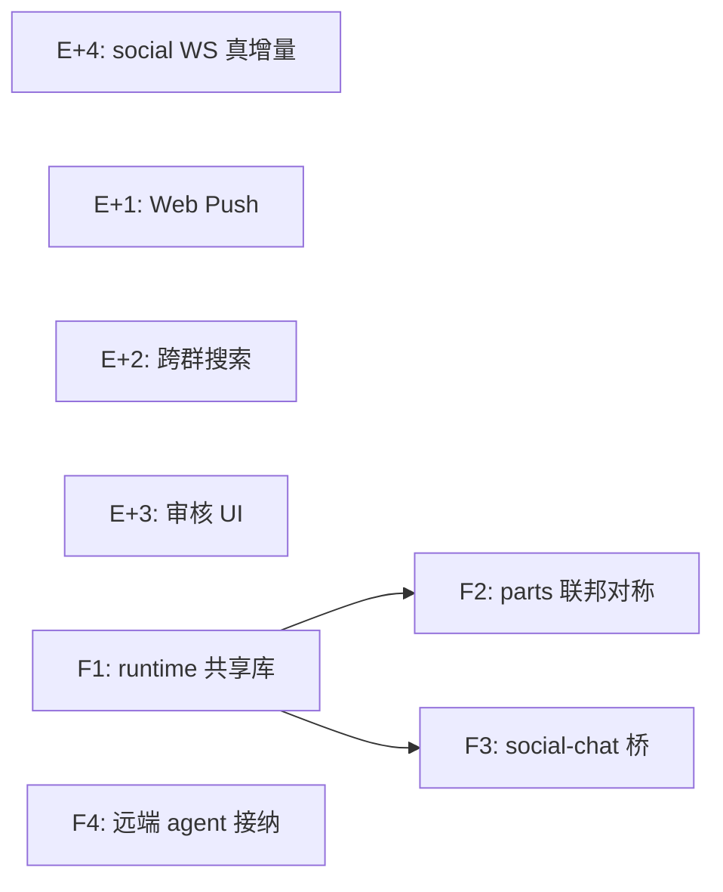

# Chat / Social 开发规划

更新：`2026-07-11`

> 本文档只包含**基线与前瞻规划**，不维护实施状态。各批次做没做、做到哪，以仓库代码与各 shell 测试为准。
>
> **已落地能力**见审阅附录（默认折叠）：[chat-vs-industrial-im-gap.md](../review/chat-vs-industrial-im-gap.md)、[social-platform-gap-analysis.md](../review/social-platform-gap-analysis.md)。

## 定位与输入

本文档是 chat / social 两个 shell 的中期开发总纲。`2026-07-04`～`2026-07-08` 四份独立调研/设计稿结论已并入各工作流；`2026-07-11` 审阅后删除原稿，M1–M8 落地后本文同步瘦身，以代码 + 审阅报告为现状参照。

相关规范：

- [world-distribution-spec.md](world-distribution-spec.md)：world 分布形态规范（已落地）

一句话总纲：

**chat / social 的底盘（viewer 对称、统一写路径、world 分布、未读/搜索/治理 inbox）已成型；接下来的主线是 F 期：runtime 库化、parts 联邦对称、social↔chat 结构化桥、远端 agent 接纳，以及若干产品化增强（Web Push、跨群搜索、审核 UI、WS 真增量）。**

---

## 〇、交互拓扑基线（谁和谁说话）

所有工作流的设计都以下面这条**一般交互逻辑**为基线。它描述的是常规形态下各方的职责边界：

- **人类 ↔ persona**：人类通过网页或 CLI 与 persona 交互——读取历史、写入新内容。persona 是真人 I/O 的一等中间层，human UI 不是绕过 part 系统的裸通道。
- **world → persona / char**：world 通过发起 API 调用与 persona 和 char 交互（喂视图 `GetChatLogForViewer`、贡献 prompt、裁决发言顺序、代发回复 `GetCharReply` 等）。
- **world → chat 存储 / p2p 层**：world 通过 `WorldChatHost` 使用 chat 的存储与 p2p 层（共享状态经 DAG、私有数据落本地、经统一写路径投递消息/触发回复）。
- **char 内部**：char 调用 AI 或插件完成回复。**回复生成流程从始至终就是 char 的活**——shell 提供宿主底盘和可复用的 runtime 库，不是接管。

不一般的情况是**被允许的特性，不是需要修复的偏差**：

- char 可以完全不依靠 AI（规则机器人、echo、桥接外部系统）；
- persona 可以全自动回复（human 席位后面根本没有人）；
- char 可以 hack 进别的 char 里为所欲为。

系统不预设"human 席位后面必须是真人、char 席位后面必须是 AI"。接口约定的是**席位的职责**（谁产出回复、谁过滤视图），不是席位背后的实现方式。

**D6 已落地**：未绑定 world / 未设置 persona 时，shell 以内置极小实现（`BUILTIN_WORLD` / `BUILTIN_PERSONA`）代替 null，拓扑无例外。

---

## 一、剩余产品化增强

对应 M5/M6 之后仍欠的产品面，chat 与 social 共享设计思路。

### E+1. Web Push

inbox / 未读水位已在两端落地；**系统级推送**仍是空白（chat 仅浏览器 `Notification`，social 依赖页内 badge + WS）。在 inbox 模型之上补 Service Worker + Web Push 订阅，作为多端一致的增强项。

### E+2. chat 跨群搜索

群内倒排索引与 Hub 搜索 API 已落地（`src/chat/search/`）；**跨群 inbox 检索**仍缺——`searchGroupMessages` 绑定 `groupId`，无统一全局入口。

### E+3. social 审核队列 UI

`report` / `mute` / `contentWarning` 数据语义与 API 已立（`src/governance/report.mjs`）；**审核后台 UI** 后置，F 期先把运营面做出来。

### E+4. social WS 真增量

live `ws` suite 已覆盖发帖 push、通知 push、断线重连（`test/live/scripts/ws.mjs`）。前端仍是「有新帖横幅 → 用户点重拉」而非单帖 DOM 插入；`init.mjs` 收到 `{ type: 'post' }` 后应拉取单帖并 prepend，消除整段 `loadFeed`。

---

## 二、工作流 F：下一阶段（方向性）

按依赖顺序排列。A–G 与 M1–M8 已完成，以下为 F 期主线。

### F1. runtime 工具链沉淀为宿主侧共享库

先立边界：**回复生成是 char 的活，`char.GetReply` 是且始终是唯一的回复生成入口，shell 不接管、不代跑。**

真正要做的是消除**重复**而不是转移**责任**：`buildPromptStruct` 本身已是 shell 共享导出（`src/prompt_struct/`），真正以复制粘贴形态散落在各 char 模板里的是围绕它的 `AIsource.StructCall` + plugin `ReplyHandler` regen 循环，应沉淀为 shell 出品的共享 runtime 库（`src/chat/session/` 或独立 lib）：

- char 主动 import / 组合这套库来实现自己的 `GetReply`（easychar 模板即是这条默认链的雏形，改为薄薄一层对库的调用）；不想用的 char 继续从零自建，完全控制权不变。
- provider 选择、tool contract、重试/审计/可观测性做成**库层能力**，char 用了库就自然获得，而不是宿主强制治理。
- 收益：char 模板大幅缩水、行为一致性提升，且不改变"char 对自己的回复负全责"的架构事实。
- 这是大改动，单独立项设计。

### F2. parts 联邦对称

- persona 跨节点从"特判透传"（`extension.otherPersona`）升级为正式 remote persona proxy。
- plugin 联邦参与（至少 prompt 贡献侧）。
- 依赖 F1：共享 runtime 库普及后，prompt 组装有统一的库层位置挂这些远端代理（而不是每个 char 各接一遍）。

### F3. social ↔ chat 结构化桥

按生态报告的边界原则：social 只传结构化 ingress，chat 只产出结构化草稿。

- `social → chat`：OnMention 无 handler 时回退 `chat.GetReply` **已落地**（`chatMentionFallback.mjs`）；下一阶段是把 mention 升级为专用 channel / 一次性会话的**结构化 ingress**，而非最小 reply 文本。
- `chat → social`：char 在 chat 会话中产出"发帖草稿"结构化输出，经确认后走 social `POST /posts`。
- 不把 persona/world/plugin 塞进 social 主语义层；当前仅有前端深链（`runUri.mjs`、`groupRef.mjs`），无后端结构化桥。

### F4. 远端 agent 的 social 接纳

- 补跨节点 `nodeHash → operator` 身份链（p2p 信任图扩展），让远端托管 agent 的 timeline ingress 可被授权，解除 `timeline_ingress.test.mjs` 中的拒绝现状。
- 属于 p2p 层工作，见 `src/scripts/p2p/AGENTS.md`。

### F5. 可观测性

- 现有 Sentry 之上补关键指标：联邦同步失败率、DAG 追补延迟、WS 连接数、生成耗时分布。以 debugLog/内部计数起步，不引重型 APM。

### 明确不做（本规划周期内）

- ActivityPub 兼容层：与自研联邦路线冲突，成本高收益不明，仅在目标转向公开联邦生态时重估。
- 移动推送/多端 native：无移动端载体。
- 大厂级 AV/直播产品化：现有 relay/streaming channel 维持现状。

---

## 三、里程碑与依赖

建议批次（完成状态看代码，本表不维护）：

| 批次 | 内容 | 说明 |
| --- | --- | --- |
| M9 | E+4 + E+3 | social 前端手感 + 审核 UI，可独立合入 |
| M10 | E+1 + E+2 | 推送与 chat 跨群搜索，共享 inbox/索引基建 |
| F 期 | F1 → F2/F3，F4/F5 并行 | 各自单独立项设计 |

### 测试策略

- 每个批次配套集成测试进各 shell 的 `test/manifest.json`（`fount test` 自包含，无需跑服务器）。
- E+4：live `ws` suite 补「发帖 → WS → 前端 DOM 可见单帖」断言（Playwright 或 live harness）。
- F4：扩展 `timeline_ingress.test.mjs` 覆盖授权后的远端 agent 写入。

---

## 附录：M1–M8 已落地摘要

> 细节与证据见审阅报告折叠附录，此处只列批次对照，便于回溯。

| 批次 | 内容 |
| --- | --- |
| M1 | viewer 模型 + `GetChatLogForViewer` 统一分发 + member_roles 接线 |
| M2 | `BeforeUserSend` + DAG-first 统一写路径 |
| M3 | materialize 层 + view-log API + persona 过滤 + D6 极小 world/persona + Hub 切读口 |
| M4 | edit/delete 钩子、悬空接口清理、目录整理、llms.txt、`remoteWorldProxy` 补齐 |
| M5 | chat/social 未读/通知 inbox + Hub badge + social 乐观写/分页/错误 toast |
| M6 | 搜索索引、social 治理最小集、social live WS 测试加强 |
| M7 | world `distribution` 声明与三分发 |
| M8 | `world_state` + `WorldChatHost` |
