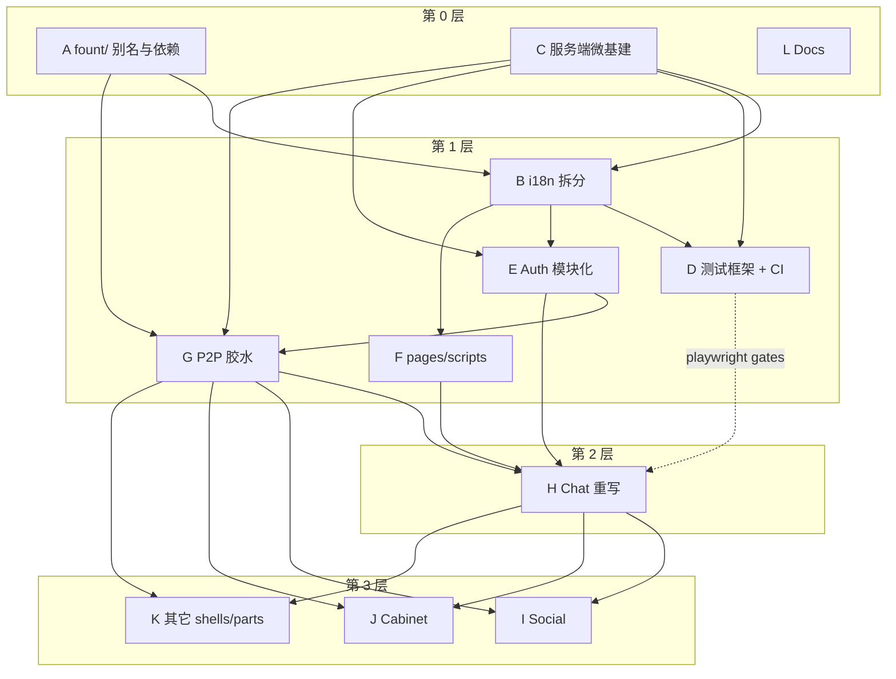

# together → master PR 拆分规划

更新：`2026-07-20`

> 工作副本：分支 `split/together-to-master`（`together` tip soft-reset 到 `master`）。
> 备份：`refs/backup/together-tip`、`refs/backup/pre-split-20260720212731`。
> 目标：用分层 PR 把 `together` 合入 `master`；每层合并后由人类通知再开下一层。
> 全部结束后：`git diff master together` 核对无遗漏、无负向回退。

## 规模

约 **1942 文件 / 337 commits**（`origin/master..together`）。

## 内容组

| ID | 标题 | 范围 | 体量 |
| --- | --- | --- | --- |
| **A** | `fount/` 别名与依赖底座 | `deno.json`（`fount/`、`esm.sh`、deps、`test` task）、`package.json` exports | 极小 |
| **B** | i18n 拆分 | `src/scripts/i18n/{bare,index}.mjs` 替扁平 `i18n.mjs`；前端 `pages/scripts/i18n/`；`.github/pages/scripts/i18n/`；`locale.mjs`；全库 import 路径 | 小–中 |
| **C** | 服务端微基建 | `net_listen`、`registries`、`no_cors`、multipart/notify/web-push、`sentry_state` 迁移、对应 pure 测与最小接线 | 中小 |
| **D** | 测试框架 + CI | `src/scripts/test/`、`fount test` CLI、`.github/workflows/*`、`.esh/commands/test.ps1` | 中 |
| **E** | Auth 模块化 | `auth.mjs`/`webauthn.mjs` → `src/server/auth/` | 小 |
| **F** | 前端 pages/scripts 重整 | scripts 目录重组、components/api/lib/theme 等 | 中 |
| **G** | P2P 胶水 | `p2p_server/`、`p2p_endpoints`、`decl/p2pAPI.ts`、`starts.P2P` | 小 |
| **H** | Chat 重写 | `shells/chat/**` + 相关 decl | 巨大 |
| **I** | Social | `shells/social/**` | 大 |
| **J** | Cabinet | `shells/cabinet/**` | 中 |
| **K** | 其它 shells / bots / parts | discord/tg/wechat、home、plugins、serviceGenerators 等 | 中 |
| **L** | Docs | `docs/design\|review`、本规划档；locales/AGENTS 大改可跟功能组或收口 | 小 |

## 依赖（实测修正）

- **B** 的 `i18n/index.mjs` 依赖 **C** 的 `registries`；完整 `auth/index` 属 **E**。在 E 合并前，B 可暂对 `auth.mjs` 接线，E 再改路径。
- **D** 的 playwright gate 引用 chat/social → 框架主体可先合，gate 跟 H/I。
- **I/J/K** 依赖 **H**；**I/J/K** 均依赖 **G** 的实体/P2P 面。

## 本轮（第 0 层）执行顺序

1. **A**、**L** — 基于 `master`，互不依赖，可并行。
2. **C** — 基于 `master`（与 A 无边；不依赖 `fount/` 别名本轮落地）；本轮落地 `net_listen` + `no_cors`（含接线与 pure 测）。**registries / parts_loader 扫描延期**到后续 PR。
3. **B** — 基于 `master` 并行开出：`i18n` 拆分后 part locales **暂留** master 的 `parts_locale_*` cache（不依赖 registries）；auth 仍走 `auth.mjs` 直到 E。

## 操作约定

- 从 `master`（或声明的 base）建 `pr/together-<id>-…` 分支；只 `git checkout together -- <paths>` / 具名 stage，禁止 `git add .`。
- 每层合并完毕后人类通知，再开下一层。
- 全部合并后比对 `master` vs `together`。

## 进度

| 层 | 组 | 状态 | PR |
| --- | --- | --- | --- |
| 0 | A | 已开 PR | https://github.com/steve02081504/fount/pull/233 |
| 0 | C | 已开 PR（net_listen + no_cors；registries 延期） | https://github.com/steve02081504/fount/pull/234 |
| 0 | L | 已开 PR | https://github.com/steve02081504/fount/pull/232 |
| 0 | B | 已开 PR（part locales 仍用旧 cache） | https://github.com/steve02081504/fount/pull/235 |
| 1+ | D–K | 未开始 | |
