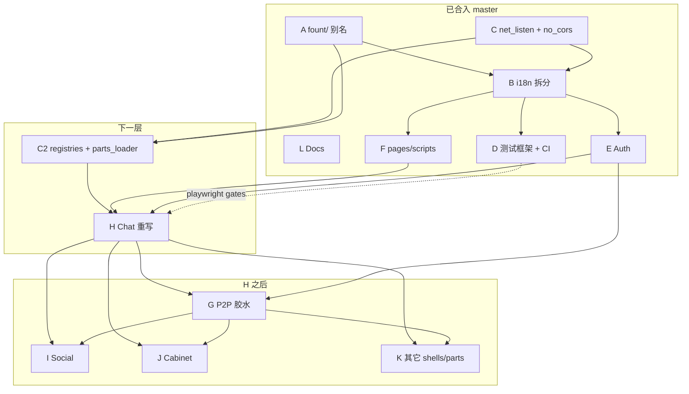

# together → master PR 拆分规划

更新：`2026-07-21`

> 工作副本：分支 `split/together-to-master`（`together` tip soft-reset 到最新 `master`）。
> 备份：`refs/backup/together-tip`、`refs/backup/pre-resync-edf-*`。
> 目标：用分层 PR 把 `together` 合入 `master`；每层合并后由人类通知再开下一层。
> 全部结束后：`git diff master together` 核对无遗漏、无负向回退。

## 规模

约 **1942 文件 / 337 commits**（初始 `origin/master..together`）。E/D/F 合入后工作树脏路径约 **320+**。

## 内容组

| ID | 标题 | 范围 | 体量 |
| --- | --- | --- | --- |
| **A** | `fount/` 别名与依赖底座 | `deno.json`（`fount/`、`esm.sh`、deps、`test` task）、`package.json` exports | 极小 |
| **B** | i18n 拆分 | `src/scripts/i18n/{bare,index}.mjs` 替扁平 `i18n.mjs`；前端 `pages/scripts/i18n/`；`.github/pages/scripts/i18n/`；`locale.mjs`；全库 import 路径 | 小–中 |
| **C** | 服务端微基建 | `net_listen`、`no_cors`（已合）；**C2**：`registries` + `parts_loader` 扫描（延期） | 中小 |
| **D** | 测试框架 + CI | `src/scripts/test/`、`fount test` CLI、`.github/workflows/*`、`.esh/commands/test.ps1` | 中 |
| **E** | Auth 模块化 | `auth.mjs`/`webauthn.mjs` → `src/server/auth/` | 小 |
| **F** | 前端 pages/scripts 重整 | scripts 目录重组、components/api/lib/theme 等 | 中 |
| **G** | P2P 胶水 | `p2p_server/`、`p2p_endpoints`、`decl/p2pAPI.ts`、`starts.P2P` | 小 |
| **H** | Chat 重写 | `shells/chat/**` + 相关 decl | 巨大 |
| **I** | Social | `shells/social/**` | 大 |
| **J** | Cabinet | `shells/cabinet/**` | 中 |
| **K** | 其它 shells / bots / parts | discord/tg/wechat、home、plugins、serviceGenerators 等 | 中 |
| **L** | Docs | `docs/design\|review`、本规划档；locales/AGENTS 大改可跟功能组或收口 | 小 |

## 依赖（实测修正）

- **B** 完整 `i18n/index`（registries 扫 locales）依赖 **C2**；已合 B 仍用 `parts_locale_*` cache。
- **D** playwright gate 引用 chat/social → 框架已合（gate 内联）；H/I 后可改回导入。
- **G** 依赖 **E**（已合）与 **H** 的 `entity/store`（及 `identity`）→ **G 须跟在 H 后或与 H 同 PR**。
- **C2** `parts_loader` 用 `@steve02081504/fount-p2p` 的 composite_key（deps 已在 A）；不强制整包 G。
- **I/J/K** 依赖 **H**；亦依赖 **G** 的实体/P2P 面。

## 操作约定

- 从 `master`（或声明的 base）建 `pr/together-<id>-…` 分支；只 `git checkout together -- <paths>` / 具名 stage，禁止 `git add .`。
- `git checkout together -- <paths>` **不会删除** master 上 together 已移除的文件；重写类 PR 必须对照 `git ls-tree` 做显式 `git rm`。
- 每层合并后：soft-reset 工作树到新 `master`，**不回退** master 上已合修复；together 仍需要的文件则 **port** 修复 hunk。
- 全部合并后比对 `master` vs `together`。

## 进度

| 层 | 组 | 状态 | PR |
| --- | --- | --- | --- |
| 0 | A | **已合并** | https://github.com/steve02081504/fount/pull/233 |
| 0 | C | **已合并**（net_listen + no_cors；registries → C2） | https://github.com/steve02081504/fount/pull/234 |
| 0 | L | **已合并** | https://github.com/steve02081504/fount/pull/232 |
| 0 | B | **已合并**（part locales 仍用旧 cache） | https://github.com/steve02081504/fount/pull/235 |
| 1 | E | **已合并**（含 endpoints `getUserByReq` 去 await、`loginWithApiKey` 可选 req） | https://github.com/steve02081504/fount/pull/236 |
| 1 | D | **已合并**（gate 内联至 H/I） | https://github.com/steve02081504/fount/pull/237 |
| 1 | F | **已合并**（含 floatingPanel/catbox 等后续修） | https://github.com/steve02081504/fount/pull/238 |
| 2 | C2 | **已合并** | https://github.com/steve02081504/fount/pull/239 |
| 2 | H | **已合并** | https://github.com/steve02081504/fount/pull/240 |
| 3 | G | **已合并** | https://github.com/steve02081504/fount/pull/241 |
| 3 | I | **已合并** | https://github.com/steve02081504/fount/pull/243 |
| 3 | J | **已合并** | https://github.com/steve02081504/fount/pull/242 |
| 3 | K | 已开 PR | https://github.com/steve02081504/fount/pull/246 |
