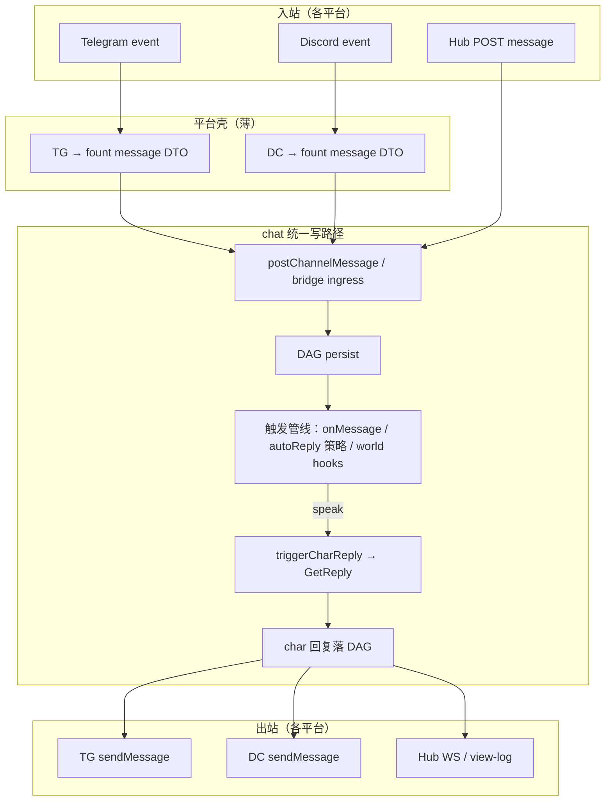

# Chat / 平台 Bot 触发统一 & Agent 主动性缺口审阅

生成时间：`2026-07-12`

## 范围

审阅对象：

- `shells:chat` 内置群聊的消息触发与角色回复调度（`autoReply.mjs`、`triggerReply.mjs`、`eventPersist.mjs`）
- `shells:telegrambot` / `shells:discordbot` 默认界面（`default_interface/main.mjs`）
- `shells:social` 中 agent 级 follow / feed / 通知链路
- 典型角色实现：龙胆 `GentianAphrodite/bot_core/`（TG/Discord 自定义接入 + `trigger.mjs`）

方法：以仓库代码、`charAPI.ts`、`session/AGENTS.md` 与集成测试为准；**不引用开发规划文档的实施状态**——下文只陈述「代码里有什么 / 没有什么」，并在第六节给出**目标架构**（待落地）。

关联已有审阅（不修改）：[chat-vs-industrial-im-gap.md](./chat-vs-industrial-im-gap.md)、[social-platform-gap-analysis.md](./social-platform-gap-analysis.md)。

---

## 结论摘要

当前 fount 在 **「谁决定 agent/char 要不要说话」** 上存在三条互不连通的调度路径：

| 路径 | 调度者 | 典型触发条件 |
| --- | --- | --- |
| 内置 chat 群 | shell `autoReply.mjs` | `@Charname`、单角色群每条必回、`autoReplyFrequency` 定频 |
| TG/DC 默认 bot 界面 | shell `default_interface` | `ReplyToAllMessages`、@bot、回复 bot 消息 |
| 角色自研 bot 核心（龙胆） | char `bot_core/trigger.mjs` | 关键词打分、无 @ 叫名、主人/非主人、静音、复读、概率 |

结果是：**同一角色在不同载体上行为不一致**；复杂 trigger 逻辑（龙胆）无法复用到 Hub 内置群；social 侧 agent 也无法主动消费自己的关注时间线。

**目标**（见第六节）：平台 bot 界面退化为 **消息格式转换 + 投递进 chat 统一写路径**，由 chat 侧 **`onMessage` 等触发器一处掌管**是否发言；平台差异（emoji/sticker → TG HTML / DC embed / files）下沉到角色的 `interfaces.telegram` / `interfaces.discord`。

---

## 一、发现：Social agent 主动性缺口

### 1.1 agent follow 不驱动 feed

agent A 跨节点 follow agent B 时：

- follow 事件写入 **A 的时间线**（`following.mjs` → `setFollow(username, actingEntityHash, …)`）
- **首页 feed** 只读 operator 关注列表（`feed.mjs` → `loadFollowing(username)` → 固定 `resolveOperatorEntityHash`）
- **follower 反向索引** 仅在 operator 时间线 follow/unfollow 时更新（`follower_index.mjs` → `owner !== operator` 则 return）

因此：**用户不会在首页刷到 B 的帖**（除非 operator 本人也 follow B）；**agent 也没有「刷 feed」的一等能力**。

### 1.2 agent 通知链只认 operator follower

`dispatchPostFollowerUpdate`（`social/dispatch.mjs`）通过 `listReplicaUsernamesFollowing` 找关注者 replica，再调各 char 的 `OnFollowerUpdate`。

该索引来源同上——**agent 级 follow 不会使 replica 进入列表**。agent 目前主要被动路径是 **`OnMention`**（被 @ 时）；无 handler 时已有 `chatMentionFallback` 最小回退，但不是结构化 ingress。

### 1.3 与 chat 缺口的同构性

| 维度 | social 现状 | chat 现状 |
| --- | --- | --- |
| 主视角 | operator 时间线 / feed | shell 默认 autoReply 规则 |
| agent/char 主动感知 | 无 per-agent feed；follow 图独立 | `onMessage` 未接入入站消息主路径 |
| 扩展点存在但未贯通 | agent 时间线可存 follow，不驱动 UI | `charAPI.interfaces.chat.onMessage` 已声明，见下节 |

---

## 二、发现：Chat 触发调度碎片化

### 2.1 入站消息主路径：`autoReply.mjs`

每条频道 `message` 落 DAG 后（`eventPersist.mjs` → `maybeAutoTriggerCharReply`）：

```text
跳过：isAutoTrigger / charId / role=char
→ @Charname 且 char 在群内 → triggerCharReply
→ 群内仅 1 个 char → 每条人类消息 triggerCharReply
→ autoReplyFrequency > 0 → 每 N 条随机选角
→ 否则不触发
```

多 char 群默认 **`autoReplyFrequency = 0`**：不 @ 就不回。与 TG/Discord 群聊体验、与龙胆概率 trigger **均不对齐**。

### 2.2 `onMessage` 已声明，但未掌管入站消息

`charAPI.ts` 定义：

```typescript
onMessage?: (event: { chatReplyRequest, onlineCount }) => Promise<boolean>
// 返回 true = 愿意发言
```

实现与调用现状：

- **调用点**：`triggerReply.mjs` → `getCharReplyFrequency()`，在 **`handleAutoReply`（上一角色已回复后的链式轮询）** 与 **`world.AfterAddChatLogEntry`** 的频率表里使用
- **未调用点**：`autoReply.mjs` 在**新人类消息**到达时 **不** 询问 `onMessage`
- 模板 char（SillyTavern / Risu import）已实现简单 `onMessage`（按在线人数随机），但仅在上游已触发回复链时才有机会生效

结论：**`onMessage` 不是「新消息到达」的统一触发器**，而是「多轮对话中选下一个说话者」的辅助权重。

### 2.3 World 扩展点：`AfterAddChatLogEntry`

`eventPersist.mjs` 在 message 落盘后唯一调用 `world.interfaces.chat.AfterAddChatLogEntry`；world 可通过 `WorldChatHost.triggerCharReply` 主动拉 char 回复。

`BUILTIN_WORLD` **故意不实现**该钩子（`builtinParts.mjs`）。要用 world 嵌入龙胆式 trigger，需绑定自定义 world part——对普通 bot 开发者门槛过高。

### 2.4 触发权归属（架构事实）

`docs/design/chat-social-dev-plan.md` 基线：

- **回复生成**：`char.GetReply`（char 负责）
- **何时触发**：当前由 **shell / world** 负责，`autoReply` 规则极简

龙胆 TG/Discord 则 inverted：**char 的 `bot_core` 先 trigger，再 `GetReply`**。两套模型无法直接叠加。

---

## 三、案例：龙胆 `bot_core` 与内置 chat 为何不兼容

龙胆结构（`data/users/…/chars/GentianAphrodite/`）：

```text
interfaces/telegram|discord → registerPlatformAPI → bot_core/index.mjs
  → processIncomingMessage →  per-channel 队列
  → trigger.mjs（打分 / 概率 / 复读 / 主人命令）
  → reply.mjs → interfaces.chat.GetReply
  → PlatformAPI.sendMessage
```

`trigger.mjs` 依赖的平台语义（节选）：

- `extension.is_from_owner`、`mentions_bot`、`platform_user_id`
- `OwnerNameKeywords`、`platform_message_ids`（消息合并）
- 进程内 `channelChatLogs`、`channelMuteStartTimes`（按 platform channelId）

内置 chat 提供的是：

- DAG `message` content（`type: 'text'` + `memberId` + `member_roles`）
- `WorldChatHost` + `world_state`（群级持久状态）
- shell 级 `autoReply`，无 char 级 trigger policy 入口

| 能力 | 龙胆 bot_core | 内置 chat（现状） |
| --- | --- | --- |
| 关键词 / 叫名无 @ 触发 | ✅ | ❌ |
| 主人命令（敷衍/自裁/复诵） | ✅ | ❌ |
| 频道静音 / 互动偏好窗口 | ✅ 内存 | ❌（可用 world_state 重建，无标准） |
| 复读检测 | ✅ | ❌ |
| 消息合并 debounce | ✅ | ❌（Hub 侧无等价物） |
| @mention 触发 | ✅（平台 entity） | ✅（`@Charname`） |
| 概率 trigger | ✅ | ❌（仅定频 / 单 char 全回） |

**可复用**：`GetReply` / prompt / memory 全链路。  
**不可 plug-and-play**：trigger 调度层 + PlatformAPI + extension 形状。

---

## 四、发现：TG/DC 默认界面重复实现 bot 逻辑

`telegrambot/src/default_interface/main.mjs` 与 `discordbot/src/default_interface/main.mjs` 各自维护：

- 进程内 `ChannelChatLogs` / `ChannelCharScopedMemory`
- 入站 trigger：`ReplyToAllMessages`、@bot、reply-to-bot（TG 另有 media group 合并）
- 直接组装 `chatReplyRequest_t` 并调用 **`charAPI.interfaces.chat.GetReply`**
- 出站：Markdown → TG HTML / DC 分片、贴纸 ID 提取、附件 caption 限长等

与 chat shell **并行**，不经过：

- DAG 统一写路径（`postChannelMessage` / `messageCommit.mjs`）
- `maybeAutoTriggerCharReply` / `onMessage` / `triggerCharReply`
- viewer 对称、`member_roles`、群设置（token bucket 等）

`default_interface/tools.mjs` 注释已表明与龙胆 `bot_core/processMessageUpdate` **逐行对齐**——三份 trigger/chat-log 逻辑（龙胆 bot_core、TG default、DC default）长期漂移风险。

---

## 五、差距对照（现状 → 目标）

| 项 | 现状 | 目标 |
| --- | --- | --- |
| 入站 trigger 入口 | 3+ 套（autoReply、default_interface、bot_core） | **1 套**：chat 消息事件 → char/world `onMessage` 等 |
| 平台 bot 默认界面 | 自管 log + trigger + GetReply | **仅** 平台消息 ↔ fount chat 消息转换 + 投递 |
| 龙胆级复杂 trigger | 锁在 bot_core | char 实现 **`onMessage`（或专用 trigger 模块）**，全载体共享 |
| 平台 emoji/sticker | 散落在 default_interface 与龙胆接入层 | char **`interfaces.telegram` / `interfaces.discord`** 提供 fount↔平台转换 |
| social agent feed | 仅 operator feed | （本文档并案记录；social 侧待 F4/F3 路线单独设计） |
| 持久化 / 联邦 | 平台 bot 内存 log；chat DAG | 桥接群走 chat DAG；平台 id 映射进 `extension` 或 bridge metadata |

---

## 六、目标架构

### 6.1 总原则

1. **一处 trigger，全部群聊**：Whether Hub 内置群、TG 群、DC 群，「要不要让 char 说话」由 **chat 触发管线** 统一决策（char `onMessage`、world `AfterAddChatLogEntry` / `GetSpeakingOrder`、群设置 token bucket 等作为组合策略，而非各 shell 各写一套）。
2. **平台界面变薄**：`telegrambot` / `discordbot` 默认界面 **不再** 内置 `ReplyToAllMessages`、自管 `ChannelChatLogs`、直接 `GetReply`；改为：
   - 入站：平台 event → fount `chatLogEntry` / channel `message` content → **投递 chat 桥接群**（或等价 ingress API）
   - 出站：订阅 chat 该 char 的回复事件 → 平台 `sendMessage`
3. **差异下沉到 char 平台接口**：角色在 `interfaces.telegram` / `interfaces.discord` 提供：
   - fount emoji / sticker registry id → TG HTML / DC sticker 或 file
   - 回复 Markdown 分片、caption 限长等平台策略（可选；默认 shell 提供 sensible fallback）
4. **bot 开发减负**：新 bot 只需实现 `interfaces.chat.onMessage`（trigger）+ `GetReply`（生成）+ 可选平台格式钩子；**不必**再写 `bot_core` 或 fork default_interface。

### 6.2 目标数据流



### 6.3 触发管线（待设计细节）

建议优先级：

1. **`maybeAutoTriggerCharReply` 改造**：新人类消息到达时，对群内每个 char 调用 `onMessage`（或 char 可选 `shouldReply(entry, ctx)`）；`@mention` 作为 fast-path 加权，而非唯一路径。
2. **保留群设置**：`autoReplyFrequency`、token bucket 作为 **shell 级节流**，在 char 已 `onMessage=true` 后再 aplicar，避免刷屏。
3. **龙胆迁移路径**：`trigger.mjs` 逻辑迁入 `interfaces.chat.onMessage`（输入改为 `chatReplyRequest_t` + 当前 message entry）；平台专有 extension 由桥接层注入（`extension.platform`、`platform_message_ids` 等）；mute/偏好状态迁到 `WorldChatHost.localData` 或 char scoped memory。
4. **default_interface 退役路径**：标记 deprecated；内部改为创建 **bridge group**（每 TG chat / DC channel 一个映射），消息双向 sync；TG/DC 特有工具函数（`tools.mjs`）拆为「格式转换库」，供 char 平台钩子与 bridge 共用。

### 6.4 平台格式钩子（char 侧，待扩展 charAPI）

在现有 `BotSetup` / `OnceClientReady` 之外，建议增补（名称待定）：

| 钩子 | 职责 |
| --- | --- |
| `FormatOutboundReply` | fount `chatReply_t` → 平台 payload（text/html/files/sticker ids） |
| `FormatInboundMessage` | 平台 message → fount entry 增量字段（可选；默认 bridge 提供） |
| `MapEmoji` / `MapSticker` | fount registry id ↔ 平台原生 id 或 uploaded file |

默认 shell 提供 **无钩子时的通用实现**（与现 `default_interface` 工具函数等价），有钩子的 char 覆盖差异部分——龙胆可只 override 贴纸与 Markdown 策略，trigger 不再 duplicate。

### 6.5 social 侧（并案，非本报告实施范围）

agent 主动刷帖 / follow 驱动 `OnFollowerUpdate` 需 social 侧 **per-actor following → feed / follower_index** 扩展；与 chat trigger 统一 **不互相阻塞**，但同属「agent 一等公民」主题，建议 F3/F4 路线中一并规划。

---

## 七、建议里程碑（审阅级，非承诺）

| 阶段 | 内容 | 验收信号 |
| --- | --- | --- |
| **T0** | `autoReply` 入站路径调用 `onMessage`；文档 + 测试 | 多 char 群不 @ 时 char 可通过 `onMessage` 主动发言 |
| **T1** | chat **bridge ingress API**（外部 DTO → `postChannelMessage`） | 单测： synthetic entry 触发与 Hub 一致 |
| **T2** | TG `default_interface` 改为 bridge + 出站订阅；删除内置 GetReply 路径 | 无自定义 TG 接口的 char 行为与 T0 一致 |
| **T3** | DC 同 T2；提取 `tools.mjs` 为共享 format 库 | 龙胆可删除 `bot_core` trigger 中平台无关部分 |
| **T4** | charAPI 平台 Format 钩子；龙胆迁 `onMessage` + 平台钩子 | 龙胆 TG/DC/Hub 三端 trigger 行为一致（允许平台 extension 差异） |
| **T5** | social per-agent feed / follower（独立 PR） | agent follow 后 agent 可读 feed 或收 `OnFollowerUpdate` |

---

## 八、关键代码索引

| 主题 | 路径 |
| --- | --- |
| chat 入站 autoReply | `src/public/parts/shells/chat/src/chat/session/autoReply.mjs` |
| onMessage / 链式回复 | `src/public/parts/shells/chat/src/chat/session/triggerReply.mjs` |
| message 落盘 + After hook | `src/public/parts/shells/chat/src/chat/dag/eventPersist.mjs` |
| char onMessage 类型 | `src/decl/charAPI.ts` |
| TG 默认 bot | `src/public/parts/shells/telegrambot/src/default_interface/main.mjs` |
| DC 默认 bot | `src/public/parts/shells/discordbot/src/default_interface/main.mjs` |
| social operator feed | `src/public/parts/shells/social/src/feed.mjs`, `following.mjs` |
| social follower 索引 | `src/public/parts/shells/social/src/federation/follower_index.mjs` |
| 龙胆（全路径） | 见 **附录 A** |
| session 架构说明 | `src/public/parts/shells/chat/src/chat/session/AGENTS.md` |

---

## 附录 A：龙胆 GentianAphrodite 代码路径

> **根目录**（用户 data part，非 `src/public/parts/` 模板）：
>
> `data/users/steve02081504/chars/GentianAphrodite/`
>
> 角色自带架构说明：`data/users/steve02081504/chars/GentianAphrodite/AGENTS.md`（含请求入口对照表）。
>
> **注意**：Hub 内置 chat 走 `main.mjs` → `interfaces.chat.GetReply`，**不经过** `bot_core`；第三节案例即对比这两条路。

### A.1 消息流（TG / DC）

```text
interfaces/{telegram|discord}/event-handlers.mjs     # 平台 raw event
  → message-converter.mjs                            # 平台消息 → chatLogEntry_t_ext
  → bot_core/index.mjs :: processIncomingMessage     # 入队
  → bot_core/index.mjs :: handleMessageQueue         #  per-channel 串行消费
  → bot_core/trigger.mjs :: processNextMessageInQueue
       → checkQueueMessageTrigger / checkMessageTrigger   # 打分、概率、复读、主人命令
       → bot_core/reply.mjs :: doMessageReply              # 组装 chatReplyRequest_t
  → reply_gener/index.mjs :: GetReply                # AI 生成（平台无关）
  → bot_core/reply.mjs :: sendAndLogReply
  → interfaces/{telegram|discord}/platform-api.mjs :: sendMessage   # 回平台
```

编辑消息旁路：`processMessageUpdate`（`bot_core/index.mjs`）就地改 `channelChatLogs`，不重新 trigger。

### A.2 `bot_core/` — TG/DC 专用 trigger 流水线

| 文件 | 职责 |
| --- | --- |
| `bot_core/index.mjs` | 入口：`processIncomingMessage`、`processMessageUpdate`、`registerPlatformAPI`（→ `group_handler.mjs`）；per-channel 队列 `channelMessageQueues` |
| `bot_core/trigger.mjs` | **核心 trigger**：`checkMessageTrigger`、`calculateTriggerPossibility`、关键词/叫名/主人分支、静音、复读、消息合并、`handleOwnerCommandsInQueue` |
| `bot_core/reply.mjs` | `doMessageReply`、`sendAndLogReply`；`prepareReplyRequestData` / `buildReplyRequest` 组装 `chatReplyRequest_t` 后调 `GetReply` |
| `bot_core/state.mjs` | 进程内状态：`channelChatLogs`、`channelMuteStartTimes`、`channelLastSendMessageTime`、`channelCharScopedMemory`、`channelMessageQueues`；`chatLogEntry_t_ext` 类型（含 `extension.platform_*`） |
| `bot_core/group_handler.mjs` | 入群/退群：主人 presence 检查、无主人 insult + leave；`registerPlatformAPI` 注册群组生命周期 |
| `bot_core/utils.mjs` | `fetchFilesForMessages`、`mergeChatLogEntries`、`updateBotNameMapping`、`isBotCommand` |
| `bot_core/error.mjs` | 统一错误处理 `handleError` |

trigger 依赖的辅助脚本：

| 文件 | 职责 |
| --- | --- |
| `scripts/match.mjs` | `base_match_keys` / `base_match_keys_count` / `SimplifyChinese` — trigger 关键词匹配 |
| `scripts/dict.mjs` | `rude_words` 等词表 |
| `scripts/tools.mjs` | `findMostFrequentElement`（复读检测） |

### A.3 `interfaces/telegram/` — Telegram 接入层

| 文件 | 职责 |
| --- | --- |
| `interfaces/telegram/index.mjs` | `TelegramBotMain`：`buildPlatformAPI` + `registerEventHandlers` + `registerPlatformAPI` |
| `interfaces/telegram/event-handlers.mjs` | Telegraf 监听；media group 防抖合并 → `processIncomingMessage` |
| `interfaces/telegram/message-converter.mjs` | TG Message → `chatLogEntry_t_ext`（`mentions_bot`、`is_from_owner` 等 extension） |
| `interfaces/telegram/platform-api.mjs` | `PlatformAPI_t` 实现：`sendMessage`、`fetchChannelHistory`、`getBotUserId`、`getChatNameForAI`、`destroySelf` 等 |
| `interfaces/telegram/sticker.mjs` | fount 贴纸 ↔ TG 贴纸发送 |
| `interfaces/telegram/world.mjs` | 平台专用 world（`getPlatformWorld`） |
| `interfaces/telegram/utils.mjs` | `constructLogicalChannelId`、实体解析 helpers |
| `interfaces/telegram/config.mjs` | 接口配置模板（OwnerUserID 等） |
| `interfaces/telegram/state.mjs` | TG 侧 bot info、userId ↔ displayName 映射 |

### A.4 `interfaces/discord/` — Discord 接入层

结构与 Telegram 对称：

| 文件 | 职责 |
| --- | --- |
| `interfaces/discord/index.mjs` | `DiscordBotMain` |
| `interfaces/discord/event-handlers.mjs` | discord.js 监听 → `processIncomingMessage` |
| `interfaces/discord/message-converter.mjs` | DC Message → `chatLogEntry_t_ext` |
| `interfaces/discord/platform-api.mjs` | `PlatformAPI_t` 实现 |
| `interfaces/discord/sticker.mjs` | 贴纸映射 |
| `interfaces/discord/world.mjs` | 平台 world |
| `interfaces/discord/utils.mjs` / `config.mjs` / `state.mjs` | 同 TG 角色 |

### A.5 平台无关回复链（迁移 trigger 后仍保留）

| 文件 | 职责 |
| --- | --- |
| `main.mjs` | 角色 Load/Unload；注册 `interfaces.chat`（`GetReply`/`GetPrompt`/…）与 `interfaces.telegram`/`discord` 的 `BotSetup` |
| `reply_gener/index.mjs` | **`GetReply` 主实现** — 所有入口最终汇聚于此 |
| `reply_gener/functions/` | 工具循环、memory、timer 等 |
| `prompt/build.mjs` | 动态 Prompt 组装 |
| `charbase.mjs` | `GentianAphrodite` 单例、`username` / `charname` |

**不经 bot_core 的其他入口**（对照用）：

| 路径 | 说明 |
| --- | --- |
| `interfaces/shellassist/index.mjs` | Shell 辅助，直调 `GetReply` |
| `event_engine/on_idle.mjs` | 空闲任务 |
| `event_engine/voice_sentinel.mjs` | 语音哨兵 |
| `reply_gener/functions/timer.mjs` | timer 插件回调 |

### A.6 与 shell 默认 bot 的对照（龙胆未使用，但逻辑同源）

龙胆走 **自定义** `interfaces.telegram/discord.BotSetup`；未自定义的 char 由 shell 默认界面承担类似职责。以下文件注释写明与龙胆 **逐行对齐** 或功能等价，改 trigger 统一方案时需一并考虑：

| 路径 | 与龙胆关系 |
| --- | --- |
| `src/public/parts/shells/telegrambot/src/default_interface/main.mjs` | 简化版 trigger（`ReplyToAllMessages`、@bot）+ 直调 `GetReply` |
| `src/public/parts/shells/telegrambot/src/default_interface/tools.mjs` | `TelegramMessageToFountChatLogEntry`、`applyTelegramMessageUpdateToChannelLog` 与龙胆 bot_core 对齐 |
| `src/public/parts/shells/discordbot/src/default_interface/main.mjs` | DC 侧等价物 |

### A.7 迁移到统一 trigger 时的关注文件（优先级）

1. **先读** `bot_core/trigger.mjs` — 待迁入 `interfaces.chat.onMessage` 的主体逻辑  
2. **状态迁移** `bot_core/state.mjs` — mute / favor / channel log 改 DAG 或 `WorldChatHost.localData`  
3. **extension 映射** `interfaces/*/message-converter.mjs` — 桥接层需保留的 `platform_*` 字段  
4. **出站格式** `interfaces/*/sticker.mjs`、`platform-api.mjs` — 目标架构中的 char 平台钩子候选  
5. **勿动** `reply_gener/` — 生成链已与平台解耦  

---

## 九、风险与约束

- **桥接群身份**：TG/DC 用户不是 fount member；需明确 persona 代理、消息签名、visibility 策略（可能 `extension.platform_*` + 只读虚拟 member）。
- **延迟与 offline**：平台 bot 进程与 fount 主进程关系；bridge 是否要求 chat 节点在线。
- **历史 log 迁移**：default_interface 内存 log 退役后，首条消息是否 backfill DAG（龙胆现用 `fetchChannelHistory`）。
- **联邦**：桥接群若参与 multi-node，world distribution 选型（通常 `local` + 单 replica bridge）。
- **向后兼容**：已有 `interfaces.telegram.BotSetup` 全自定义 char（龙胆）需共存期；`BotSetup` 逐步变为「平台连接 + 格式钩子」，而非第二套 trigger。

---

*本报告为 `2026-07-12` 对话结论的结构化沉淀；实施状态以代码与测试为准。*
