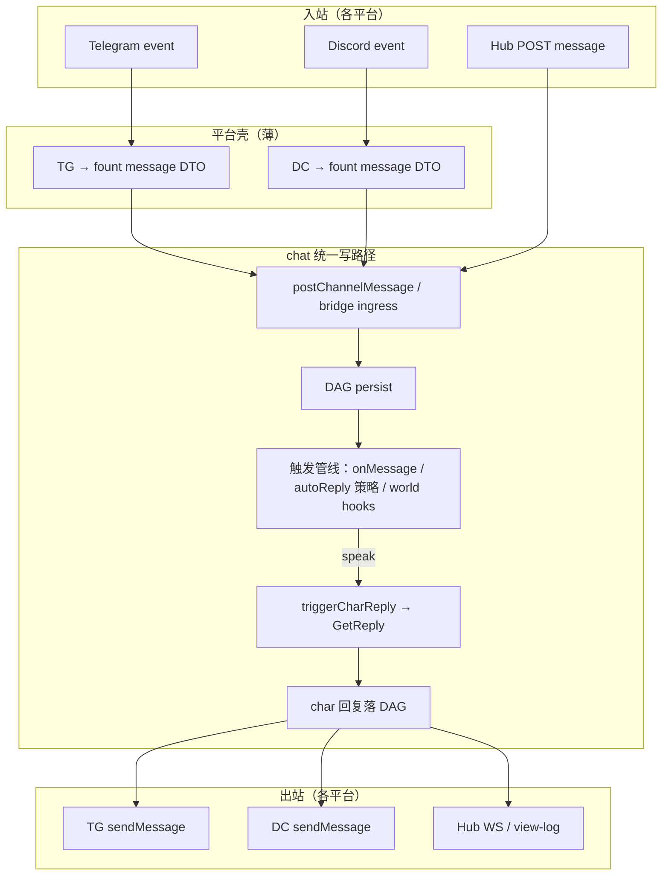

# Chat / 平台 Bot 触发统一 & Agent 主动性缺口审阅

最后核对：`2026-07-12`

## 范围

审阅对象：

- `shells:chat` 内置群聊的消息触发与角色回复调度
- `shells:telegrambot` / `shells:discordbot` 默认界面
- `shells:social` 中 agent 级 follow / feed / 通知链路
- 典型角色实现：龙胆 `GentianAphrodite`（TG/DC 自定义接入 + `bot_core`）

方法：以仓库代码、`charAPI.ts`、`session/AGENTS.md` 与集成测试为准；**不引用开发规划文档的实施状态**——下文只陈述「代码里有什么 / 没有什么」，并在第六节给出**目标架构**（待落地）。

关联审阅：[README.md](./README.md)、[human-agent-notification-parity-review.md](./human-agent-notification-parity-review.md)、[chat-vs-industrial-im-gap.md](./chat-vs-industrial-im-gap.md)、[social-platform-gap-analysis.md](./social-platform-gap-analysis.md)。

---

## 结论摘要

当前 fount 在 **「谁决定 agent/char 要不要说话」** 上存在三条互不连通的调度路径：

| 路径 | 调度者 | 典型触发条件 |
| --- | --- | --- |
| 内置 chat 群 | shell `autoReply.mjs` | `@Charname`、单角色群每条必回、`autoReplyFrequency` 定频 |
| TG/DC 默认 bot 界面 | shell `default_interface` | `ReplyToAllMessages`、@bot、回复 bot 消息 |
| 角色自研 bot 核心（龙胆） | char `bot_core/trigger.mjs` | 关键词打分、无 @ 叫名、主人/非主人、静音、复读、概率 |

结果是：**同一角色在不同载体上行为不一致**；复杂 trigger 逻辑（龙胆）无法复用到 Hub 内置群；social 侧 agent 也无法主动消费自己的关注时间线。

**目标**（见第六节）：平台 bot 界面退化为 **消息格式转换 + 投递进 chat 统一写路径**，由 chat 侧 **`onMessage` 等触发器一处掌管**是否发言；平台差异（emoji/sticker → TG HTML / DC embed / files）下沉到角色的 `interfaces.telegram` / `interfaces.discord`。

---

## 一、发现：Social agent 主动性缺口

### 1.1 agent follow 不驱动 feed

- follow 事件可写入 **agent 时间线**（`setFollow` + `actingEntityHash`）
- **首页 feed** 只读 operator 关注列表（`loadFollowing` → `resolveOperatorEntityHash`）
- **follower 反向索引** 仅在 operator 时间线 follow/unfollow 时更新

因此：用户不会在首页刷到「仅 agent follow 的对象」；agent 也没有「刷 feed」的一等能力。

### 1.2 agent 通知链只认 operator follower

`dispatchPostFollowerUpdate` 通过 `listReplicaUsernamesFollowing` 找关注者；该索引来源同上——**agent 级 follow 不会使 replica 进入列表**。agent 目前主要被动路径是 **`OnMention`**。

### 1.3 与 chat 缺口的同构性

| 维度 | social 现状 | chat 现状 |
| --- | --- | --- |
| 主视角 | operator 时间线 / feed | shell 默认 autoReply 规则 |
| agent/char 主动感知 | 无 per-agent feed | `onMessage` 未接入入站消息主路径 |
| 扩展点存在但未贯通 | agent 时间线可存 follow，不驱动 UI | `charAPI.interfaces.chat.onMessage` 已声明 |

---

## 二、发现：Chat 触发调度碎片化

### 2.1 入站消息主路径：`autoReply.mjs`

每条频道 `message` 落 DAG 后（`eventPersist.mjs` → `maybeAutoTriggerCharReply`）：

```text
跳过：isAutoTrigger / charId / role=char
→ @Charname 且 char 在群内 → triggerCharReply
→ 群内仅 1 个 char → 每条人类消息 triggerCharReply
→ autoReplyFrequency > 0 → 每 N 条随机选角
→ 否则不触发
```

多 char 群默认 **`autoReplyFrequency = 0`**：不 @ 就不回。

### 2.2 `onMessage` 已声明，但未掌管入站消息

`charAPI.ts`：`onMessage(event) => Promise<boolean>`（`true` = 愿意发言）。

**调用点**（均在 `triggerReply.mjs` → `getCharReplyFrequency`）：

- 链式轮询：上一 char 回复后的 `handleAutoReply`
- 定频选角：`autoReplyFrequency` 路径且 `charname=null`
- 自定义 world：`AfterAddChatLogEntry` 内（`BUILTIN_WORLD` **未实现**该钩子）

**未调用点**：`maybeAutoTriggerCharReply` 在新人类消息到达时 **不** 询问 `onMessage`。

结论：**`onMessage` 不是「新消息到达」的统一触发器**，而是链式/定频选角的辅助权重。

### 2.3 World 扩展点：`AfterAddChatLogEntry`

`eventPersist.mjs` 在 message 落盘后调用；world 可通过 `WorldChatHost.triggerCharReply` 主动拉 char 回复。`BUILTIN_WORLD` 故意不实现——对普通 bot 开发者门槛过高。

### 2.4 触发权归属（架构事实）

`docs/design/chat-social-dev-plan.md` 基线：

- **回复生成**：`char.GetReply`（char 负责）
- **何时触发**：当前由 **shell / world** 负责，`autoReply` 规则极简

龙胆 TG/Discord 则 inverted：**char 的 `bot_core` 先 trigger，再 `GetReply`**。两套模型无法直接叠加。

---

## 三、案例：龙胆与内置 chat 为何不兼容

龙胆（用户 data part，`data/users/…/chars/GentianAphrodite/`）在 TG/DC 上走：

```text
平台 event → message-converter → bot_core 队列 → trigger.mjs → GetReply → PlatformAPI.sendMessage
```

Hub 内置 chat 走 `interfaces.chat.GetReply`，**不经过** `bot_core`。

| 能力 | 龙胆 bot_core | 内置 chat（现状） |
| --- | --- | --- |
| 关键词 / 叫名无 @ 触发 | ✅ | ❌ |
| 主人命令、静音、复读、消息合并 | ✅ | ❌ |
| @mention 触发 | ✅（平台 entity） | ✅（`@Charname`） |
| 概率 trigger | ✅ | ❌（仅定频 / 单 char 全回） |

**可复用**：`GetReply` / prompt / memory 全链路。  
**不可 plug-and-play**：trigger 调度层 + PlatformAPI + extension 形状。

角色自带架构说明见 `data/users/…/chars/GentianAphrodite/AGENTS.md`（实施细节以该目录为准，本审阅不维护文件级清单）。

---

## 四、发现：TG/DC 默认界面重复实现 bot 逻辑

`telegrambot` / `discordbot` 的 `default_interface/main.mjs` 各自维护：

- 进程内 `ChannelChatLogs` / 队列
- 入站 trigger：`ReplyToAllMessages`、@bot、reply-to-bot
- 直接调用 **`charAPI.interfaces.chat.GetReply`**
- 出站 Markdown 分片、贴纸等平台格式

与 chat shell **并行**，不经过 DAG 统一写路径（`postChannelMessage`）、`maybeAutoTriggerCharReply`、`onMessage`、`triggerCharReply`。

`default_interface/tools.mjs` 注释表明与龙胆 `bot_core` **逐行对齐**——三份 trigger/chat-log 逻辑长期漂移风险。

**不存在** TG/DC → chat 的 bridge ingress API（审阅 T1 仍为待落地项）。

---

## 五、差距对照（现状 → 目标）

| 项 | 现状 | 目标 |
| --- | --- | --- |
| 入站 trigger 入口 | 3+ 套（autoReply、default_interface、bot_core） | **1 套**：chat 消息事件 → char/world `onMessage` 等 |
| 平台 bot 默认界面 | 自管 log + trigger + GetReply | **仅** 平台消息 ↔ fount chat 消息转换 + 投递 |
| 龙胆级复杂 trigger | 锁在 bot_core | char 实现 **`onMessage`**，全载体共享 |
| 平台 emoji/sticker | 散落在 default_interface 与龙胆接入层 | char **`interfaces.telegram` / `interfaces.discord`** 格式钩子 |
| social agent feed | 仅 operator feed | per-actor following → feed / follower_index |
| 持久化 / 联邦 | 平台 bot 内存 log；chat DAG | 桥接群走 chat DAG；平台 id 映射进 extension |

---

## 六、目标架构

### 6.1 总原则

1. **一处 trigger，全部群聊**：Hub 内置群、TG 群、DC 群，「要不要让 char 说话」由 **chat 触发管线** 统一决策。
2. **平台界面变薄**：`telegrambot` / `discordbot` 默认界面 **不再** 内置自管 log + 直接 `GetReply`；改为平台 event → chat 桥接群 ingress → 出站订阅 char 回复。
3. **差异下沉到 char 平台接口**：fount emoji/sticker ↔ 平台原生；Markdown 分片等平台策略可选覆盖。
4. **bot 开发减负**：新 bot 只需 `onMessage`（trigger）+ `GetReply`（生成）+ 可选平台钩子。

### 6.2 目标数据流



### 6.3 触发管线（待设计细节）

1. **`maybeAutoTriggerCharReply` 改造**：新人类消息对每个 char 调 `onMessage`；`@mention` 作为 fast-path 加权。
2. **保留群设置**：`autoReplyFrequency`、token bucket 作为 **shell 级节流**，在 char 已 `onMessage=true` 后再 aplicar。
3. **龙胆迁移路径**：`trigger.mjs` 逻辑迁入 `interfaces.chat.onMessage`；平台 extension 由桥接层注入；mute/偏好状态迁到 `WorldChatHost.localData` 或 char scoped memory。
4. **default_interface 退役路径**：改为 bridge group 双向 sync；`tools.mjs` 拆为共享 format 库。

### 6.4 平台格式钩子（char 侧，待扩展 charAPI）

| 钩子 | 职责 |
| --- | --- |
| `FormatOutboundReply` | fount `chatReply_t` → 平台 payload |
| `FormatInboundMessage` | 平台 message → fount entry 增量字段（可选） |
| `MapEmoji` / `MapSticker` | fount registry id ↔ 平台原生 |

默认 shell 提供无钩子时的通用实现；有钩子的 char 覆盖差异部分。

### 6.5 social 侧（并案，非本报告实施范围）

agent 主动刷帖 / follow 驱动 `OnFollowerUpdate` 需 **per-actor following → feed / follower_index**；与 chat trigger 统一同属「agent 一等公民」主题。详见 [human-agent-notification-parity-review.md](./human-agent-notification-parity-review.md) 第六节。

---

## 七、建议里程碑（审阅级，非承诺）

| 阶段 | 内容 | 验收信号 |
| --- | --- | --- |
| **T0** | `autoReply` 入站路径调用 `onMessage`；文档 + 测试 | 多 char 群不 @ 时 char 可通过 `onMessage` 主动发言 |
| **T1** | chat **bridge ingress API**（外部 DTO → `postChannelMessage`） | 单测： synthetic entry 触发与 Hub 一致 |
| **T2** | TG `default_interface` 改为 bridge + 出站订阅 | 无自定义 TG 接口的 char 行为与 T0 一致 |
| **T3** | DC 同 T2；提取 `tools.mjs` 为共享 format 库 | 龙胆可删除 bot_core 中平台无关 trigger 部分 |
| **T4** | charAPI 平台 Format 钩子；龙胆迁 `onMessage` + 平台钩子 | 龙胆 TG/DC/Hub 三端 trigger 行为一致 |
| **T5** | social per-agent feed / follower（独立 PR） | agent follow 后可读 feed 或收 `OnFollowerUpdate` |

---

## 八、证据索引

| 主题 | 路径 |
| --- | --- |
| chat 入站 autoReply | `src/public/parts/shells/chat/src/chat/session/autoReply.mjs` |
| onMessage / 链式回复 | `src/public/parts/shells/chat/src/chat/session/triggerReply.mjs` |
| message 落盘 + After hook | `src/public/parts/shells/chat/src/chat/dag/eventPersist.mjs` |
| char onMessage 类型 | `src/decl/charAPI.ts` |
| TG / DC 默认 bot | `src/public/parts/shells/telegrambot/src/default_interface/main.mjs`、`discordbot/…/main.mjs` |
| social operator feed | `src/public/parts/shells/social/src/feed.mjs`、`following.mjs` |
| social follower 索引 | `src/public/parts/shells/social/src/federation/follower_index.mjs` |
| session 架构说明 | `src/public/parts/shells/chat/src/chat/session/AGENTS.md` |
| 龙胆参考实现 | `data/users/steve02081504/chars/GentianAphrodite/AGENTS.md` |

---

## 九、风险与约束

- **桥接群身份**：TG/DC 用户不是 fount member；需明确 persona 代理、消息签名、visibility 策略。
- **延迟与 offline**：平台 bot 进程与 fount 主进程关系；bridge 是否要求 chat 节点在线。
- **历史 log 迁移**：default_interface 内存 log 退役后，首条消息是否 backfill DAG。
- **联邦**：桥接群若参与 multi-node，world distribution 选型（通常 `local` + 单 replica bridge）。
- **向后兼容**：已有全自定义 `BotSetup` 的 char（龙胆）需共存期；`BotSetup` 逐步变为「平台连接 + 格式钩子」，而非第二套 trigger。

---

*本报告为审阅结论的结构化沉淀；实施状态以代码与测试为准。*
