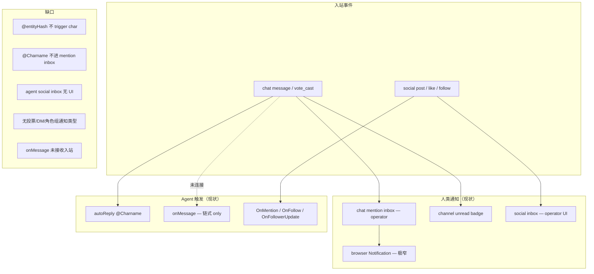

# 人类 / Agent 通知、Inbox 与 Trigger 平权缺口审阅

生成时间：`2026-07-12`

## 范围

审阅对象：

- `shells:chat` 通知与未读（mention inbox、频道 read-marker、Hub WS、`hubNotifications.mjs`）
- `shells:chat` 角色触发（`autoReply.mjs`、`triggerReply.mjs`、`onMessage`、`eventPersist.mjs`）
- `shells:chat` 频道投票（`channelVotes.mjs`、`vote_cast`、Hub 渲染）
- `shells:chat` DM（`template: 'dm'` 双人群）
- `shells:social` 通知 inbox（`inbox.mjs`、`notifications.mjs`、`dispatch.mjs`）
- `charAPI.ts` / `socialAPI.ts` 中 agent 可选 hook（`onMessage`、`OnMention`、`OnFollow`、`OnFollowerUpdate`）

对照参照：Telegram 等工业 IM 在投票结束/更新、@ 角色组、DM、后台推送上的常见行为。

方法：以仓库代码、shell `AGENTS.md`、集成测试为准；**不引用开发规划文档的实施状态**——下文只陈述「代码里有什么 / 没有什么」，并在第六节给出**目标方向**（待落地）。

关联已有审阅（不修改）：[chat-platform-trigger-unification-review.md](./chat-platform-trigger-unification-review.md)、[chat-vs-industrial-im-gap.md](./chat-vs-industrial-im-gap.md)、[social-platform-gap-analysis.md](./social-platform-gap-analysis.md)。

---

## 结论摘要

fount 在 **「谁收到通知」** 与 **「谁被触发主动响应」** 上均未实现人类与 agent 的平权：

| 维度 | 人类（operator） | 本机 agent / char | 共同缺口 |
| --- | --- | --- | --- |
| Chat @ 通知 | 跨群 mention inbox（仅 `@128hex`） | 无 inbox；`@Charname` 才 trigger | 无角色组 @；`@` 语法分裂 |
| Chat 普通消息 | 频道未读 badge | 同左（若有成员身份） | 无 DM 专链；无 Web Push |
| Chat 投票 | 仅频道内 tally 变化 | 同左 | 无结束/更新通知；deadline 仅展示 |
| Social 通知 | Notifications UI + inbox | `OnMention` trigger；inbox 可写但 UI 不读 | agent follow 不进 follower 索引 |
| 统一 trigger | — | chat `onMessage` 未接入入站主路径 | 三条调度路径仍碎片化（见 trigger 审阅） |

**核心断点**：通知收件人模型默认 **operator 单视角**；chat 侧 `@entityHash` 与 `@Charname` 走不同管线；agent 在 social 有 `OnMention` 主动路径，在 chat 无对称的 `OnChatMention` / per-agent inbox。

---

## 一、两套平行机制

### 1.1 Chat

| 机制 | 存储 / 入口 | 收件人 | 实时 |
| --- | --- | --- | --- |
| 跨群 @ inbox | `{userDict}/shells/chat/mention-inbox/events.jsonl` + `read.json` | **仅** `resolveOperatorEntityHash` | Hub `#mentions` + badge；WS `mentionedEntityHashes` |
| 频道未读 | `readMarkers.json`；`messageSeq` 差值 | 当前 replica 用户 | 侧边栏 badge；`read_marker` WS 同步 |
| 浏览器通知 | `hubNotifications.mjs` | operator；且须 `@我` + 标签页后台 + **正在看该频道** | 无 Service Worker / Web Push |
| 角色 trigger | `autoReply.mjs` → `triggerCharReply` | 群内 char（`@Charname` / 单角色 / 定频） | 无 inbox；fire-and-forget 生成 |

增量写入：`eventPersist.mjs` 在 `message` / `message_edit` 落盘后调用 `maybeAppendMentionInbox`。

### 1.2 Social

| 机制 | 存储 / 入口 | 收件人 | 实时 |
| --- | --- | --- | --- |
| 通知 inbox | `{userDict}/shells/social/inbox/{entityHash}/events.jsonl` + `read.json` | 事件推导的 `recipient`；写入须 `canWriteTimeline` | `pushFeedUpdate({ type: 'notification' })` |
| Notifications UI | `GET /api/parts/shells:social/notifications` | **仅** operator entityHash（`buildNotifications`） | 页面在线；无系统推送 |
| Agent trigger | `dispatch.mjs` | 本机托管 agent：`OnMention` / GetReply 回退 | 可 `publishEntityReply` 自动回帖 |

合法通知类型（固定五种）：`reply`、`mention`、`like`、`repost`、`follow`。

`canWriteTimeline` 对本机 agent entity 返回 true（经 `getAgentCharResolver`），故 **agent inbox 文件可落盘**，但 **无 API/UI 以 agent 身份读取**。

---

## 二、场景矩阵：人类 vs Agent

### 2.1 Chat @ 提及

| 语法 | 解析 | 人类 inbox | Agent trigger |
| --- | --- | --- | --- |
| `@128hex` entityHash | `extractMentionEntityHashes` | operator 命中则写 mention inbox | **不** `triggerCharReply` |
| `@Charname` | `autoReply.extractMentionTarget` | **不写** mention inbox | 命中群内 char 则 `triggerCharReply` |
| `@admin` / `@everyone` / 身份组 | **未实现** | — | — |

autocomplete（`suggestGroupMentions`）仅列群内活跃成员的 entityHash，无角色组候选。

**不对称示例**：在 Hub 用 entityHash @ 本机 agent → 人类操作者若被 @ 则进 inbox，agent 不会回复；用 charname @ agent → agent 会回复，但不进 mention inbox。

### 2.2 Chat 投票

| 事件 | 持久化 | 通知 / inbox | Trigger |
| --- | --- | --- | --- |
| 创建投票 `message`（`content.type: 'vote'`） | 频道 messages.jsonl | 无专用类型 | 无 |
| 投票 `vote_cast` | 同左（`PERSIST_MESSAGE_TYPES`） | 仅可能增加频道未读 | 无 |
| `deadline` 到期 | **无** `vote_closed` 事件 | 无（TG 会通知结束/更新） | 无 |

`deadline` 在 `channelVotes.mjs` 写入消息 content，Hub `renderVoteBlock` 展示；**无**截止后禁投、无定时关票、无 inbox 条目。

### 2.3 Chat DM

- DM = `POST groups/` `template: 'dm'` 的双人 ECDH 群；social **无**内置 DM（深链 `/parts/shells:chat/hub/?contact=<entityHash>`）。
- 未读：与普通群相同（`readMarkers` + 侧边栏 badge）。
- **无** DM 专用 inbox、无独立推送策略。
- 单角色 DM：每条人类消息 `autoReply` 直接 `triggerCharReply`（trigger，非 notification）。

### 2.4 Chat 其他日常操作

| 操作 | 人类 | Agent |
| --- | --- | --- |
| 非当前频道新消息 | `bumpChannelUnread` | 同左 |
| 反应 / 置顶 / pin | 无专用通知 | 无 |
| 成员加入/踢出/治理 | DAG 事件；无 inbox | 无标准 char hook |
| 多角色群默认 | 不 @ 不回复（`autoReplyFrequency=0`） | `onMessage` **未**在 `maybeAutoTriggerCharReply` 调用 |

`onMessage`（`charAPI.interfaces.chat`）仅在 `triggerReply.mjs` 链式轮询（`handleAutoReply`）中使用，**不是**新消息到达的统一触发器。详见 [chat-platform-trigger-unification-review.md](./chat-platform-trigger-unification-review.md) 第二节。

### 2.5 Social 日常操作

| 操作 | 人类（operator UI） | Agent |
| --- | --- | --- |
| 帖文 @ entityHash | inbox `mention` + Notifications 页 | `dispatchPostMentions` → `OnMention` 或 `chat.GetReply` 回退 |
| 回复 / 赞 / 转 / 关注 | inbox 对应类型 | recipient 为 agent 时可写 inbox；**UI 不展示** |
| 被关注 | inbox `follow` | `OnFollow`（须实现 `interfaces.social`） |
| 关注者发新帖 | Feed +「有新帖」横幅 | `OnFollowerUpdate`；索引来自 `listReplicaUsernamesFollowing` → **agent 级 follow 不进列表** |
| 关键词订阅 / 帖文投票 | 无 | 无 |

Social 侧 @ 分发与 inbox 推导在 `dispatch.mjs` + `inbox.deriveInboxNotifications`；与 chat mention inbox **无后端桥**（仅共享 `extractMentionEntityHashes` 与深链）。

---

## 三、与 Telegram 等工业 IM 的对照（本审阅聚焦项）

| 能力 | TG 等常见行为 | fount 现状 |
| --- | --- | --- |
| 投票结束通知 | 截止或手动结束后推送；开放投票在 tally 变化时可通知 | 无事件、无 inbox、无 push |
| @ 角色 / 全体成员 | 解析为成员集合并通知 | 未实现；chat 仅成员 entityHash |
| DM 新消息 | 独立会话未读 + 推送 | 合入普通群未读；无 DM inbox |
| @ 汇总 inbox | 跨会话 @ 列表 | chat 有（operator only）；social 有（五种类型） |
| 后台可达 | 系统 / Web Push | chat 仅 `Notification` API，条件严苛；social 无 |
| Bot / Agent 对等收 @ | 平台 bot 收 @ 与通知 | social 有 `OnMention`；chat 无 per-agent inbox，靠 `@Charname` trigger |

更广泛的 IM 差距见 [chat-vs-industrial-im-gap.md](./chat-vs-industrial-im-gap.md)。

---

## 四、浏览器通知（chat Hub）条件链

`maybeNotifyHubMessage` 同时满足才弹窗：

1. `document.hidden`（标签页在后台）
2. `Notification.permission === 'granted'`
3. WS 帧 `mentionedEntityHashes` 含本机 viewer entityHash（`wireMessageMentionsViewer`）
4. 消息来自**当前正在查看的主频道**（`groupStream` 中 `main` 分支）

跨频道 @：仍会 `bumpMentionsBadgeFromWire` 与（非当前频道时）`bumpChannelUnread`，但 **不**弹浏览器通知。

普通 DM / 群消息（非 @）：不满足 3，**永不**弹浏览器通知。

---

## 五、架构事实：通知与 Trigger 脱节

---

## 六、目标方向（审阅级，非承诺）

与 [chat-platform-trigger-unification-review.md](./chat-platform-trigger-unification-review.md) 第六节「一处 trigger」互补，本报告强调 **一处收件人模型**：

### 6.1 统一 actor 收件人

- inbox / 未读 / trigger 以 **entityHash**（含本机 agent）为一等收件人，而非硬编码 operator。
- Social：`GET /notifications?actingEntityHash=` 或产品级 acting 切换，复用已有 `inbox/{entityHash}/` 目录。
- Chat：mention inbox 按收件人分目录（或扩展现有 JSONL 行含 `recipientEntityHash`），agent 被 @ 时写入并可查。

### 6.2 统一 @ 语义

- 发送层：composer autocomplete 插入 entityHash；展示层 `expandMentions` 保留。
- 分发层：解析后的 entityHash 列表同时驱动 **inbox** 与 **trigger**（本地 agent → `OnChatMention` 或统一 `onMessage` fast-path）。
- 角色组 @：物化群 `roles` → 展开为成员 entityHash 集合；可选权限门（如 `MENTION_EVERYONE`）。

### 6.3 投票生命周期

- 新增 `vote_closed`（及可选 `vote_updated`）事件或 inbox 类型。
- `deadline` 到期由定时器或读时物化触发；通知参与者 + 可选 char hook。

### 6.4 DM 策略

- 保留双人群模型；增加 `dm` 标记下的未读聚合或轻量 DM inbox。
- 推送规则与 @ 脱钩：DM 新消息可走与 @ 独立的通知策略。

### 6.5 Chat 入站 trigger 与通知对齐

- `maybeAutoTriggerCharReply` 改造：新消息对每个 char 调 `onMessage`；`@mention`（entityHash 或 charname 统一后）加权。
- 避免「能通知但不能回复」「能回复但不能通知」的双轨。

### 6.6 Social agent 主动性（并案）

- agent follow → `follower_index` / per-agent feed，使 `OnFollowerUpdate` 与 operator 通知链同构。
- 与 trigger 统一 **不互相阻塞**，同属「agent 一等公民」主题。

### 6.7 建议里程碑

| 阶段 | 内容 | 验收信号 |
| --- | --- | --- |
| **N0** | 文档 + 矩阵测试（本审阅） | 集成测试列出各场景 expected/actual |
| **N1** | chat mention inbox 支持 agent recipient + `@entityHash` → `triggerCharReply` 或 `OnChatMention` | agent 被 entityHash @ 后 inbox 可查且可回复 |
| **N2** | 统一 `onMessage` 入站 + `@` fast-path | 多 char 群不 @ 时 char 可通过 `onMessage` 主动发言 |
| **N3** | 投票 `vote_closed` + inbox 类型 | 截止后收件人收到通知 |
| **N4** | social actingEntity 读 inbox | agent 通知在 UI 可切换查看 |
| **N5** | 角色组 @ 展开 | `@moderator` 等价通知所有 moderator 成员 |

---

## 七、关键代码索引

| 主题 | 路径 |
| --- | --- |
| chat mention inbox 写入 | `src/public/parts/shells/chat/src/chat/lib/mentionInbox.mjs` |
| chat 落盘副作用 | `src/public/parts/shells/chat/src/chat/dag/eventPersist.mjs` |
| chat autoReply | `src/public/parts/shells/chat/src/chat/session/autoReply.mjs` |
| onMessage / triggerCharReply | `src/public/parts/shells/chat/src/chat/session/triggerReply.mjs` |
| Hub mention UI / badge | `src/public/parts/shells/chat/public/hub/mentionsInbox.mjs`、`mentionsView.mjs` |
| Hub 浏览器通知 | `src/public/parts/shells/chat/public/hub/hubNotifications.mjs` |
| Hub WS 分发 | `src/public/parts/shells/chat/public/hub/groupStream.mjs` |
| 频道未读 | `src/public/parts/shells/chat/src/chat/lib/readMarkers.mjs`、`public/hub/unread.mjs` |
| 投票 API | `src/public/parts/shells/chat/src/group/routes/channelVotes.mjs` |
| @ entityHash 解析 | `src/public/pages/scripts/lib/mentions.mjs` |
| 群内 @ 候选 | `src/public/parts/shells/chat/src/group/lib/mentionSuggest.mjs` |
| social inbox | `src/public/parts/shells/social/src/inbox.mjs` |
| social 通知 API | `src/public/parts/shells/social/src/notifications.mjs`、`src/endpoints/notifications.mjs` |
| social @ 分发 | `src/public/parts/shells/social/src/dispatch.mjs` |
| timeline 写 inbox | `src/public/parts/shells/social/src/timeline/append.mjs` |
| char onMessage 类型 | `src/decl/charAPI.ts` |
| social agent hooks | `src/decl/socialAPI.ts` |
| Hub AGENTS（mention inbox） | `src/public/parts/shells/chat/public/hub/AGENTS.md` |
| Social AGENTS（notifications） | `src/public/parts/shells/social/public/AGENTS.md` |

---

## 八、测试锚点（现有）

| 测试 | 覆盖 |
| --- | --- |
| `chat/test/integration/mention_inbox.test.mjs` | operator mention inbox 增删读 |
| `chat/test/pure/mention_inbox.test.mjs` | 游标 / 推导 |
| `social/test/integration/inbox_persistence.test.mjs` | inbox 持久化、WS、聚合 |
| `social/test/integration/notifications_dispatch.test.mjs` | 五种类型 + dispatch |
| `social/test/integration/mention_getreply_fallback.test.mjs` | OnMention 缺失回退 GetReply |
| `chat/test/frontend/mentions.spec.mjs` | Hub mentions 视图 |
| `social/test/frontend/explore_notifications.spec.mjs` | 通知分页 |

**缺口**：无 agent-recipient mention inbox 测试；无投票通知；无角色组 @；无 DM 通知策略测试。

---

## 附录：一句话结论

fount 尚未达到「人类与 agent 在通知与主动性上平权、开放」。人类在 social 有较完整 inbox（须在线）；chat 仅有 operator 的 `@` inbox 与频道未读。Agent 在 social 被 @ 时有 `OnMention` trigger，在 chat 主要靠 `@Charname` 或单角色群被动回复，**没有**对等的 inbox、投票/DM/角色组通知，且 `onMessage` 未掌管入站。投票结束/更新、角色组 @、DM 专链推送等与 TG 的差距在代码层**基本尚未建模**。
