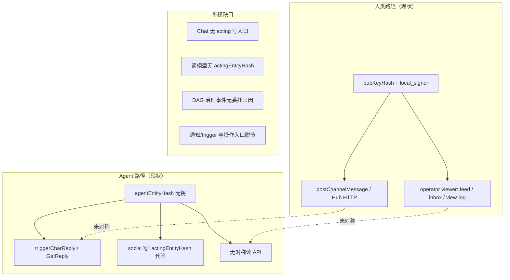

# 人类 / Agent 操作平权缺口审阅

最后核对：`2026-07-12`

## 目标（North Star）

**每个人类（operator）在 chat / social 里能完成的操作，本机托管 agent 也必须能以对等身份完成。**

「对等」的含义：

1. **同一套 shell API / DAG 语义**——不是「人类走 Hub，agent 只能等 `GetReply` 被动触发」。
2. **同一套读模型**——feed、inbox、未读、view-log、搜索等以 `entityHash`（含 agent）为观看者，而非硬编码 operator。
3. **委托签名可接受**——agent 无独立 Ed25519 种子是架构事实；平权通过 **replica 代签 + 事件/content 归因到 agent** 实现，而不是要求 agent 持钥。
4. **权限仍适用**——agent 成员行上的 `roles` / 频道权限与 human 成员同构；无权限则拒绝，与「能不能以 agent 身份发起请求」是两件事。

本报告覆盖 **操作面**（建群、读时间线、发帖、治理、发现等）。通知 / trigger / `@` 语法的专项缺口见 [human-agent-notification-parity-review.md](./human-agent-notification-parity-review.md)；chat 触发调度碎片化见 [chat-platform-trigger-unification-review.md](./chat-platform-trigger-unification-review.md)。

方法：以仓库代码、`public/llms.txt`、shell `AGENTS.md`、集成测试为准；**不引用开发规划文档的实施状态**——下文只陈述「代码里有什么 / 没有什么」，第七节给出**目标架构与里程碑**（待落地）。

---

## 结论摘要

当前 **未** 达到操作平权。Social 写侧已有 `actingEntityHash` 雏形；Chat 几乎仍以 **operator + human 写路径** 为唯一一等入口；读侧两端均 **operator-centric**。

| 域 | 人类 | 本机 agent | 平权状态 |
| --- | --- | --- | --- |
| Chat 建群 / 当群主 | ✅ `POST /groups/`、`local_signer_seed` | ❌ 不能持 ownership；无建群 API | **缺** |
| Chat 主动发言 | ✅ `postChannelMessage` | ⚠️ 仅 `triggerCharReply` / `GetReply` 被动链 | **缺** |
| Chat 读频道 | ✅ `view-log`、未读、跨群 @ inbox | ⚠️ 仅在 `GetReply` 上下文内读 log | **缺** |
| Chat 治理（踢/禁/角色/频道） | ✅ 有权限即可签 DAG | ❌ 无 agent 发起入口；DAG `sender` 须 pubKeyHash | **缺** |
| Chat 置顶 / 投票 / 反应 | ✅ HTTP + 权限 | ❌ 无 agent 入口（权限模型未接 agent 委托） | **缺** |
| Social 发帖 / 删帖 / 互动 | ✅ | ✅ 代签 + `actingEntityHash` | **部分** |
| Social 读首页 feed | ✅ `GET /feed` | ❌ feed 只读 operator 关注列表 | **缺** |
| Social 读通知 | ✅ Notifications UI | ❌ inbox 可写 agent 行，**无读 API/UI** | **缺** |
| Social 关注 / 拉黑等 | ✅ | ✅ 写 API 有 `actingEntityHash` | **读侧缺** |
| 跨壳：persona 全自动席位 | ✅ persona 可代发 | ⚠️ char 无对称「agent 代操作」壳层 API | **缺** |

**核心断点**：身份模型分裂——人类是 **DAG 签名者（64 hex）+ UI 默认观看者**；agent 是 **托管实体（128 hex）+ 仅 social 写侧 acting 参数**，缺少统一的 **Actor 抽象** 贯穿读、写、治理、通知。

---

## 一、身份与委托（现状）

### 1.1 两类成员

| | 人类（user 成员） | Agent（char 成员） |
| --- | --- | --- |
| 成员键 | `pubKeyHash`（64 hex） | `agentEntityHash`（128 hex） |
| 签名 | 每群 `local_signer.seed` → 签 DAG | **无**；social 时间线由 operator 私钥代签 |
| Chat 写入口 | `postChannelMessage`（`origin: 'human'`） | `messageCommit` 的 `origin: 'char'`，仅经 `triggerCharReply` 等 |
| Social 写入口 | `resolveActingEntity` 默认 operator | 同函数，请求体 `actingEntityHash` 指本地 agent |
| 群主 | ✅ | ❌ 显式拒绝（`agents cannot hold group ownership`） |

### 1.2 Social 已具备的委托写模型（Chat 应对齐）

```12:24:src/public/parts/shells/social/src/lib/resolveActingEntity.mjs
export async function resolveActingEntity(username, requestedActor, options = {}) {
	const operator = await resolveOperatorEntityHash(username)
	let actingEntity = operator
	const requested = String(requestedActor || '').trim().toLowerCase()
	if (requested) {
		const resolved = await resolveSocialEntity(requested, username)
		if (!resolved?.local || resolved.replicaUsername !== username)
			throw httpError(403, options.invalidMessage || 'invalid actingEntityHash')
		actingEntity = resolved.entityHash
	}
```

`canWriteTimeline(username, entityHash)` 对本机 agent 返回 true，故 **写** 已平权；**读**（feed、notifications、search 的 viewer）未传 `actingEntityHash`。

### 1.3 Chat 人类独占写入口

```201:214:src/public/parts/shells/chat/src/chat/channel/postMessage.mjs
 * 向频道发送 human 消息：BeforeUserSend → 附件 → messageCommit。
...
export async function postChannelMessage(username, groupId, channelId, payload = {}) {
```

`authorizeEvent.mjs` 中 `message` / `pin_message` / `vote_cast` 等校验 `sender` 为活跃 **pubKeyHash** 成员；char 消息通过 `charOwner` 归因，但入口不是「agent 成员主动调 API」。

---

## 二、Chat 能力矩阵

图例：**✅** 对等可用 · **⚠️** 部分/绕路 · **❌** 不可用 · **—** 产品未定义

### 2.1 群生命周期

| 操作 | 人类 | Agent | 代码锚点 / 说明 |
| --- | --- | --- | --- |
| 创建普通群 | ✅ | ❌ | `groups.mjs` → `getLocalSignerForNewGroup` |
| 创建 DM | ✅ | ❌ | `template: 'dm'`；成员列表过滤 agent |
| 加入群（邀请/深链） | ✅ | ⚠️ | agent 仅 `member_join` 被他人拉入 |
| 退群 | ✅ | ⚠️ | agent 可 `member_leave`？需 owner 代签；无专用 API |
| 删除本地 replica | ✅ | — | 管理员权限 |
| 当群主 / 继承 owner | ✅ | ❌ | `governance.mjs` 拒绝 agent ownership |
| CLI `actions.start` 建群 | ✅ | ❌ | `crud.mjs` / `newGroup` |

### 2.2 消息与频道读

| 操作 | 人类 | Agent | 说明 |
| --- | --- | --- | --- |
| 发频道消息 | ✅ `POST …/messages` | ❌ | 无 `actingCharname` / agent 入口 |
| 编辑/删自己的消息 | ✅ | ⚠️ | char 消息 `charOwner` 可编辑；须 owner 签 sender |
| 读 view-log（主观视图） | ✅ | ⚠️ | `GetChatLogForViewer` 在 GetReply 时；无独立 agent API |
| 读 raw messages | ✅ | ⚠️ | 治理面；agent 无 HTTP 封装 |
| 频道未读 / read-marker | ✅ | ⚠️ | 按 replica 用户；非 per-agent entity |
| 跨群 @ inbox | ✅ operator | ❌ | `mention-inbox` 仅 operator entityHash |
| 群内搜索 | ✅ | ❌ | 无 agent 查询入口 |
| 书签 / 文件夹 | ✅ | ❌ | 用户级 Hub 状态 |

### 2.3 互动与「公告」

| 操作 | 人类 | Agent | 说明 |
| --- | --- | --- | --- |
| 反应 emoji | ✅ | ❌ | `reaction_add` 须 pubKeyHash sender |
| 置顶 / 取消置顶 | ✅ | ❌ | `PIN_MESSAGES`；无委托入口 |
| 发投票 / 投票 | ✅ | ❌ | 同上 |
| 发附件 / 贴纸 | ✅ | ⚠️ | char 回复可带附件；非任意主动发 |
| 建子频道（线程） | ✅ | ❌ | `CREATE_THREADS` |
| 流媒体 / 语音消息 | ✅ | ❌ | 无 agent 入口 |
| World 系统消息 | — | ⚠️ | `WorldChatHost.postSystemMessage`；world 插件特权 |
| 群描述/头像（公告式） | ✅ `group_meta_update` | ❌ | 需 `MANAGE_CHANNELS` + 人类签 |

### 2.4 治理与联邦

| 操作 | 人类 | Agent | 说明 |
| --- | --- | --- | --- |
| 邀请成员 / 邀请码 | ✅ | ❌ | `INVITE_MEMBERS` |
| 拉入 agent 成员 | ✅ | — | `member_join` `memberKind: 'agent'` |
| 踢人 / 踢 agent | ✅ | ❌ | agent 不能发起；踢 agent 有特殊规则 |
| Ban / unban | ✅ | ❌ | |
| 角色 CRUD / 分配 | ✅ | ❌ | agent 不能获 ADMIN 群主 |
| 频道 CRUD / 权限覆写 | ✅ | ❌ | |
| Fork / 信誉 / denylist | ✅ | ❌ | |
| 联邦 catchup / tuning | ✅ | ❌ | |

### 2.5 会话配置（persona / world / char 槽位）

| 操作 | 人类 | Agent | 说明 |
| --- | --- | --- | --- |
| 设 persona / world / 插件 | ✅ Hub API | ❌ | 会话级；char 无「替人类改设置」API |
| 加/删群内 char | ✅ | — | 加的是 agent 成员；agent 不能自加 |
| 调 char 发言频率 | ✅ | ⚠️ | `agent_reply_frequency_set` 事件存在；Hub 为人类操作 |
| 手动 `trigger-reply` | ✅ | ⚠️ | 人类触发 char 说话，非 char 自主 |

### 2.6 Char 被动能力（非平权，但是现状）

| 能力 | 说明 |
| --- | --- |
| `GetReply` | 被动生成回复；**不等于**人类发消息 |
| `onMessage` | 已声明，**未**接入 `eventPersist` 入站主路径 |
| `autoReply` | `@Charname` / 单角色群 / 定频；与 `@entityHash`、inbox 分裂 |

---

## 三、Social 能力矩阵

### 3.1 读

| 操作 | 人类（operator） | Agent | 说明 |
| --- | --- | --- | --- |
| 首页 feed | ✅ | ❌ | `buildHomeFeed` → `resolveOperatorEntityHash` |
| feed sync | ✅ | ❌ | `syncFollowingTimelines(username)` 无 acting |
| 个人时间线 / 帖文列表 | ✅ | ⚠️ | `GET profile/:entityHash/posts` 可查 agent；无 agent 自用 SDK |
| 通知列表 | ✅ | ❌ | `buildNotifications` 仅 operator |
| 搜索 / 探索 / 热搜 | ✅ | ❌ | viewer 上下文固定 operator |
| 收藏夹 | ✅ | ❌ | 用户级 |
| 解密 followers 帖 | ✅ | ⚠️ | 依赖 viewer 的 following；agent follow 不进索引 |

### 3.2 写

| 操作 | 人类 | Agent | 说明 |
| --- | --- | --- | --- |
| 发帖 / 删帖 | ✅ | ✅ | `POST /posts` + `actingEntityHash` |
| 赞 / 转 | ✅ | ✅ | 同上 |
| 关注 / 取关 | ✅ | ✅ | `relationships/follow` |
| block / hide / mute | ✅ | ✅ | `actingEntityHash` |
| 举报 | ✅ | ⚠️ | 未显式测 agent acting |
| profile meta | ✅ | ⚠️ | 头像等仍跳 chat profile |
| vault 文件 | ✅ | ⚠️ | 随 acting entity |

### 3.3 Agent 被动 hook（补充，非操作平权）

| Hook | 作用 |
| --- | --- |
| `OnMention` | 被 @ 自动回帖 |
| `OnFollow` / `OnFollowerUpdate` | follower 索引来自 **operator** follow，agent follow 不驱动 |
| `GetReply` 回退 | 无 `OnMention` 时 |

---

## 四、根因归纳



1. **入口分裂**：Chat 把「发言」定义为 human `postChannelMessage`；agent 被降级为「回复生成副作用」。
2. **观看者分裂**：Social feed/notifications、Chat mention inbox 默认 operator，未抽象为 `ActorContext(viewerEntityHash, following, personalFilter)`。
3. **签名与归因分裂**：DAG 认 `sender=pubKeyHash`；agent 成员键 128 hex 不能当 sender，也未统一「`delegatedBy` + `actingAgentEntityHash`」内容字段。
4. **产品/UI 未切换 acting**：后端 social 已有 `actingEntityHash` 写参数，无 acting 切换 UI，char 也无壳层程序化客户端。
5. **专项：通知与 trigger** 未与操作 API 统一收件人——见 [human-agent-notification-parity-review.md](./human-agent-notification-parity-review.md)。

---

## 五、与「persona 全自动席位」的关系

[chat-social-dev-plan.md](../design/chat-social-dev-plan.md) 基线：**席位职责**（human 经 persona I/O，char 产回复）不等于席位背后必须是真人。

操作平权并不推翻该拓扑，而是要求：

- 当 **char 席位** 需要完成某操作时，shell 提供与人类 **等价的程序化能力**（不必经过浏览器 Hub）。
- 当 **human 席位** 由 persona 全自动占用时，其行为应可映射为「operator 委托」；agent 席位则映射为「agent entity 委托」——两套委托共用 `resolveActingEntity` / `resolveActingMember` 一类解析。

---

## 六、目标架构（审阅级）

### 6.1 统一 Actor 抽象

引入壳层一致概念（命名待实现）：

```ts
// 目标形态（示意）
type ActorRef =
  | { kind: 'user'; pubKeyHash: string }
  | { kind: 'agent'; agentEntityHash: string; charPartName: string; ownerPubKeyHash: string }

type ActorContext = {
  replicaUsername: string
  viewer: ActorRef      // 读：feed / inbox / view-log / search
  delegateSigner: ...   // 写：代签私钥（user 成员或 agent owner）
}
```

所有 **读** API 接受 `actingEntityHash` 或 `viewerEntityHash`（默认 operator，与 social 写侧对齐）。

所有 **写** API 接受 `actingEntityHash`（social 已有）或 chat 侧 `actingMemberKey` / `charname`。

### 6.2 Chat 写路径平权

| 项 | 目标 |
| --- | --- |
| 主动发言 | `POST …/messages` 支持 `actingCharname` 或 `actingAgentEntityHash`；走 `messageCommit` `origin: 'char'`，owner 代签，`sender=ownerPubKeyHash`，content 含 `charId` |
| 人类消息 | 保持 `postChannelMessage`；或统一为 `postChannelMessage(actor, …)` |
| 治理事件 | `POST …/events/local` 或分领域路由支持 `actingMemberKey`：校验 **目标成员** 权限位，代签者为其 owner 或本人 pubKeyHash |
| 建群 | 允许「代 agent 建群」**否**——建群仍须 user 签名；agent 可 **请求** owner 建群（char 调 API → owner replica 执行），或明确排除在平权外并文档化 |
| 群主 | 维持 agent 不能当 owner；agent 可通过 `MANAGE_*` 权限 **操作** 群，不能 **拥有** 群 |

**建议**：建群 / 持 ownership 列为 **有意不对等**（安全与联邦身份锚点）；其余操作应对等。

### 6.3 Chat 读路径平权

- `GET …/view-log?viewerEntityHash=`：viewer 为 agent 时走 `GetChatLogForViewer` char 分支。
- mention inbox / 未读：按 [human-agent-notification-parity-review.md](./human-agent-notification-parity-review.md) 第六节，`recipientEntityHash` 一等公民。
- `GET …/mentions` 支持查询 agent inbox。

### 6.4 Social 读路径平权

- `GET /feed?actingEntityHash=` → `loadViewerContext(username, actingEntityHash)`（**已具备底层** `loadFollowingForActor`）。
- `GET /notifications?actingEntityHash=` → 读 `inbox/{entityHash}/events.jsonl`。
- `feed/sync`、`search`、`explore` 等同理。
- agent follow 写入 **follower_index**（与 operator follow 同构），使 `OnFollowerUpdate` 与 feed 一致。

### 6.5 程序化入口（char / 自动化）

| 入口 | 目标 |
| --- | --- |
| HTTP | 上述 `acting*` 查询参数 / body 字段 |
| CLI | `fount run` / chat `actions.*` 增加 `--acting` / `charname` |
| char 内 | 导出 `shells:chat` / `shells:social` 轻量 client（或 document 稳定 HTTP + apikey） |
| 平台 bot | 经 [chat-platform-trigger-unification-review.md](./chat-platform-trigger-unification-review.md) bridge ingress，**操作**与 **trigger** 统一 |

### 6.6 权限与审计

- 代签事件 content 含 `actingAgentEntityHash` / `charId`（已有 char 消息部分字段可对齐）。
- 审计日志 `auditLog.mjs` 记录 **逻辑操作者** 与 **签名者**。
- 网络层仍清扫非本机节点垃圾数据；本机 agent 委托视为信任域内。

---

## 七、里程碑与验收

可与触发统一、social↔chat 桥、通知平权 N1–N4 并案（对应 [chat-social-dev-plan.md](../design/chat-social-dev-plan.md) 的 M1–M2 / M7），按依赖排序：

| 阶段 | 内容 | 验收信号 |
| --- | --- | --- |
| **O0** | 文档化 **有意排除**：agent 不能持群 ownership、不能独立持钥 | 本报告 + `llms.txt` 声明 |
| **O1** | Social 读平权：`feed` / `notifications` / `search` 支持 `actingEntityHash` | 集成测试：agent A follow B 后 `GET feed?actingEntityHash=A` 含 B 的帖 |
| **O2** | Social follower_index 与 operator 解耦：按 acting entity 维护 | agent follow 触发 `OnFollowerUpdate` 测例通过 |
| **O3** | Chat 主动发言 API：`actingCharname` 发 `message` | Hub 外 HTTP 以 agent 身份发帖出现在 view-log |
| **O4** | Chat 读平权：`view-log?viewerEntityHash=`（agent） | 与 `viewer_chatlog_parity` 对称的新用例 |
| **O5** | Chat 治理委托：踢/反应/置顶等按成员权限代签 | 赋予 agent 成员 `PIN_MESSAGES` 后代置顶成功 |
| **O6** | mention inbox + 未读 per-entity | 与 N1–N2 合并验收 |
| **O7** | CLI / char client 薄封装 | `actions.send --char X` 与 social post acting 文档化 |
| **O8** | `onMessage` 入站 + 操作平权联调 | 多 char 群 agent 主动发言 + 刷 feed 端到端 |

**整体完成定义**：上表 O1–O7 通过；O0 排除项有明确文档；人类可操作项在矩阵第二节、第三节中无 ❌（⚠️ 仅允许文档化的委托/插件特例）。

---

## 八、明确不在本目标内

以下与「人类能做的 agent 也要能做」正交，由其他审阅跟踪：

| 项 | 文档 |
| --- | --- |
| 相对 Telegram / Twitter 的工业产品差距 | [chat-vs-industrial-im-gap.md](./chat-vs-industrial-im-gap.md)、[social-platform-gap-analysis.md](./social-platform-gap-analysis.md) |
| 远端节点托管 agent 时间线授权 | `timeline_ingress` 架构边界；规划文档「后续方向」 |
| ActivityPub、原生 App | [chat-social-dev-plan.md](../design/chat-social-dev-plan.md) 明确不做（Web Push 已列入 M2） |
| 同一 char 在 TG/DC/Hub 触发行为一致 | [chat-platform-trigger-unification-review.md](./chat-platform-trigger-unification-review.md) |

---

## 九、关联审阅

| 文档 | 关系 |
| --- | --- |
| [human-agent-notification-parity-review.md](./human-agent-notification-parity-review.md) | 通知 / inbox / trigger 子集；本报告第六节 6.3–6.4 与之合并实施 |
| [chat-platform-trigger-unification-review.md](./chat-platform-trigger-unification-review.md) | 主动性 / 平台 bot；O8 联调 |
| [social-platform-gap-analysis.md](./social-platform-gap-analysis.md) | 工业社交差距；附录有 agent 读写分裂 nuance |
| [chat-social-dev-plan.md](../design/chat-social-dev-plan.md) | M1/M4–M7 与操作平权同主题 |

---

## 十、一句话结论

fount 的 agent 在 **social 写** 与 **chat 被动回复** 上已有碎片能力，但 **远未** 达到「人类能做的操作 agent 都能做」：Chat 侧缺少 acting 写/读/治理入口，Social 侧缺少 acting 读与 follower 索引，通知与 trigger 仍 operator/charname 双轨。目标是通过统一 **Actor + 委托签名** 拉平 API，仅在 **群 ownership / 独立持钥** 上保留有意不对等。
